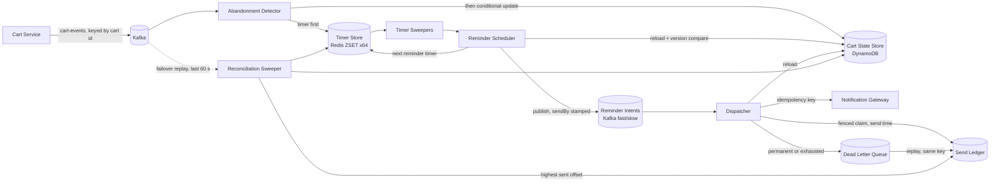

# Abandoned Cart Recovery: Design

## 1. Summary

Shoppers who add items and then go quiet get up to three reminders, at 30 minutes, 1 hour, and 24 hours after their last activity, unless they purchase, clear, or come back to the cart first. Detection is event-driven. Each cart has one record and one pending timer tagged with the cart's version. A timer that fires checks the tag against the record and drops itself if anything changed, so cancellation is a compare, not a delete, and works under at-least-once delivery. Every send has a deterministic idempotency key of cart id, version, and offset index, which dedupes at the ledger and at the notification provider. Failures retry with backoff, dead-letter with a reason, and replay safely under the same key.

The runnable pipeline in this repository implements detection, scheduling, cancellation, idempotency, and failure handling behind interfaces with in-memory adapters, driven by a fake clock. Section 11 maps each interface to its production backing. The same core classes also run as separately deployable roles on Kafka, Redis, and DynamoDB (Section 12), measured under load on one laptop (Section 13).

## 2. Assumptions

- About 10 events per cart session, about 70% of carts abandon, about 1 KB per event. Peak is 5k events per second, spikes are 2.5x for an hour.
- The Cart Service already exists, owns the durable cart, and publishes events carrying a strictly increasing per-cart version.
- Reminders go through an existing notification gateway that accepts an idempotency key. The gateway is out of scope.
- Offsets are measured from last activity, so with defaults the first reminder fires at the moment the cart is declared abandoned. Configuration rejects a first offset smaller than the window.
- A resume, meaning the shopper reopened the cart, counts as activity. It cancels pending reminders and restarts the inactivity clock. A frequency cap of three sequences per cart per 7 days stops a shopper who keeps peeking from receiving endless sequences.
- The company does not run a workflow engine. See section 14 for the Temporal alternative.

## 3. Success and guardrail metrics

**Control group.** A holdout arm of about 10% of eligible carts is assigned by hashing the shopper key with an experiment salt. Holdout carts run through the whole pipeline and are tracked identically but schedule no sends, so the groups differ only in the reminder.

**Success.** Primary: recovery rate, the share of abandoned carts that purchase within 7 days of abandonment, treatment versus holdout, reported with confidence intervals. Secondary: recovered revenue per abandoned cart, time to recovery. Attribution uses the purchase event, not link clicks, so open and click tracking do not bias it.

**Guardrails, the signs of harm.** Unsubscribe and spam-complaint rates per send, bounce rate, sends after purchase, duplicate sends, sends per shopper per day against the frequency cap, and holdout purchase rate not dropping. The intent is that a breach pauses dispatch, but nothing in either mode computes these rates or compares them with a threshold. What exists is a manual switch: an operator sets `recovery-meta.paused`, every dispatcher replica re-reads it every 5 seconds, and both lanes and the retry loop pause until it is cleared (§12.6). The in-memory pipeline only counts sends, cancellations, skips, and dead letters. Every abandonment, treatment or holdout, is recorded once as an `ABANDONED` outcome tagged with its arm, so the control-group denominator (abandoned carts per arm) comes from the same event stream as the guardrail counts, not a separate query.

**System health.** Consumer lag, timer backlog past due, fire latency p99, dead letter depth, dedupe hit rate, skipped-for-lateness count.

**Targets.** Wrong sends under 0.01% of sends. Timely delivery, within 5 minutes for the 30 minute and 1 hour offsets and 30 minutes for the 24 hour offset, for 99.5% of scheduled reminders. Missed entirely under 0.1% per month. The design drops when in doubt: a stale or too-late reminder is skipped and counted, never sent.

## 4. Detection: event-driven

Event-driven, with lazily validated timers. A batch scan every minute would be simpler to explain, but its precision is bounded by the scan interval, every scan is a wide query over a large cart table, spikes land on scan boundaries, scaling needs manual partitioning, and the cancellation race between the scan reading a row and the checkout writing it still forces a version check. Event-driven gives minute-level precision at 5k events per second, one cheap upsert per event, and horizontal scaling by stream partition.

### Components

| Component | Job | Talks to |
|---|---|---|
| Cart Service (existing) | Publishes `CartEdited`, `CartResumed`, `CartCleared`, `CartPurchased` with cart id, shopper key, version, time, item snapshot | `cart-events` stream, 64 partitions keyed by cart id |
| Abandonment Detector | Writes the timer first, then a field-scoped conditional update to the cart record; ignores events at or below the stored version; commits the offset after both writes. | Cart State Store, Timer Store |
| Cart State Store | One record per cart: status, version, last activity, snapshot, arm, sequence starts, plus a sparse open-cart index entry while a next step is pending. Field-scoped conditional writes on version. | DynamoDB |
| Timer Store | Due-time index, one timer per cart, monotonic upsert by `(version, offsetIndex)`. Derived and rebuildable. | Redis sorted set, 64 shards by cart hash |
| Timer Sweepers | Pop due timers per shard in bounded batches under a short lease. An expired lease returns the timer, giving at-least-once timer delivery. | Reminder Scheduler |
| Reminder Scheduler | For `CHECK_ABANDON`, waits on a watermark gate, then reloads the record and compares the version tag and expected status: drop, or mark abandoned and arm the first reminder timer. For `REMINDER i`, reloads and compares without a watermark wait — freshness there is the dispatcher's watermark gate (§5), not the scheduler's — then drops or publishes a `sendBy`-stamped intent and arms the next reminder timer. Writes no ledger row either way: dedupe is the dispatcher's job. | Cart State Store, Timer Store, Reminder Intents |
| Dispatcher | Consumes reminder intents (two priority lanes in production, one queue in memory), takes a fenced ledger claim at send time, re-validates the cart and `sendBy` at each checkpoint, checks the `recovery-meta.paused` guardrail switch, calls the gateway with the idempotency key, retries with jitter, dead-letters. | Send Ledger, Cart State Store, Notification Gateway, Dead Letter Queue |
| Reconciliation Sweeper | Every few minutes reads only carts that still have a next step, from the sparse open-cart index, and reinserts any timer missing from the store, starting after the ledger's highest sent offset and skipping offsets already past their lateness bound. Also detects a Redis restart or failover and replays recent `cart-events` into timer upserts. | Cart State Store, Timer Store, Send Ledger, `cart-events` (failover replay only) |
| Config and Metrics | Window, offsets, lateness bounds, frequency cap, holdout, arms. Counters from every stage. | All |

The timer-before-record order above lives in the shared `AbandonmentDetector`, so in memory writes in the same order too (Section 11): a crash between the two writes leaves at most a stray timer, which the reconciler repairs from the record, while leaving the record first would let a crash hide an abandoned cart until the next sweep finds it by a wider scan. What is production-only is the crash this protects against: `DynamoCartStateStore` and the Redis timer store are two independent stores that can fail between one write and the next, and the field-scoped `UpdateItem`, conditioned on `version <` the incoming event's version and touching only the fields an event actually changes, removes the lost-update race on `sequenceStarts` that a read-then-write update would have. `InMemoryCartStateStore` and the in-memory timer store are two objects in one JVM with no failure between them, so the identical write order carries no crash-safety meaning there; it is simply inherited from the shared detector.

### State machine

Statuses `ACTIVE`, `ABANDONED`, `CLOSED`.

- Edit or resume: `ACTIVE`, version and last activity updated, timer `CHECK_ABANDON` due at last activity plus window, tagged with the version. A closed cart reopens as a new cycle.
- Purchase or clear: `CLOSED`, version updated, best-effort timer removal.
- `CHECK_ABANDON` fires: drop if the version differs or status is not `ACTIVE`. Otherwise `ABANDONED`, and unless the arm is holdout or the cap is reached, timer `REMINDER 0` due at last activity plus the first offset.
- `REMINDER i` fires: drop if the version differs or status is not `ABANDONED`. Otherwise publish a reminder intent stamped with a `sendBy` deadline — the scheduler no longer checks the lateness bound itself, that check moved to the dispatcher (§5). Either way, schedule `REMINDER i+1` if one exists, otherwise end the sequence.

One timer per cart at all times keeps the Redis upsert model simple and bounds the timer set to the number of in-flight carts.

## 5. Mid-flight cancellation

Three checkpoints, each a cheap read:

1. The version compare when the timer fires. Any edit, resume, purchase, or clear bumps the version, so a timer created before it is stale.
   Demonstrated by: `ReminderSchedulerTest.staleVersionTimerIsDropped`, `reminderForAnOlderCycleIsDropped`, `checkAbandonOnAClosedCartIsDropped`, `reminderOnAnActiveCartIsDropped`. End to end, Verifier 3a, 3b, 4a, 4b, and 13 show no send after the version changes, and Verifier 6 shows a redelivered abandonment check dropped by the status compare. In memory the best-effort timer removal always succeeds, so the unit tests are what exercise the compare itself.
2. The monotonic timer upsert when the reminder is scheduled: `REMINDER i` is written only if its `(version, offsetIndex)` is greater than what is stored, so a stale or redelivered schedule is a no-op rather than a second reminder timer.
   Demonstrated by: Verifier 6; `ReminderSchedulerTest.staleVersionTimerIsDropped`, `aDuplicateReminderTimerPublishesTheSameKeyAgainForTheDispatcherToDedupe`. The upsert only prevents a duplicate *timer*; a duplicate *publish* of the same intent (a redelivery, or two schedulers racing the same due timer) is deduped downstream by a ledger claim taken at send time, not at scheduling time, in either mode — production's fenced claim below, or the in-memory ledger's conditional claim.
3. A reload of the record immediately before the gateway call, and before every retry attempt. A purchase seen here cancels the intent. The same checkpoint drops an intent whose scheduled time plus lateness bound has passed, whether on the first attempt, a retry after backoff, or a dead-letter replay, and counts it as skipped late.
   Demonstrated by: Verifier 9b, 9c; `DispatcherTest.cancelsWhenTheCartWasPurchasedBeforeTheSend`, `purchaseDuringBackoffCancelsTheRetry`, `aRetryLandingAfterSendByIsSkippedNotSent`, `aReplayPastSendByIsSkippedAsLate`, `sendByExactlyNowIsNotLate`.

The residual window is the gateway round trip. Sends after purchase are counted as a guardrail with a target under 0.01%.

**Production infra adds two more checkpoints.** Before checkpoint 3's reload, the dispatcher checks a per-partition watermark — the newest event time each detector has fully processed and committed, published every poll loop — for the intent's recorded source partition; a lagging partition holds only its own reminders, pausing that slice of the dispatch consumer, so a purchase still sitting in Kafka cannot be missed by a read that runs ahead of it. And where the in-memory dispatcher re-validates lateness against whatever the caller passes at each of the three checkpoints, production stamps one deadline, `sendBy`, into the intent when it is scheduled, and checks it before taking a send token, after the claim, and immediately before the call — a late intent is dropped before it can spend any capacity, not just before it can send. The ledger write at checkpoint 2 also moves: production takes a fenced claim (a token good for one lease, conditioned on the ledger row's current status) at send time, for every attempt including retries, rather than once at scheduling time, so a lease holder that overruns its lease is fenced out rather than risking a double send.

## 6. Idempotency under at-least-once delivery

| Layer | Mechanism | Demonstrated by |
|---|---|---|
| Events | Per-cart version monotonicity. Redelivered or reordered events are ignored and counted. | Verifier 5, 7; `AbandonmentDetectorTest.duplicateAndOutOfOrderEventsAreIgnored` |
| Timers | The Redis upsert only writes if the new `(version, offsetIndex)` pair is greater than what is stored; equal data is a no-op that keeps the current lease. A redelivered or stale timer is dropped when it fires and its version no longer matches the record. | Verifier 6; `ReminderSchedulerTest.staleVersionTimerIsDropped`, `aDuplicateReminderTimerPublishesTheSameKeyAgainForTheDispatcherToDedupe`; production: timer store contract tests for the monotonic upsert |
| Intents | Ledger key of cart id, version, and offset index, written with a conditional put. | Verifier 6, 8, 10 (one ledger row per key) |
| Gateway | The same key is the provider idempotency key, so a retry after a timeout does not double send. | Verifier 8, 9 show every attempt and the replay carry the same key. Provider-side dedupe is production design only: the gateway is out of scope and the recording sink does not dedupe. |

A reopened cart has a new version, so its reminders get new keys and are not confused with the earlier cycle's. Demonstrated by Verifier 13.

**Superseded reminders are recorded.** A reminder whose cycle is superseded by a resume or purchase before its intent is published is deliberately not sent: an active shopper is never reminded. Since review fix 2 it still leaves an outcome. The timer store returns the timer each write displaced (`TimerStore.Upsert.displaced()`, and `remove`'s return value). When the detector's write displaces a `REMINDER(v, i)`, it records `SUPERSEDED` for every offset `j ≥ i` of that cycle due at or before the event's `occurredAt`. When it displaces an overdue `CHECK_ABANDON(v)`, it reads the cart once and does the same from offset 0, for a treatment cart the frequency cap would have allowed. A redelivered event's write is a no-op and displaces nothing, so it records nothing twice. If the detector crashes, or its outcome produce to Kafka fails, between the timer write and the outcome record, that `SUPERSEDED` outcome is lost: the redelivered event's write displaces nothing, and the key then counts as unexplained. The reconciler records `SKIPPED_LATE` for each offset a rebuild skips as already past its lateness bound, only when its rebuild wrote, so once. A crash between that upsert and its `SKIPPED_LATE` record loses the outcome for good, because the next sweep finds the timer already rebuilt and skips the cart. A `REMINDER` whose intent is already published but not yet re-armed for the next offset can still be displaced, so `SUPERSEDED` can coexist with `SENT` or `CANCELLED` on the same key, and every consumer of `reminder-outcomes` must resolve each key by precedence `SENT > DEAD > CANCELLED > SKIPPED_LATE > SUPERSEDED`. The load test reads all of this from `reminder-outcomes`, resolving each key by precedence `SENT > DEAD > CANCELLED > SKIPPED_LATE > SUPERSEDED` over expected keys only. A key resolved `SUPERSEDED` at or before its `sendBy` is a correct non-send and is excluded from unexplained missing. One resolved after its `sendBy` is a lateness miss ("superseded after sendBy"), and an expected key with no outcome at all is "never superseded, no outcome". A reminder due exactly at the superseding event is recorded `SUPERSEDED` (the boundary is inclusive), but the loadgen's `Expected` does not count it, so it lands on the "outcomes on non-expected keys" line. `CorrectnessSummary` and `Accounting.unexplainedMissing` still compute unexplained missing as expected − sent − skipped late − cancelled − dead − superseded before sendBy, which deliberately deviates from the production-infra spec's §8.5 formula. The script-based inference that used to supply these buckets (`MissingBreakdown`) is reported beside them as a cross-check.

## 7. Failure handling

| Failure | Behaviour | Demonstrated by |
|---|---|---|
| Transient send failure | Exponential backoff with full jitter, bounded attempts. The cart is re-validated before each attempt, so a purchase during backoff stops the retry, and a retry that would land past the reminder's lateness bound is dropped and counted instead of sent. | Verifier 8; `DispatcherTest.transientFailureRetriesWithExponentialBackoffThenSucceedsOnce`, `purchaseDuringBackoffCancelsTheRetry`, `aRetryLandingAfterSendByIsSkippedNotSent`. The full-jitter formula, `RETRY_BASE × 2^(attempts−1)` times a fraction in [0, 1], lives once in the shared `Dispatcher`, so replicas retrying together don't resonate in production; only the fraction's source differs by mode — `ThreadLocalRandom` in production, a fixed `1.0` in the in-memory `Pipeline` — which turns the identical formula into exact deterministic doubling for the fake-clock verifier. |
| Permanent send failure or exhausted retries | Dead letter with reason. Replay re-enqueues under the same key, and the drain re-validates the cart and the lateness bound, so a replay after purchase or past the bound is dropped and a repeated replay sends nothing more. | Verifier 9, 9b, 9c; `DispatcherTest.exhaustedRetriesAreDeadLetteredWithTheOriginalIntent`, `permanentFailureIsDeadLetteredAndReplaySendsOnce`, `aReplayPastSendByIsSkippedAsLate` |
| Detector down | Kafka retains events for seven days. The consumer resumes from its committed offset. Reprocessing is idempotent by version. | Idempotent reprocessing: Verifier 5, 7. Retention and offset commits are production design only (no broker in memory). |
| Timer store loss | Redis holds only rebuildable state — timers and the watermark, never a system of record. The reconciler's periodic sweep reinserts any timer missing from Redis, from the cart record and the ledger's highest sent offset, skipping offsets already past their lateness bound. On top of the sweep, production detects a Redis restart or failover (comparing Redis's `run_id` and replication role against the values it last stored in `recovery-meta`) and replays the last 60 seconds of `cart-events` into timer upserts — the only kind of write a restart or failover can actually lose, since a lost scheduler write is redelivered by its own lease and a lost remove or reconciler write is harmless. | Verifier 10, 10b, 11; `PipelineTest.restartWhileActiveRebuildsTheCheckTimer`, `restartWhileAbandonedResumesFromTheLedger`, `restartAfterAllRemindersSchedulesNothing`, `restartAfterEveryReminderWasSkippedRebuildsNothing`, `restartAfterPartialOutageSkipsToTheNextOnTimeOffset`; production: the Redis-restart test (`RedisRestartIT`) and e2e 6 (`FLUSHALL`) |
| Gateway down | A circuit breaker wraps the notification sink: over the last 100 send attempts, a transient-failure ratio above 50% opens it for 30 seconds, pausing both lane consumers and the retry loop; one probe send on a half-open breaker decides whether to close it again. | The backlog behaviour behind a paused or open breaker resolves the same way regardless of cause — retries within budget, drop past the lateness bound: Verifier 8 and 9b. In-memory has no breaker of its own. |
| Poison event | A record that fails to deserialize is classified deterministic: consumers send it to the topic's dead-letter topic and commit past it. The scheduler applies the same deterministic-error handling to a timer whose offset no longer exists after the offset count shrank — acks it and counts `timers.poison` instead of leaving it for lease redelivery — and this half is shared: it runs identically for `Pipeline` and is unit-tested in memory. | `ReminderSchedulerTest.aReminderOffsetOutsideTheConfigIsPoisonAndAcked` (both modes); the deserialize-and-DLQ half has no in-memory analogue, since in-memory events are typed records with no schema to fail. |

## 8. Capacity

| Figure | Baseline | Spike (2.5x for 1 hour) |
|---|---|---|
| Cart events per second | 5,000 | 12,500 |
| Events in the spike hour | | 45 million |
| Stream throughput | 5 MB/s | 12.5 MB/s |
| State and timer upserts per second, each | 5,000 | 12,500 |
| Distinct carts per second | 500 | 1,250 |
| Carts becoming abandoned per second | 350 | 875 |
| Reminder sends per second | about 945 | about 2,400 (next-day burst) |

Sixty-four partitions keep each under 200 events per second at spike. Abandoned carts keep a timer until their 24 hour reminder, so the in-flight timer set is about 350 per second times 86,400 seconds, roughly 30 million members and about 3 GB, or about 50 MB per shard across 64 shards, which is comfortable and lets sweepers run in parallel. The reconciliation sweep reads only carts that still have a next step, so the scan stays bounded by the in-flight set rather than every cart ever seen. The 24 hour reminders for a spike hour land as a burst a day later, so the dispatcher has a rate limiter and a backlog.

### Store load (production infra, at the baseline 5k events/s)

| Store | Load | Figure |
|---|---|---|
| `carts` base writes | 1 `UpdateItem` per event, plus 2 per abandonment | about 10k WCU/s baseline, about 25k at spike |
| `carts` GSI writes | only when the open-cart index entry changes | about 1.5k to 2.5k WCU/s baseline; provisioned with headroom, since a throttled GSI back-pressures the base table |
| `carts` reads | consistent `GetItem` per timer fire and per dispatch attempt | about 3k to 6k RCU/s |
| `send-ledger` | claim + GSI insert + finish + GSI delete per reminder, plus failed conditional claims from competing retry pollers | about 3.8k WCU/s baseline, about 9.6k in the next-day burst |
| Redis | one script per event plus claims, acks, and watermark reads and writes | about 8k to 18k ops/s across the cluster; about 5 to 6 GB for about 28 to 32M timers |
| Reconciler sweep | the sparse open-cart index holds in-flight carts only | about 800 RCU/s at the default 5 minute interval; about 30 to 80 s per sweep |
| Failover replay | re-reads the last 60 s of `cart-events`, only after a Redis restart or failover | at most about 750k Redis upserts, no DynamoDB reads |

On-demand capacity absorbs about 2x the previous peak instantly; the 2.5x spike needs warm throughput or provisioned capacity set in advance.

## 9. Behaviour under load spikes

Delay, never drop events, never reject upstream. The pipeline is off the checkout path, so cart events are always accepted. Kafka absorbs the burst, detectors autoscale on consumer lag, sweepers pull bounded batches, and the dispatcher rate limits to the gateway. Two Kafka topics carry the priority lanes, split by `offsetIndex < FAST_OFFSETS` (by default the 30 minute and 1 hour offsets are fast, the 24 hour offset is slow), consumed by separate dispatcher threads sharing one token bucket per replica: the fast lane takes any available token, the slow lane only while more than `FAST_RESERVE` (default 30%) of the bucket remains — so the next-day burst can never strand capacity the fast lane could use, and can never starve it either. In-memory still drains in due order: there is only one process and one thread, so lane priority has nothing to arbitrate. If the backlog grows past the lateness bounds, reminders are skipped and counted rather than sent late, so an extreme spike degrades into fewer reminders instead of a flood of stale ones.

## 10. Secondary topics

**Guest users.** The shopper key is the user id when known, otherwise the session id. On login the Cart Service merges the guest cart into the user cart, keeping the guest quantities for overlapping items because they reflect the most recent intent, then emits a clear for the guest cart and an edit for the user cart. The pipeline needs no new logic: the clear cancels the guest reminders and the edit starts the user cart's clock. Guests get reminders only when a contact channel exists, such as an email captured before checkout or a web push subscription, and are otherwise tracked but not sent.

**Experimentation.** Arms cover timing, meaning alternate offset sets resolved at scheduling time, and message variants resolved at dispatch time. Assignment unit is the shopper key, fixed on the cart record for the cart's life. Trade-off: user id gives a consistent experience across devices and clean attribution but covers only logged-in shoppers, while session id covers everyone but one person can land in several arms across sessions and attribution to a session is noisier. Recommendation: user id when available, session id otherwise, and report the two populations separately.

**Personalization.** The intent carries no items or name, only the identifiers needed to gate and dedupe. The dispatcher builds the message from its consistent cart read, taken right before sending — the same read that re-validates the cart is still abandoned — so first name and the item snapshot are always as current as the cart record, with no separate refresh call and nothing to fall back to if one had failed.

## 11. The runnable pipeline

Java 21 and Gradle. The runtime dependencies in `build.gradle.kts` serve the infra adapters: `kafka-clients` 4.3.1, `lettuce-core` 6.7.1, the AWS SDK v2 (BOM 2.54.17) `dynamodb` client with `apache5-client`, Jackson 2.19.1 (`jackson-databind`, `jackson-datatype-jsr310`), and `slf4j-simple` at runtime. The in-memory mode and its tests use none of them, so they need only a JDK and no infrastructure. `./gradlew test` runs the fake-clock verifier and unit tests (including the in-memory halves of the adapter contract tests), and `./gradlew run` prints a scripted timeline. `./gradlew integrationTest`, which `./gradlew check` also runs, needs Docker for Testcontainers.

| Interface | In-memory adapter | Infra adapter |
|---|---|---|
| `Clock` | `FakeClock`, moves forward only | `Instant::now`, wired per role — no dedicated class |
| `CartStateStore` | `InMemoryCartStateStore`, conditional put on version | DynamoDB `carts` table, field-scoped conditional `UpdateItem`, sparse GSI `open-by-shard` for the reconciler |
| `TimerStore` | `PriorityQueueTimerStore`, upsert by cart id | Redis sorted set per shard, Lua scripts for the monotonic upsert, claim, release, and ack |
| `Watermark` | the clock, or the buffered detector's position | Redis hash, one entry per partition, generation-fenced end-offset snapshots |
| `IntentPublisher` | in-memory queue drained by `Pipeline` | Kafka, two topics split by lane (`reminder-intents-fast` / `reminder-intents-slow`) |
| `SendLedger` | `InMemorySendLedger` | DynamoDB `send-ledger` table, fenced conditional claim, sparse GSI `retrying-by-shard` for the retry loop |
| `NotificationSink` | `RecordingNotificationSink`, never sends, scriptable failures | recording sink producing to Kafka `sink-sends`, with an injectable transient-failure rate for load testing |
| `OutcomeRecorder` | list | Kafka `reminder-outcomes` |
| `DeadLetterQueue` | `InMemoryDeadLetterQueue` | Kafka `reminder-dlq`, replayed by the `replay` role |

The `Outbox` port and `InMemoryOutbox` no longer exist: dedupe moved from a scheduling-time ledger-plus-outbox transaction to a fenced claim taken by the dispatcher at send time (§5, §6).

**Running the infra build.** `docker compose --env-file demo.env up -d --build` starts Kafka, Redis, and DynamoDB Local plus every role at 2 replicas (1 for the reconciler), against `demo.env`'s compressed timings; `docker compose --env-file demo.env --profile load run --rm -e RATE=50 -e DURATION=PT60S loadgen` drives a load test and writes a report under `build/reports/load/`. Section 12 describes the roles and README.md is the operator runbook. The infra tests do not re-prove every invariant above; they cover two things. The adapter contract tests (`TimerStoreContract`, `WatermarkContract`, `SendLedgerContract`, `CartStateStoreContract`) run the same cases against the in-memory adapter in `test` and against Redis or DynamoDB Local in `integrationTest`: the monotonic upsert, conditional remove, claim, release, lease expiry and ack; watermark generation fencing, max within a generation, staleness and the `-1` minimum; the ledger claim, takeover at `leaseUntil`, stale-token rejection, retry listing and reopen; and the cart conditional updates. `EndToEndIT` runs the roles as in-process threads against real containers, in seven scenarios, one test each: three sends in order for one cart over 8 partitions (idle partitions do not stall the gate), a mid-sequence purchase stops the rest, duplicate and out-of-order events send each key once, two schedulers and two dispatchers send no key twice across 200 carts, a 30% transient failure rate retries, dead-letters and replays each dead key once, a Redis `FLUSHALL` mid-sequence is rebuilt without duplicates, and a stopped detector holds a reminder until the purchase behind it cancels it. `RedisRestartIT` restarts Redis after dropping a detector upsert and checks that the failover replay restores it. Timing under load, the lateness bounds and the 0.1% missed target are not covered by these tests; Section 13 has the measured numbers. A future per-shopper send cap (rather than per-cart) would add a counter item keyed by shopper, incremented by the scheduler alongside `sequenceStarts` — not a change to any key shown above.

**Operating the infra build.** Every role serves `/health`, `/ready` and `/metrics` on `HEALTH_PORT`; the README's operator runbook lists every key. `/health` is the compose healthcheck: it fails only when a loop has not iterated for 15 s. That fixed bound is deliberately looser than spec §7.4's "3× poll interval", so a GC pause or a slow dependency call never restarts a container, and loops keep beating while backing off or paused. `/ready` shows per-partition watermark lag (`stale` when no end-offset snapshot is satisfied), `stuck.<topic>-
`, breaker and pause state, and reconciler sweep time. `/metrics` lists the counters, which are also logged every 10 s.

**Holding on a stale watermark.** When a timer's source partition reads as stale (`Instant.EPOCH`: never published, or silent for more than 5 s), `ReminderScheduler` cannot tell how far behind the detector is, so it releases the timer for `maxHold`. A known gap makes it hold only for that gap, clamped to 1 s and `maxHold`. `maxHold = max(1 s, min(60 s, smallest lateness bound ÷ 4))`, computed once from the configuration. That is 60 s at production timings (5 minute smallest bound) and 5 s with `demo.env`'s 20 s bound, so one hold can no longer outlast a whole lateness bound. Stale is now rare: a lagging or cut-off detector keeps publishing an older time rather than going silent (§12.2), so the scheduler usually sees the real gap. The fixed 60 s hold was the main cause of the first recorded load run's 22.6% skipped-late (§13).

Core classes: `AbandonmentDetector` handles events, `ReminderScheduler` handles timer fires, `Dispatcher` handles one reminder intent at a time (`handle`: `sendBy` pre-check, send token, watermark gate, fenced ledger claim, cart re-check, send, returning the token on every path that does not send), runs the retry pass over a shard's due ledger rows (`retryDue`, which settles a row already past its `sendBy` without a token), and reopens dead letters for replay (`replay`), and `Reconciler` rebuilds timers. `Pipeline` wires them and drives the clock. `advanceTo` stops at every timer and retry due time so each fire runs at its own virtual time.

The verifier covers: the default schedule, clock reset on edit, cancellation by purchase, clear, and resume, duplicate events, duplicate timers, out-of-order events, transient retry, permanent failure with replay inside the lateness bound, a replay after the bound dropped rather than sent, a replay after purchase cancelled, restart with timer rebuild, including a restart after abandonment but before the first reminder, lateness skipping, holdout, reopen after purchase, the frequency cap, config validation, and a hundred interleaved carts. `PipelineTest` adds a restart after an outage longer than the whole sequence, which rebuilds nothing, a restart after a partial outage, which skips straight to the next offset still on time, and an event ingested after timers were due, which fires them first.

## 12. Production infrastructure

One application and one image. `Main` runs the fake-clock demo when no `--role` is given (or with `--mode=inmemory`), and otherwise runs the named role until SIGTERM. An unknown role or mode exits with code 2. The core classes of Sections 4 to 7 are shared unchanged. Only the adapters (§11 table) and the role wiring in `app/` are infra-specific. The build follows `docs/superpowers/specs/2026-09-25-production-infra-design.md`. Where the code differs from that spec, this section describes the code. README.md is the operator runbook: commands, drills with expected outcomes, and the health endpoints.

### 12.1 Roles and deployment

| Role | What it does | In `docker-compose.yml` |
|---|---|---|
| `init` | Creates the three tables (TTL enabled), the `recovery-meta` item (S, P and `paused = false`, each written only if absent), the seven topics with P partitions each, the Redis `epoch` key, and the first stored Redis identity. Refuses to continue if the configured S or P differ from the stored ones. Idempotent. | one-off; every long-running role waits for it to complete successfully |
| `detector` | Consumes `cart-events` in group `detector` (500 records per poll, 500 ms poll timeout). `AbandonmentDetector` writes the timer, then the cart. Publishes watermarks (§12.2). | 2 replicas |
| `scheduler` | Claims up to `MAX_IN_FLIGHT` due timers across all shards, runs `ReminderScheduler.onTimer` on each, then acks or releases it. Idles 200 ms when nothing is due. | 2 replicas |
| `dispatcher` | Two lane consumers, groups `dispatcher-fast` and `dispatcher-slow` (50 records per poll), share one `TokenBucket` and one `CircuitBreaker` around `KafkaRecordingSink`. A control loop runs every `RETRY_POLL`: it calls `Dispatcher.retryDue` for every shard, starting at a random one, releases gate-held partitions whose source caught up, and re-reads `recovery-meta.paused` every 5 s. | 2 replicas |
| `reconciler` | Every 1 s, checks the Redis identity. It sweeps shards or runs the failover replay (§12.9), one piece of work at a time. | 1 replica |
| `replay` | One-off. Reads `reminder-dlq` in group `replay`, from its committed offset to the end offsets at start, and calls `Dispatcher.replay`, which reopens `DEAD` ledger rows. The dispatchers' retry loop then sends or skips them. | no service of its own: `docker compose run --rm dispatcher --role=replay` |
| `loadgen` | Produces a scripted workload at `RATE` for `DURATION` (environment variables, not flags), waits for lag to drain, reads `sink-sends` and `reminder-outcomes`, and writes the report. | `load` profile, on demand |

**Threads.** Each role's long-running loops run on platform threads (`RoleContext.runLoops`), and a Kafka consumer is only ever touched by its own poll thread. Handler work runs on virtual threads: the consumer loop's per-cart groups, the scheduler's claimed timers, and the reconciler's per-shard sweep. Platform threads are kept where a virtual thread would be wrong. The poll threads and the reconciler's replay worker drive a `KafkaConsumer`. `RoleContext.verifyStartup`, and the `BatchConsumerLoop` constructor for its dead-letter topic, load producer metadata on the platform thread, so a virtual thread never waits for metadata inside the producer's monitor.

**Startup checks.** Every role except `loadgen` calls `RoleContext.verifyStartup`, which refuses to start when `recovery-meta` is missing, when `SHARDS` or `PARTITIONS` differ from the values stored there, or when any of the seven topics is missing or has a partition count other than `PARTITIONS`. The role then throws, the process exits with code 1, and compose restarts it (`restart: unless-stopped`).

**Shutdown.** On SIGTERM, `Main`'s shutdown hook interrupts the role thread and waits up to 30 s for it to return. `runLoops` then stops each loop through its stop action: `BatchConsumerLoop.close()` stops polling, gives in-flight groups up to 25 s, commits completed prefixes only, and closes the consumer. The dispatcher closes both lanes in parallel under one 27 s deadline, and the scheduler and reconciler loops stop at their next check. Compose allows 40 s (`stop_grace_period`). A loop that ends on its own is treated as a failure: the process exits and is restarted. §11 describes the `/health`, `/ready` and `/metrics` endpoints.

### 12.2 Watermark

The watermark `W[p]` is a Redis time before which every record appended to `cart-events` partition `p` has been processed and committed. The detector's `DetectorWatermarkHooks` maintain it, and `RedisWatermark` stores it.

- **Snapshots.** Before a poll, at most every 250 ms, the detector reads Redis `TIME` as `T` and *then* the broker's end offsets `E` for its assigned partitions. Every record appended before `T` therefore lies below `E[p]`. A failed call takes no snapshot. Two rings are kept: the latest 8 snapshots (dense), and the first snapshot of each second back to `max(latenessBounds) + CLOCK_SKEW` (sparse; about 1,800 entries at production bounds, 35 with `demo.env`).
- **Publishing.** After every loop iteration, including empty polls, in-flight iterations and backoff, the detector publishes for each assigned partition the `T` of the newest retained snapshot, dense first then sparse, whose `E[p]` is at or below the committed position, however old. A detector that has fallen behind therefore reports "behind by X", and both gates hold in proportion, instead of going stale. A detector cut off from the broker takes no new snapshots and keeps republishing its last satisfied time, which is frozen. That is as safe as a stale entry, because a frozen watermark only makes both gates hold, and the lag stays visible. It deliberately deviates from the production-infra spec's §5.4 ("its watermark goes stale"), with the same effect on sends, but only while the frozen time is within `max(latenessBounds) + CLOCK_SKEW` of the latest Redis `TIME` the detector read. Past that it can no longer affect any send, so the detector stops publishing it and the entry goes stale after 5 s. Without that stop, a cut-off replica would keep its old, higher generation fresh indefinitely and, after a consumer-group reset, the fencing below would reject the new owners until it died. A partition behind every retained snapshot, and by then past every lateness bound, likewise writes nothing and goes stale. A dead detector still goes stale after 5 s, because nothing writes. For a partition this member has not committed yet, the broker's committed offset seeds the position, so an idle partition still counts as caught up. `/ready`'s `watermark.lag_ms.p<n>` is the latest Redis `TIME` the detector read minus the published time.
- **Fencing (`wmSet.lua`).** Each entry is `generation|eventTime|updatedAt`, where the generation is the classic consumer-group generation id (consumers use `group.protocol=classic` for this reason) and `updatedAt` is Redis `TIME`. A lower generation is rejected while the stored entry is fresh. Once the entry is stale (older than 5 s), a lower generation is accepted, so a consumer-group reset, which restarts generations low, cannot fence a partition forever. The same generation keeps the maximum event time, and a higher generation overwrites.
- **Reading (`wmGet.lua`).** An entry that is missing, or was not written for more than 5 s, reads as `Instant.EPOCH`. `current(-1)`, used for a cart record written before `srcPartition` existed, is the minimum over partitions `0..PARTITIONS−1`. `now()` is Redis `TIME`, so both gates compare Redis times.

Two gates use it:

| Gate | Condition | When not met |
|---|---|---|
| Scheduler, `CHECK_ABANDON` only | `W[srcPartition] ≥ dueAt + CLOCK_SKEW` | release the timer for `clamp(dueAt + CLOCK_SKEW − W, 1 s, maxHold)`, or for `maxHold` when `W` reads as `EPOCH` (§11); counts `timers.held` |
| Dispatcher, every intent and every retry | `W[srcPartition] ≥ TIME − CLOCK_SKEW` | a consumed intent returns HOLD: the loop seeks the lane partition back to the held record and pauses it, and `DispatcherRole.GateHolds` keeps it paused until the control loop sees the source partition caught up; a retry row is skipped this round. Either way the send token taken before the gate is returned |

A snapshot is taken at most every 250 ms and published after the commit, so under normal load the watermark trails Redis time by about 0.5 to 1 s (measured at 520 to 1,010 ms while debugging the dispatcher's integration tests). `CLOCK_SKEW` must be larger than that trail, or the dispatcher gate holds a healthy system. It is 5 s in compose and 2 s in the integration tests. §11, "Holding on a stale watermark", gives the scheduler's hold cap.

### 12.3 Consumer loop

`BatchConsumerLoop` is the one consumer implementation, used by the detector and both dispatcher lanes.

- **Batches.** Each poll's records are grouped by record key (the cart id). Groups run concurrently on virtual threads, at most `MAX_IN_FLIGHT` at once, with records in order within a group. While a batch is in flight the poll thread keeps polling with every partition paused, so group membership, hooks and health beats continue.
- **Commits.** After the batch, each partition is committed at its lowest held or unfinished offset, never past it, and seeked back there. On a revoke, only completed prefixes are committed. A lost partition is never committed.
- **HOLD.** A handler may return `HOLD` (the dispatcher's gate or no send token). The record and everything after it on that partition are redelivered, and the partition is paused for one poll timeout (500 ms), or longer through the pause predicate.
- **Poison.** A `PoisonException`, from a decode failure or a deterministic store error (§12.6), sends the raw record to the topic's dead-letter topic with `error` and `source-offset` headers, then counts as done and is committed. If the dead-letter produce fails, the record is retried.
- **Retry.** Any other exception is retried in process up to 3 attempts (100 ms, then 200 ms backoff). After that the partition is seeked back to the failed record and paused with exponential backoff from 1 s, capped at 30 s.
- **Pause predicate.** `pauseWhile` is evaluated for every assigned partition on every iteration, and also inside `onPartitionsAssigned`, so a newly assigned partition that should be paused never delivers a batch first. A predicate that throws counts as paused.

### 12.4 Send ledger

`DynamoSendLedger` stores one row per idempotency key. The partition key is `cartId`; the sort key is `sk = "<version, 20 digits>#<offsetIndex, 2 digits>"` (`DynamoSendLedger.sk`), so `begins_with("<version>#")` never matches a longer version. The key string itself is `cartId:version:offsetIndex` (`LedgerKey`), parsed from the right so a cart id may contain `:`.

| Transition | Condition | Effect |
|---|---|---|
| `claim` | row absent, or `RETRYING` with `nextAttemptAt ≤ now`, or `SENDING` with `leaseUntil ≤ now` (takeover is inclusive) | `SENDING` with a fresh UUID `leaseToken`, `leaseUntil = now + LEASE`, `nextAttemptAt = leaseUntil`, `attempts + 1`. `sendBy`, `srcPartition` and `ttl` are written only if absent, so a takeover keeps the stored ones. Otherwise `NotClaimed` (`final` or `leased`), counted `dispatch.duplicate` |
| `markRetry` | `SENDING` and the caller's token | `RETRYING`, `nextAttemptAt = now + full-jitter backoff`, lease removed |
| `finish` | `SENDING` and the caller's token | final `SENT`, `SKIPPED_LATE`, `CANCELLED` or `DEAD` (with `reason`); lease, `retryShard` and `nextAttemptAt` removed |
| `reopen` | `DEAD` | `RETRYING`, due now, `attempts = 0` |

A `false` from `markRetry` or `finish` means the lease was lost, counted as `dispatch.lease_lost`. Every non-final row carries `retryShard = "s#<shard>"`, so the sparse GSI `retrying-by-shard` (partition `retryShard`, sort `nextAttemptAt`, projecting `srcPartition` and `sendBy`) holds exactly the rows a retry loop may take: `RETRYING` rows once due, and `SENDING` rows whose lease expired. `Dispatcher.retryDue` reads it (eventually consistent). A row already past its `sendBy` is claimed and finished `SKIPPED_LATE` at once, with no token and no gate. An on-time row passes the watermark gate, takes a send token *before* claiming so it never holds a lease while waiting for capacity, and then claims. `DispatcherRole` runs every shard's pass at once on virtual threads and waits for all of them before the next `RETRY_POLL`. On the intent path and the retry path alike, only a send keeps its token. A gate hold, a `NotClaimed` claim, a cancel or late skip after the cart re-read, and a lease too short for `GATEWAY_TIMEOUT` each return it (`SendBudget.release`; `TokenBucket` caps the refund at its capacity), counted as `dispatch.token_refunded`. An exception keeps the token, so a refund never follows a send. DynamoDB cannot change a GSI's projection in place: locally the tables are recreated (`docker compose --profile load down -v`), and a deployed table would need a new index and a cutover. A send is not started with less than `GATEWAY_TIMEOUT` of lease left (`dispatch.lease_expiring`). On a transient failure at `attempts ≥ MAX_SEND_ATTEMPTS`, or on a permanent failure, the dispatcher produces the dead letter to `reminder-dlq`, records a `DEAD` outcome, and then calls `finish(DEAD)`. `highestOffsetIndex(cartId, version)` is a consistent descending query on `begins_with(sk, "<version>#")` with limit 1, which the reconciler uses to resume after the highest offset already in the ledger.

### 12.5 Data and topics

**DynamoDB** (on-demand billing):

| Table | Key | Contents | TTL |
|---|---|---|---|
| `carts` | `cartId` | status, version, lastActivityAt, items (at most 50), shopperKey, firstName, arm, sequenceStarts, srcPartition. While the cart has a next step, also `openShard = "s#<n>"` and `openUntil` (last activity + last offset + its lateness bound, rounded up to the hour), which form the sparse `KEYS_ONLY` GSI `open-by-shard` read by the reconciler | `ttl` = lastActivityAt + 30 days |
| `send-ledger` | `cartId`, `sk` | §12.4; GSI `retrying-by-shard` | `ttl` = first claim + 30 days |
| `recovery-meta` | `id = "meta"` | `shards`, `partitions`, `paused`, `redisRunId`, `redisRole`, `redisChangeAt` | none |

**Redis** (rebuildable only, AOF on in compose; all script time comes from Redis `TIME`):

| Key | Type | Contents |
|---|---|---|
| `timers:{s}` | sorted set | member cartId, score due time or lease expiry (`LEASE`) |
| `timerdata:{s}` | hash | cartId → `kind\|version\|offsetIndex\|srcPartition\|dueAtMillis` |
| `watermarks` | hash | partition → `generation\|eventTime\|updatedAt` |
| `epoch` | string | sentinel written by `init` and after every reconciler sweep; missing means Redis lost data |

**Kafka.** There are seven topics, all keyed by cart id and all with the same partition count P. `init` creates them with `min.insync.replicas` from config, and every role verifies them at startup. Producers use `acks=all` and idempotence.

| Topic | Value | Retention |
|---|---|---|
| `cart-events` | cart event | 7 days |
| `cart-events-dlq` | original bytes, headers `error`, `source-offset` | 30 days |
| `reminder-intents-fast` | intent, `offsetIndex < FAST_OFFSETS` | 7 days |
| `reminder-intents-slow` | intent, `offsetIndex ≥ FAST_OFFSETS` | 7 days |
| `reminder-dlq` | dead letter (intent, reason, failedAt); or the raw bytes of a poison intent with `error`, `source-offset` headers | 30 days |
| `reminder-outcomes` | outcome (`ABANDONED`, `SENT`, `SKIPPED_LATE`, `CANCELLED`, `DEAD`) | 7 days |
| `sink-sends` | one record per recording-sink `send()` call | 7 days |

Payloads are JSON (`JsonCodec`) with `schemaVersion` 1 and epoch-millisecond times; unknown fields are ignored, so writers can add fields before readers know them.

### 12.6 Error classification

Only three kinds of failure are deterministic, meaning poison: a payload that fails to decode, a value the consumer's deserializer rejects, and an AWS 400 whose error code is `ValidationException` or `SerializationException` (`Failures.isDeterministic`, an allow-list). A poison record goes to its dead-letter topic and is committed. A poison timer is acked and counted as `timers.poison`. Everything else is transient and retried without limit, including other 400s such as a missing table or a denied permission, because dead-lettering an infrastructure fault could lose a purchase. Nothing gives up on an endless retry. What surfaces it is the `/ready` key `stuck.<topic>-
` (committed offset unchanged for 5 minutes while lag is above 0) for consumers, and the `scheduler.timer_failed` counter for timers, which stay leased and are redelivered.

The `CircuitBreaker` wraps the sink. Over the last 100 send attempts, a transient-failure ratio above 50% opens it for 30 s. While it is open, sends fail fast and both lane consumers and the retry loop pause. After 30 s, one probe send decides whether it closes or reopens. The guardrail switch `recovery-meta.paused` pauses the same consumers and retry loop, and is set by hand (§3). If the item cannot be read, the last known value is kept.

### 12.7 Configuration

`InfraConfig.fromEnv` reads every variable once. Unset or blank takes the default, and compose passes the same values explicitly.

| Variable | Default | Variable | Default |
|---|---|---|---|
| `WINDOW` | `PT30M` | `KAFKA_BOOTSTRAP` | `localhost:9092` |
| `OFFSETS` | `PT30M,PT1H,PT24H` | `REDIS_URL` | `redis://localhost:6379` |
| `LATENESS_BOUNDS` | `PT5M,PT5M,PT30M` (one per offset) | `DYNAMO_ENDPOINT` | unset (real AWS); set for DynamoDB Local |
| `FREQUENCY_CAP` | `3` | `SHARDS` | `8` |
| `FREQUENCY_WINDOW` | `P7D` | `PARTITIONS` | `8` |
| `HOLDOUT_PERCENT` | `10` | `REPLICATION_FACTOR` / `MIN_INSYNC_REPLICAS` | `1` / `1` |
| `MAX_SEND_ATTEMPTS` | `5` | `MAX_SEND_RATE` (per replica, per second) | `1000` |
| `RETRY_BASE` | `PT1M` | `FAST_RESERVE` | `0.3` |
| `FAST_OFFSETS` | `2` | `SEND_FAILURE_RATE` (load testing) | `0` |
| `LEASE` | `PT90S` | `RECONCILE_INTERVAL` | `PT5M` |
| `GATEWAY_TIMEOUT` | `PT30S` | `RETRY_POLL` | `PT1S` |
| `CLOCK_SKEW` | `PT5S` | `MAX_IN_FLIGHT` | `256` |
| | | `HEALTH_PORT` | `8081` |

Validation includes `LEASE ≥ 3 × GATEWAY_TIMEOUT`, one lateness bound per offset, a first offset not before `WINDOW`, `MIN_INSYNC_REPLICAS ≤ REPLICATION_FACTOR`, and `FAST_RESERVE` in [0, 1). A violation prints one line, `invalid configuration: <message>`, to stderr and exits with code 2. Every role prints `role=<name> config hash <12 hex>` at startup (the first 12 hex characters of SHA-256 over the effective config), so replicas running different configs are easy to spot. `demo.env` overrides only the timings (window 30 s, offsets 30/60/120 s, bounds 20/20/30 s, `RETRY_BASE` 2 s, `RECONCILE_INTERVAL` 30 s). The 64 shards and partitions of §8 are the production sizing; compose runs 8. `MAX_IN_FLIGHT` also sizes the DynamoDB HTTP connection pool.

### 12.8 Virtual threads and pinning

DynamoDB calls run on virtual threads, so the HTTP client must not hold a monitor while it blocks. The SDK's default `apache-client` (Apache HttpClient 4) does: its connection pool (`AbstractConnPool`) waits for a free connection, and drains released responses, inside `synchronized`. Under pool contention every carrier thread was pinned and the JVM deadlocked, and the end-to-end tests timed out. The build uses `apache5-client` (HttpClient 5, which uses locks instead of monitors), sized to `MAX_IN_FLIGHT`. `integrationTest` runs with `-Djdk.tracePinnedThreads=full`. `PinningGuard`, which JUnit auto-registers for every integration test, fails a test if a pinning report was printed while it ran. `DynamoTablesTest.clientDoesNotPinVirtualThreadsUnderPoolContention` is the regression test: 64 virtual threads share a 2-connection pool. `PinningGuardSelfIT` checks that the guard itself fires.

### 12.9 Failover and reconciler

The reconciler role runs a 1 s tick (§7 covers what a rebuild does).

- **Sweep.** It sweeps at start, every `RECONCILE_INTERVAL`, and immediately when the Redis `epoch` key is missing, meaning Redis lost data. Shards are swept in parallel on virtual threads (`Reconciler.reconcileShard`), and `epoch` is rewritten afterwards. The duration goes to `/ready`, flagged `reconciler.sweep_slow` when it exceeds the smallest lateness bound.
- **Identity.** Every tick, even while a sweep or replay is running, it reads the Redis `run_id` and replication `role` and compares them with `recovery-meta`. On a difference it calls `RecoveryMetaStore.markRedisChange`, which sets `redisChangeAt` only if it is absent, so the earliest unrepaired change is kept. The write is also conditional on the stored identity still being the one just read, so a replay that has already stored the new identity is never marked stale again.
- **Failover replay.** Once the in-flight work finishes, it reads `cart-events` on a platform thread with a consumer that belongs to no group, from `offsetsForTimes(redisChangeAt − 60 s)` to the end offsets read at the start. It re-issues a `CHECK_ABANDON` upsert for every edit or resume, which the monotonic upsert makes safe, and only then stores the new identity. If Redis changes again during the replay, the replay aborts and the next tick restarts from the stored earliest change.

`init` stores the first identity, so a reconciler restart does not look like a failover. `RedisRestartIT` and `EndToEndIT.flushAllMidSequenceIsRebuiltWithoutDuplicates` exercise both paths.

## 13. Measured results and known limitations

The recorded runs are `docs/load-reports/2026-09-26T21-41-08.md` (before review fixes 1–3) and `docs/load-reports/2026-09-27T21-56-27.md` (after). Every role and every container shared one 12-core laptop, so the figures are a floor for that machine, not a capacity figure for the design.

**Rate step-down.** 5,000 events/s (the §2 baseline) was aborted after about 90 s, with detector lag rising from about 33k to 242k. 1,000/s was rejected with lag still climbing past 21k. 500/s was rejected because lag trended upward without bound. 250/s held: lag peaked at about 1.4k and drained to 0. The detector was the bottleneck at every rate. At 250/s target, the achieved rate was 87.3 events/s over an 859 s publish span, because the workload's resume and purchase tails stretch the span well past the nominal 300 s. The after-fix run achieved 84.5 events/s over 887 s, with detector lag peaking at only 42, so it ran under less machine pressure than the before run and did not trigger fixes 1 and 3 (see below and its comparison section).

**250/s against the §3 targets** (`demo.env` timings):

| Measure | Target | Before fixes | After (lower machine pressure; fixes 1 and 3 not triggered) |
|---|---|---|---|
| Sent on time | 99.5% | 73.6% (32,108 of 43,635) | 99.6% (43,666 of 43,857) |
| Skipped late | counted, never sent | 22.6% (9,860), mostly the fixed 60 s stale hold exceeding the 20 to 30 s demo bounds | 0.0% (0) |
| Superseded | counted, never sent | not recorded (640 inferred from the script) | before sendBy 191, after sendBy 0 |
| Never superseded, no outcome | 0 | not split | 0 |
| Unexplained missing | under 0.1% | 2.1% (917); 0.35% in an earlier run | 0.0% (0) |
| Duplicate sends | under 0.01% | 0 | 0 |
| Post-purchase sends | under 0.01% | 0 | 0 |

The after-fix run shows no regression and shows fix 2's accounting working under load: 191 keys resolved `SUPERSEDED` before sendBy, and the identity expected = sent + skipped late + cancelled + dead + superseded + never superseded closes exactly. It does not demonstrate fixes 1 and 3 under load. Its max watermark lag was 1,696 ms, below the old code's 2 s snapshot cutoff, so the old code would probably not have read a partition stale either, and `dispatch.token_refunded` never incremented, with no retries, so no token was refunded and no late retry occurred. The drop in skipped-late (9,860 to 0) is therefore most likely the lower machine pressure (detector lag peaked at 42 against 1,415 before), not the fixes (`docs/load-reports/2026-09-27T21-56-27.md`, comparison section). A real before/after needs a run with an induced detector stall, for example pausing the detector container for about 10 s mid-run.

**Known limitations.**

- Fixes 1 (watermark history) and 3 (token refunds, late retries take no token) have no before/after load evidence; the after-fix run never stalled the detector past 2 s and never retried (above). That needs a run with an induced detector stall, such as pausing the detector container for about 10 s mid-run.
- Detector throughput limits the local stack to about 250 events/s, far below the 5,000/s baseline. It has not been measured on dedicated hardware.
- A crash or a failed outcome produce between the detector's timer write and its `SUPERSEDED` outcome loses that outcome; the key then counts as "never superseded, no outcome" (§6). A crash between a reconciler rebuild's upsert and its `SKIPPED_LATE` outcome loses that outcome for good, because the next sweep skips the already-rebuilt cart.
- A reminder due exactly at the superseding event is recorded `SUPERSEDED` but the load test's `Expected` does not count it, so it is reported under "outcomes on non-expected keys" rather than as superseded (§6).
- Consumers use the client's default assignor list (eager range first) with no static membership. The cooperative-sticky assignor and static membership (`group.instance.id`) are deferred, so every rebalance, including each step of a rolling restart, revokes all of a group's partitions at once.
- The send budget is per replica; there is no global send-rate limit across dispatcher replicas.
- The guardrails have no automatic thresholds. Pausing is a manual `recovery-meta.paused` flip (§3).
- How long a real gateway honours the idempotency key has not been checked. The two at-most-once exceptions depend on it (§15).
- Only DynamoDB Local has been tested, never real AWS. The code retries unprocessed `BatchGetItem` keys, but that path, GSI propagation lag and throttling have never been exercised against real DynamoDB.

## 14. Alternatives considered

**Batch scan.** Rejected for the reasons in section 4.

**Temporal or a durable workflow engine.** A workflow per cart, edits as signals, a sleep that resets on each signal, and a purchase signal that ends the workflow is a textbook fit. It would replace the Redis timer store and its Lua scripts, the reconciler with its failover replay, and most of the send ledger's lease, retry index and dead-letter replay, since workflow timers and activity retries are durable. The stream consumer, the version compare and the gateway idempotency key would stay. The cost is that every edit becomes a durable history write, roughly a billion workflow actions per day at this volume, which is a material bill on a hosted service or a heavy sharded persistence tier when self-hosted, and carts with hundreds of edits need continue-as-new. If the company already runs Temporal, the recommended shape is a hybrid: keep the lightweight stream consumer for the high-volume edit stream and start a workflow only when a cart is confirmed abandoned, about ten times fewer starts than events. That workflow would own the three timers, cancellation by signal, retries, and dead-lettering.

## 15. Questions for the business

- Which contact channels exist for guests, and is capturing an email before checkout acceptable?
- Is the 24 hour reminder subject to quiet hours or local-time delivery windows?
- Does the frequency cap apply per cart or per shopper across carts?
- Are discounts ever included in reminders, which would add a margin guardrail?
- How long does the notification gateway honour an idempotency key? The design's two at-most-once exceptions (§3) both assume it is honoured for at least the longest lateness bound; today that assumption is stood in for by the recording sink and has never been checked against a real gateway.
