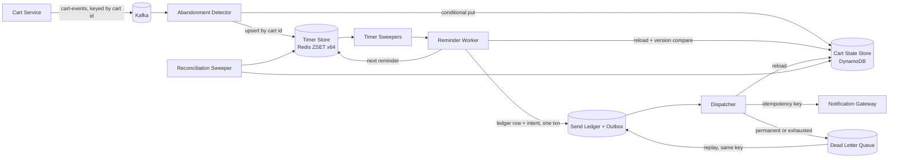

# Abandoned Cart Recovery: Design

## 1. Summary

Shoppers who add items and then go quiet get up to three reminders, at 30 minutes, 1 hour, and 24 hours after their last activity, unless they purchase, clear, or come back to the cart first. Detection is event-driven. Each cart has one record and one pending timer tagged with the cart's version. A timer that fires checks the tag against the record and drops itself if anything changed, so cancellation is a compare, not a delete, and works under at-least-once delivery. Every send has a deterministic idempotency key of cart id, version, and offset index, which dedupes at the ledger and at the notification provider. Failures retry with backoff, dead-letter with a reason, and replay safely under the same key.

The runnable pipeline in this repository implements detection, scheduling, cancellation, idempotency, and failure handling behind interfaces with in-memory adapters, driven by a fake clock. Section 11 maps each interface to its production backing.

## 2. Assumptions

- About 10 events per cart session, about 70% of carts abandon, about 1 KB per event. Peak is 5k events per second, spikes are 2.5x for an hour.
- The Cart Service already exists, owns the durable cart, and publishes events carrying a strictly increasing per-cart version.
- Reminders go through an existing notification gateway that accepts an idempotency key. The gateway is out of scope.
- Offsets are measured from last activity, so with defaults the first reminder fires at the moment the cart is declared abandoned. Configuration rejects a first offset smaller than the window.
- A resume, meaning the shopper reopened the cart, counts as activity. It cancels pending reminders and restarts the inactivity clock. A frequency cap of three sequences per cart per 7 days stops a shopper who keeps peeking from receiving endless sequences.
- The company does not run a workflow engine. See section 12 for the Temporal alternative.

## 3. Success and guardrail metrics

**Control group.** A holdout arm of about 10% of eligible carts is assigned by hashing the shopper key with an experiment salt. Holdout carts run through the whole pipeline and are tracked identically but schedule no sends, so the groups differ only in the reminder.

**Success.** Primary: recovery rate, the share of abandoned carts that purchase within 7 days of abandonment, treatment versus holdout, reported with confidence intervals. Secondary: recovered revenue per abandoned cart, time to recovery. Attribution uses the purchase event, not link clicks, so open and click tracking do not bias it.

**Guardrails, the signs of harm.** Unsubscribe and spam-complaint rates per send, bounce rate, sends after purchase, duplicate sends, sends per shopper per day against the frequency cap, and holdout purchase rate not dropping. Any of these breaching its threshold pauses dispatch. Production design only: the in-memory pipeline counts sends, cancellations, skips, and dead letters, but has no thresholds or pause switch.

**System health.** Consumer lag, timer backlog past due, fire latency p99, dead letter depth, dedupe hit rate, skipped-for-lateness count.

**Targets.** Wrong sends under 0.01% of sends. Timely delivery, within 5 minutes for the 30 minute and 1 hour offsets and 30 minutes for the 24 hour offset, for 99.5% of scheduled reminders. Missed entirely under 0.1% per month. The design drops when in doubt: a stale or too-late reminder is skipped and counted, never sent.

## 4. Detection: event-driven

Event-driven, with lazily validated timers. A batch scan every minute would be simpler to explain, but its precision is bounded by the scan interval, every scan is a wide query over a large cart table, spikes land on scan boundaries, scaling needs manual partitioning, and the cancellation race between the scan reading a row and the checkout writing it still forces a version check. Event-driven gives minute-level precision at 5k events per second, one cheap upsert per event, and horizontal scaling by stream partition.

### Components

| Component | Job | Talks to |
|---|---|---|
| Cart Service (existing) | Publishes `CartEdited`, `CartResumed`, `CartCleared`, `CartPurchased` with cart id, shopper key, version, time, item snapshot | `cart-events` stream, 64 partitions keyed by cart id |
| Abandonment Detector | Upserts the cart record and one version-tagged timer per cart. Ignores events at or below the stored version. Commits the offset after the state write. | Cart State Store, Timer Store |
| Cart State Store | One record per cart: status, version, last activity, snapshot, arm, sequence starts. Conditional writes on version. | DynamoDB |
| Timer Store | Due-time index, one timer per cart, upsert replaces. Derived and rebuildable. | Redis sorted set, 64 shards by cart hash |
| Timer Sweepers | Pop due timers per shard in bounded batches under a short lease. An expired lease returns the timer, giving at-least-once timer delivery. | Reminder Worker |
| Reminder Worker | Reloads the record, compares the version tag and expected status, then drops, marks abandoned and schedules, or writes ledger row plus outbox intent in one conditional transaction. | Cart State Store, Timer Store, Send Ledger, Outbox |
| Dispatcher | Drains the outbox in two priority lanes (production only; the in-memory dispatcher drains in due order), re-validates the cart and the lateness bound, calls the gateway with the idempotency key, retries, dead-letters. | Notification Gateway, Dead Letter Queue |
| Reconciliation Sweeper | Every few minutes reads only carts that still have a next step, from a sparse index of open carts whose last offset has not passed, and reinserts any missing timer, skipping offsets already past their lateness bound. | Cart State Store, Timer Store |
| Config and Metrics | Window, offsets, lateness bounds, frequency cap, holdout, arms. Counters from every stage. | All |

### State machine

Statuses `ACTIVE`, `ABANDONED`, `CLOSED`.

- Edit or resume: `ACTIVE`, version and last activity updated, timer `CHECK_ABANDON` due at last activity plus window, tagged with the version. A closed cart reopens as a new cycle.
- Purchase or clear: `CLOSED`, version updated, best-effort timer removal.
- `CHECK_ABANDON` fires: drop if the version differs or status is not `ACTIVE`. Otherwise `ABANDONED`, and unless the arm is holdout or the cap is reached, timer `REMINDER 0` due at last activity plus the first offset.
- `REMINDER i` fires: drop if the version differs or status is not `ABANDONED`. Skip and count if past the lateness bound. Otherwise write the ledger row and outbox intent. Either way schedule `REMINDER i+1` if one exists.

One timer per cart at all times keeps the Redis upsert model simple and bounds the timer set to the number of in-flight carts.

## 5. Mid-flight cancellation

Three checkpoints, each a cheap read:

1. The version compare when the timer fires. Any edit, resume, purchase, or clear bumps the version, so a timer created before it is stale.
   Demonstrated by: `ReminderSchedulerTest.staleVersionTimerIsDropped`, `reminderForOlderCycleIsDroppedAfterReopenAndReabandon`, `checkAbandonOnClosedCartIsDropped`, `reminderOnActiveCartIsDropped`. End to end, Verifier 3a, 3b, 4a, 4b, and 13 show no send after the version changes, and Verifier 6 shows a redelivered abandonment check dropped by the status compare. In memory the best-effort timer removal always succeeds, so the unit tests are what exercise the compare itself.
2. The ledger and outbox write, conditioned on the record version being unchanged.
   Demonstrated by: Verifier 6 and `ReminderSchedulerTest.duplicateReminderTimerWritesNothingTwice` for the ledger's conditional put on the key. The condition on the record version is production design only: the in-memory scheduler reads then writes on a single thread, so nothing can interleave, while production runs the worker and detector concurrently and needs one conditional transaction.
3. A reload of the record immediately before the gateway call, and before every retry attempt. A purchase seen here cancels the intent. The same checkpoint drops an intent whose scheduled time plus lateness bound has passed, whether on the first attempt, a retry after backoff, or a dead-letter replay, and counts it as skipped late.
   Demonstrated by: Verifier 9b, 9c; `DispatcherTest.cancelsEntryWhenCartWasPurchasedBeforeTheSend`, `purchaseDuringBackoffCancelsTheRetry`, `retryLandingAfterTheLatenessBoundIsDroppedNotSent`, `replayAfterTheLatenessBoundIsDroppedNotSent`, `attemptExactlyAtTheLatenessBoundIsStillSent`.

The residual window is the gateway round trip. Sends after purchase are counted as a guardrail with a target under 0.01%.

## 6. Idempotency under at-least-once delivery

| Layer | Mechanism | Demonstrated by |
|---|---|---|
| Events | Per-cart version monotonicity. Redelivered or reordered events are ignored and counted. | Verifier 5, 7; `AbandonmentDetectorTest.duplicateAndOutOfOrderEventsAreIgnored` |
| Timers | Version tag compared on fire. A redelivered timer fails the ledger existence check. | Verifier 6; `ReminderSchedulerTest.staleVersionTimerIsDropped`, `duplicateReminderTimerWritesNothingTwice` |
| Intents | Ledger key of cart id, version, and offset index, written with a conditional put. | Verifier 6, 8, 10 (one ledger row per key) |
| Gateway | The same key is the provider idempotency key, so a retry after a timeout does not double send. | Verifier 8, 9 show every attempt and the replay carry the same key. Provider-side dedupe is production design only: the gateway is out of scope and the recording sink does not dedupe. |

A reopened cart has a new version, so its reminders get new keys and are not confused with the earlier cycle's. Demonstrated by Verifier 13.

## 7. Failure handling

| Failure | Behaviour | Demonstrated by |
|---|---|---|
| Transient send failure | Exponential backoff with jitter, bounded attempts. The cart is re-validated before each attempt, so a purchase during backoff stops the retry, and a retry that would land past the reminder's lateness bound is dropped and counted instead of sent. | Verifier 8; `DispatcherTest.transientFailureRetriesWithExponentialBackoffThenSucceedsOnce`, `purchaseDuringBackoffCancelsTheRetry`, `retryLandingAfterTheLatenessBoundIsDroppedNotSent`. Jitter is production design only: the in-memory dispatcher uses fixed doubling so fake-clock times are exact. |
| Permanent send failure or exhausted retries | Dead letter with reason. Replay re-enqueues under the same key, and the drain re-validates the cart and the lateness bound, so a replay after purchase or past the bound is dropped and a repeated replay sends nothing more. | Verifier 9, 9b, 9c; `DispatcherTest.exhaustedRetriesGoToDeadLetter`, `permanentFailureGoesStraightToDeadLetterAndReplaySendsOnce`, `replayAfterTheLatenessBoundIsDroppedNotSent` |
| Detector down | Kafka retains events for seven days. The consumer resumes from its committed offset. Reprocessing is idempotent by version. | Idempotent reprocessing: Verifier 5, 7. Retention and offset commits are production design only (no broker in memory). |
| Timer store loss | The store is derived data. The reconciliation sweeper reinserts missing timers from records and the ledger, starting at the first offset still within its lateness bound, so a restart after an outage does not re-run reminders already skipped. Full rebuild scans the state store or replays the stream. Timers that fire past their lateness bound are skipped and counted rather than sent stale. | Verifier 10, 10b, 11; `PipelineTest.restartWhileActiveRebuildsTheCheckTimer`, `restartWhileAbandonedResumesFromTheLedger`, `restartAfterAllRemindersSchedulesNothing`, `restartAfterEveryReminderWasSkippedRebuildsNothing`, `restartAfterPartialOutageSkipsToTheNextOnTimeOffset`. Rebuild by stream replay is production design only. |
| Gateway down | Circuit breaker pauses dispatch, the outbox backs up, drain resumes within lateness bounds. | Production design only: the in-memory dispatcher has no breaker. The backlog behaviour it relies on, retries and dropping past the bound, is Verifier 8 and 9b. |
| Poison event | Schema validation, event dead letter, alert. | Production design only: in-memory events are typed records, so there is no schema to fail. |

## 8. Capacity

| Figure | Baseline | Spike (2.5x for 1 hour) |
|---|---|---|
| Cart events per second | 5,000 | 12,500 |
| Events in the spike hour | | 45 million |
| Stream throughput | 5 MB/s | 12.5 MB/s |
| State and timer upserts per second, each | 5,000 | 12,500 |
| Distinct carts per second | 500 | 1,250 |
| Carts becoming abandoned per second | 350 | 875 |
| Reminder sends per second | about 1,000 | about 2,600 |

Sixty-four partitions keep each under 200 events per second at spike. Redis and DynamoDB absorb 12.5k writes per second each, which a single relational primary would handle only with careful tuning. Abandoned carts keep a timer until their 24 hour reminder, so the in-flight timer set is about 350 per second times 86,400 seconds, roughly 30 million members and about 3 GB, or about 50 MB per shard across 64 shards, which is comfortable and lets sweepers run in parallel. The reconciliation sweep reads only carts that still have a next step: a sparse index of open carts whose last offset has not passed, equivalently records moved to a terminal status or given a TTL after their last offset, so the scan stays bounded by the in-flight set rather than every cart ever seen. The 24 hour reminders for a spike hour land as a burst a day later, so the dispatcher has a rate limiter and a backlog.

## 9. Behaviour under load spikes

Delay, never drop events, never reject upstream. The pipeline is off the checkout path, so cart events are always accepted. Kafka absorbs the burst, detectors autoscale on consumer lag, sweepers pull bounded batches, and the dispatcher rate limits to the gateway. Two priority lanes keep 30 minute reminders ahead of 24 hour ones, because a fresh reminder recovers more revenue than a stale one; this is production design only, the in-memory dispatcher drains in due order. If the backlog grows past the lateness bounds, reminders are skipped and counted rather than sent late, so an extreme spike degrades into fewer reminders instead of a flood of stale ones.

## 10. Secondary topics

**Guest users.** The shopper key is the user id when known, otherwise the session id. On login the Cart Service merges the guest cart into the user cart, keeping the guest quantities for overlapping items because they reflect the most recent intent, then emits a clear for the guest cart and an edit for the user cart. The pipeline needs no new logic: the clear cancels the guest reminders and the edit starts the user cart's clock. Guests get reminders only when a contact channel exists, such as an email captured before checkout or a web push subscription, and are otherwise tracked but not sent.

**Experimentation.** Arms cover timing, meaning alternate offset sets resolved at scheduling time, and message variants resolved at dispatch time. Assignment unit is the shopper key, fixed on the cart record for the cart's life. Trade-off: user id gives a consistent experience across devices and clean attribution but covers only logged-in shoppers, while session id covers everyone but one person can land in several arms across sessions and attribution to a session is noisier. Recommendation: user id when available, session id otherwise, and report the two populations separately.

**Personalization.** The intent carries first name and item snapshot. The dispatcher refreshes the snapshot from the Cart Service at send time, so prices and stock are current, and falls back to the stored snapshot if that call fails.

## 11. The runnable pipeline

Java 21, Gradle, no runtime dependencies. `./gradlew test` runs the fake-clock verifier, `./gradlew run` prints a scripted timeline.

| Interface | In-memory adapter | Production backing |
|---|---|---|
| `Clock` | `FakeClock`, moves forward only | System clock |
| `CartStateStore` | `InMemoryCartStateStore`, conditional put on version | DynamoDB, conditional write |
| `TimerStore` | `PriorityQueueTimerStore`, upsert by cart id | Redis sorted set per shard, `ZADD` replaces |
| `SendLedger` | `InMemorySendLedger` | DynamoDB conditional put on the key |
| `Outbox` | `InMemoryOutbox` | Same table as the ledger, written in one transaction |
| `NotificationSink` | `RecordingNotificationSink`, never sends, scriptable failures | Notification gateway client |
| `DeadLetterQueue` | `InMemoryDeadLetterQueue` | Kafka topic plus replay tool |

Core classes: `AbandonmentDetector` handles events, `ReminderScheduler` handles timer fires, `Dispatcher` drains the outbox, `Reconciler` rebuilds timers. `Pipeline` wires them and drives the clock. `advanceTo` stops at every timer and retry due time so each fire runs at its own virtual time.

The verifier covers: the default schedule, clock reset on edit, cancellation by purchase, clear, and resume, duplicate events, duplicate timers, out-of-order events, transient retry, permanent failure with replay inside the lateness bound, a replay after the bound dropped rather than sent, a replay after purchase cancelled, restart with timer rebuild, including a restart after abandonment but before the first reminder, lateness skipping, holdout, reopen after purchase, the frequency cap, config validation, and a hundred interleaved carts. `PipelineTest` adds a restart after an outage longer than the whole sequence, which rebuilds nothing, a restart after a partial outage, which skips straight to the next offset still on time, and an event ingested after timers were due, which fires them first.

## 12. Alternatives considered

**Batch scan.** Rejected for the reasons in section 4.

**Temporal or a durable workflow engine.** A workflow per cart, edits as signals, a sleep that resets on each signal, and a purchase signal that ends the workflow is a textbook fit, and it removes most of the timer store, reconciliation, and outbox code. The cost is that every edit becomes a durable history write, roughly a billion workflow actions per day at this volume, which is a material bill on a hosted service or a heavy sharded persistence tier when self-hosted, and carts with hundreds of edits need continue-as-new. If the company already runs Temporal, the recommended shape is a hybrid: keep the lightweight stream consumer for the high-volume edit stream and start a workflow only when a cart is confirmed abandoned, about ten times fewer starts than events. That workflow would own the three timers, cancellation by signal, retries, and dead-lettering.

## 13. Questions for the business

- Which contact channels exist for guests, and is capturing an email before checkout acceptable?
- Is the 24 hour reminder subject to quiet hours or local-time delivery windows?
- Does the frequency cap apply per cart or per shopper across carts?
- Are discounts ever included in reminders, which would add a margin guardrail?
