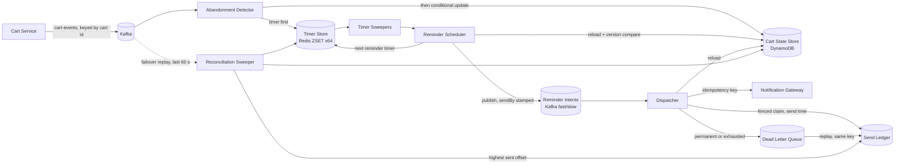

# Abandoned Cart Recovery: Design

## 1. Summary

Shoppers who add items and then go quiet get up to three reminders, at 30 minutes, 1 hour, and 24 hours after their last activity, unless they purchase, clear, or come back to the cart first. Detection is event-driven. Each cart has one record and one pending timer tagged with the cart's version. A timer that fires checks the tag against the record and drops itself if anything changed, so cancellation is a compare, not a delete, and works under at-least-once delivery. Every send has a deterministic idempotency key of cart id, version, and offset index, which dedupes at the ledger and at the notification provider. Failures retry with backoff, dead-letter with a reason, and replay safely under the same key.

The runnable pipeline in this repository implements detection, scheduling, cancellation, idempotency, and failure handling behind interfaces with in-memory adapters, driven by a fake clock. Section 11 maps each interface to its production backing.

## 2. Assumptions

- About 10 events per cart session, about 70% of carts abandon, about 1 KB per event. Peak is 5k events per second, spikes are 2.5x for an hour.
- The Cart Service already exists, owns the durable cart, and publishes events carrying a strictly increasing per-cart version.
- Reminders go through an existing notification gateway that accepts an idempotency key. The gateway is out of scope.
- Offsets are measured from last activity, so with defaults the first reminder fires at the moment the cart is declared abandoned. Configuration rejects a first offset smaller than the window.
- A resume, meaning the shopper reopened the cart, counts as activity. It cancels pending reminders and restarts the inactivity clock. A frequency cap of three sequences per cart per 7 days stops a shopper who keeps peeking from receiving endless sequences.
- The company does not run a workflow engine. See section 12 for the Temporal alternative.

## 3. Success and guardrail metrics

**Control group.** A holdout arm of about 10% of eligible carts is assigned by hashing the shopper key with an experiment salt. Holdout carts run through the whole pipeline and are tracked identically but schedule no sends, so the groups differ only in the reminder.

**Success.** Primary: recovery rate, the share of abandoned carts that purchase within 7 days of abandonment, treatment versus holdout, reported with confidence intervals. Secondary: recovered revenue per abandoned cart, time to recovery. Attribution uses the purchase event, not link clicks, so open and click tracking do not bias it.

**Guardrails, the signs of harm.** Unsubscribe and spam-complaint rates per send, bounce rate, sends after purchase, duplicate sends, sends per shopper per day against the frequency cap, and holdout purchase rate not dropping. Any of these breaching its threshold pauses dispatch. The infra build implements the switch itself: a `recovery-meta.paused` flag, checked by every dispatcher replica every 5 seconds, pauses both lanes within one poll cycle once set. The in-memory pipeline still only counts sends, cancellations, skips, and dead letters, with no threshold logic of its own. Every abandonment, treatment or holdout, is recorded once as an `ABANDONED` outcome tagged with its arm, so the control-group denominator (abandoned carts per arm) comes from the same event stream as the guardrail counts, not a separate query.

**System health.** Consumer lag, timer backlog past due, fire latency p99, dead letter depth, dedupe hit rate, skipped-for-lateness count.

**Targets.** Wrong sends under 0.01% of sends. Timely delivery, within 5 minutes for the 30 minute and 1 hour offsets and 30 minutes for the 24 hour offset, for 99.5% of scheduled reminders. Missed entirely under 0.1% per month. The design drops when in doubt: a stale or too-late reminder is skipped and counted, never sent.

## 4. Detection: event-driven

Event-driven, with lazily validated timers. A batch scan every minute would be simpler to explain, but its precision is bounded by the scan interval, every scan is a wide query over a large cart table, spikes land on scan boundaries, scaling needs manual partitioning, and the cancellation race between the scan reading a row and the checkout writing it still forces a version check. Event-driven gives minute-level precision at 5k events per second, one cheap upsert per event, and horizontal scaling by stream partition.

### Components

| Component | Job | Talks to |
|---|---|---|
| Cart Service (existing) | Publishes `CartEdited`, `CartResumed`, `CartCleared`, `CartPurchased` with cart id, shopper key, version, time, item snapshot | `cart-events` stream, 64 partitions keyed by cart id |
| Abandonment Detector | Writes the timer first, then a field-scoped conditional update to the cart record; ignores events at or below the stored version; commits the offset after both writes. | Cart State Store, Timer Store |
| Cart State Store | One record per cart: status, version, last activity, snapshot, arm, sequence starts, plus a sparse open-cart index entry while a next step is pending. Field-scoped conditional writes on version. | DynamoDB |
| Timer Store | Due-time index, one timer per cart, monotonic upsert by `(version, offsetIndex)`. Derived and rebuildable. | Redis sorted set, 64 shards by cart hash |
| Timer Sweepers | Pop due timers per shard in bounded batches under a short lease. An expired lease returns the timer, giving at-least-once timer delivery. | Reminder Scheduler |
| Reminder Scheduler | For `CHECK_ABANDON`, waits on a watermark gate, then reloads the record and compares the version tag and expected status: drop, or mark abandoned and arm the first reminder timer. For `REMINDER i`, reloads and compares without a watermark wait — freshness there is the dispatcher's watermark gate (§5), not the scheduler's — then drops or publishes a `sendBy`-stamped intent and arms the next reminder timer. Writes no ledger row either way: dedupe is the dispatcher's job. | Cart State Store, Timer Store, Reminder Intents |
| Dispatcher | Consumes reminder intents (two priority lanes in production, one queue in memory), takes a fenced ledger claim at send time, re-validates the cart and `sendBy` at each checkpoint, checks the `recovery-meta.paused` guardrail switch, calls the gateway with the idempotency key, retries with jitter, dead-letters. | Send Ledger, Cart State Store, Notification Gateway, Dead Letter Queue |
| Reconciliation Sweeper | Every few minutes reads only carts that still have a next step, from the sparse open-cart index, and reinserts any timer missing from the store, starting after the ledger's highest sent offset and skipping offsets already past their lateness bound. Also detects a Redis restart or failover and replays recent `cart-events` into timer upserts. | Cart State Store, Timer Store, Send Ledger, `cart-events` (failover replay only) |
| Config and Metrics | Window, offsets, lateness bounds, frequency cap, holdout, arms. Counters from every stage. | All |

The timer-before-record order above lives in the shared `AbandonmentDetector`, so in memory writes in the same order too (Section 11): a crash between the two writes leaves at most a stray timer, which the reconciler repairs from the record, while leaving the record first would let a crash hide an abandoned cart until the next sweep finds it by a wider scan. What is production-only is the crash this protects against: `DynamoCartStateStore` and the Redis timer store are two independent stores that can fail between one write and the next, and the field-scoped `UpdateItem`, conditioned on `version <` the incoming event's version and touching only the fields an event actually changes, removes the lost-update race on `sequenceStarts` that a read-then-write update would have. `InMemoryCartStateStore` and the in-memory timer store are two objects in one JVM with no failure between them, so the identical write order carries no crash-safety meaning there; it is simply inherited from the shared detector.

### State machine

Statuses `ACTIVE`, `ABANDONED`, `CLOSED`.

- Edit or resume: `ACTIVE`, version and last activity updated, timer `CHECK_ABANDON` due at last activity plus window, tagged with the version. A closed cart reopens as a new cycle.
- Purchase or clear: `CLOSED`, version updated, best-effort timer removal.
- `CHECK_ABANDON` fires: drop if the version differs or status is not `ACTIVE`. Otherwise `ABANDONED`, and unless the arm is holdout or the cap is reached, timer `REMINDER 0` due at last activity plus the first offset.
- `REMINDER i` fires: drop if the version differs or status is not `ABANDONED`. Otherwise publish a reminder intent stamped with a `sendBy` deadline — the scheduler no longer checks the lateness bound itself, that check moved to the dispatcher (§5). Either way, schedule `REMINDER i+1` if one exists, otherwise end the sequence.

One timer per cart at all times keeps the Redis upsert model simple and bounds the timer set to the number of in-flight carts.

## 5. Mid-flight cancellation

Three checkpoints, each a cheap read:

1. The version compare when the timer fires. Any edit, resume, purchase, or clear bumps the version, so a timer created before it is stale.
   Demonstrated by: `ReminderSchedulerTest.staleVersionTimerIsDropped`, `reminderForAnOlderCycleIsDropped`, `checkAbandonOnAClosedCartIsDropped`, `reminderOnAnActiveCartIsDropped`. End to end, Verifier 3a, 3b, 4a, 4b, and 13 show no send after the version changes, and Verifier 6 shows a redelivered abandonment check dropped by the status compare. In memory the best-effort timer removal always succeeds, so the unit tests are what exercise the compare itself.
2. The monotonic timer upsert when the reminder is scheduled: `REMINDER i` is written only if its `(version, offsetIndex)` is greater than what is stored, so a stale or redelivered schedule is a no-op rather than a second reminder timer.
   Demonstrated by: Verifier 6; `ReminderSchedulerTest.staleVersionTimerIsDropped`, `aDuplicateReminderTimerPublishesTheSameKeyAgainForTheDispatcherToDedupe`. The upsert only prevents a duplicate *timer*; a duplicate *publish* of the same intent (a redelivery, or two schedulers racing the same due timer) is deduped downstream by a ledger claim taken at send time, not at scheduling time, in either mode — production's fenced claim below, or the in-memory ledger's conditional claim.
3. A reload of the record immediately before the gateway call, and before every retry attempt. A purchase seen here cancels the intent. The same checkpoint drops an intent whose scheduled time plus lateness bound has passed, whether on the first attempt, a retry after backoff, or a dead-letter replay, and counts it as skipped late.
   Demonstrated by: Verifier 9b, 9c; `DispatcherTest.cancelsWhenTheCartWasPurchasedBeforeTheSend`, `purchaseDuringBackoffCancelsTheRetry`, `aRetryLandingAfterSendByIsSkippedNotSent`, `aReplayPastSendByIsSkippedAsLate`, `sendByExactlyNowIsNotLate`.

The residual window is the gateway round trip. Sends after purchase are counted as a guardrail with a target under 0.01%.

**Production infra adds two more checkpoints.** Before checkpoint 3's reload, the dispatcher checks a per-partition watermark — the newest event time each detector has fully processed and committed, published every poll loop — for the intent's recorded source partition; a lagging partition holds only its own reminders, pausing that slice of the dispatch consumer, so a purchase still sitting in Kafka cannot be missed by a read that runs ahead of it. And where the in-memory dispatcher re-validates lateness against whatever the caller passes at each of the three checkpoints, production stamps one deadline, `sendBy`, into the intent when it is scheduled, and checks it before taking a send token, after the claim, and immediately before the call — a late intent is dropped before it can spend any capacity, not just before it can send. The ledger write at checkpoint 2 also moves: production takes a fenced claim (a token good for one lease, conditioned on the ledger row's current status) at send time, for every attempt including retries, rather than once at scheduling time, so a lease holder that overruns its lease is fenced out rather than risking a double send.

## 6. Idempotency under at-least-once delivery

| Layer | Mechanism | Demonstrated by |
|---|---|---|
| Events | Per-cart version monotonicity. Redelivered or reordered events are ignored and counted. | Verifier 5, 7; `AbandonmentDetectorTest.duplicateAndOutOfOrderEventsAreIgnored` |
| Timers | The Redis upsert only writes if the new `(version, offsetIndex)` pair is greater than what is stored; equal data is a no-op that keeps the current lease. A redelivered or stale timer is dropped when it fires and its version no longer matches the record. | Verifier 6; `ReminderSchedulerTest.staleVersionTimerIsDropped`, `aDuplicateReminderTimerPublishesTheSameKeyAgainForTheDispatcherToDedupe`; production: timer store contract tests for the monotonic upsert |
| Intents | Ledger key of cart id, version, and offset index, written with a conditional put. | Verifier 6, 8, 10 (one ledger row per key) |
| Gateway | The same key is the provider idempotency key, so a retry after a timeout does not double send. | Verifier 8, 9 show every attempt and the replay carry the same key. Provider-side dedupe is production design only: the gateway is out of scope and the recording sink does not dedupe. |

A reopened cart has a new version, so its reminders get new keys and are not confused with the earlier cycle's. Demonstrated by Verifier 13.

## 7. Failure handling

| Failure | Behaviour | Demonstrated by |
|---|---|---|
| Transient send failure | Exponential backoff with full jitter, bounded attempts. The cart is re-validated before each attempt, so a purchase during backoff stops the retry, and a retry that would land past the reminder's lateness bound is dropped and counted instead of sent. | Verifier 8; `DispatcherTest.transientFailureRetriesWithExponentialBackoffThenSucceedsOnce`, `purchaseDuringBackoffCancelsTheRetry`, `aRetryLandingAfterSendByIsSkippedNotSent`. The full-jitter formula, `RETRY_BASE × 2^(attempts−1)` times a fraction in [0, 1], lives once in the shared `Dispatcher`, so replicas retrying together don't resonate in production; only the fraction's source differs by mode — `ThreadLocalRandom` in production, a fixed `1.0` in the in-memory `Pipeline` — which turns the identical formula into exact deterministic doubling for the fake-clock verifier. |
| Permanent send failure or exhausted retries | Dead letter with reason. Replay re-enqueues under the same key, and the drain re-validates the cart and the lateness bound, so a replay after purchase or past the bound is dropped and a repeated replay sends nothing more. | Verifier 9, 9b, 9c; `DispatcherTest.exhaustedRetriesAreDeadLetteredWithTheOriginalIntent`, `permanentFailureIsDeadLetteredAndReplaySendsOnce`, `aReplayPastSendByIsSkippedAsLate` |
| Detector down | Kafka retains events for seven days. The consumer resumes from its committed offset. Reprocessing is idempotent by version. | Idempotent reprocessing: Verifier 5, 7. Retention and offset commits are production design only (no broker in memory). |
| Timer store loss | Redis holds only rebuildable state — timers and the watermark, never a system of record. The reconciler's periodic sweep reinserts any timer missing from Redis, from the cart record and the ledger's highest sent offset, skipping offsets already past their lateness bound. On top of the sweep, production detects a Redis restart or failover (comparing Redis's `run_id` and replication role against the values it last stored in `recovery-meta`) and replays the last 60 seconds of `cart-events` into timer upserts — the only kind of write a restart or failover can actually lose, since a lost scheduler write is redelivered by its own lease and a lost remove or reconciler write is harmless. | Verifier 10, 10b, 11; `PipelineTest.restartWhileActiveRebuildsTheCheckTimer`, `restartWhileAbandonedResumesFromTheLedger`, `restartAfterAllRemindersSchedulesNothing`, `restartAfterEveryReminderWasSkippedRebuildsNothing`, `restartAfterPartialOutageSkipsToTheNextOnTimeOffset`; production: the Redis-restart test (`RedisRestartIT`) and e2e 6 (`FLUSHALL`) |
| Gateway down | A circuit breaker wraps the notification sink: over the last 100 send attempts, a transient-failure ratio above 50% opens it for 30 seconds, pausing both lane consumers and the retry loop; one probe send on a half-open breaker decides whether to close it again. | The backlog behaviour behind a paused or open breaker resolves the same way regardless of cause — retries within budget, drop past the lateness bound: Verifier 8 and 9b. In-memory has no breaker of its own. |
| Poison event | A record that fails to deserialize is classified deterministic: consumers send it to the topic's dead-letter topic and commit past it. The scheduler applies the same deterministic-error handling to a timer whose offset no longer exists after the offset count shrank — acks it and counts `timers.poison` instead of leaving it for lease redelivery — and this half is shared: it runs identically for `Pipeline` and is unit-tested in memory. | `ReminderSchedulerTest.aReminderOffsetOutsideTheConfigIsPoisonAndAcked` (both modes); the deserialize-and-DLQ half has no in-memory analogue, since in-memory events are typed records with no schema to fail. |

## 8. Capacity

| Figure | Baseline | Spike (2.5x for 1 hour) |
|---|---|---|
| Cart events per second | 5,000 | 12,500 |
| Events in the spike hour | | 45 million |
| Stream throughput | 5 MB/s | 12.5 MB/s |
| State and timer upserts per second, each | 5,000 | 12,500 |
| Distinct carts per second | 500 | 1,250 |
| Carts becoming abandoned per second | 350 | 875 |
| Reminder sends per second | about 945 | about 2,400 (next-day burst) |

Sixty-four partitions keep each under 200 events per second at spike. Abandoned carts keep a timer until their 24 hour reminder, so the in-flight timer set is about 350 per second times 86,400 seconds, roughly 30 million members and about 3 GB, or about 50 MB per shard across 64 shards, which is comfortable and lets sweepers run in parallel. The reconciliation sweep reads only carts that still have a next step, so the scan stays bounded by the in-flight set rather than every cart ever seen. The 24 hour reminders for a spike hour land as a burst a day later, so the dispatcher has a rate limiter and a backlog.

### Store load (production infra, at the baseline 5k events/s)

| Store | Load | Figure |
|---|---|---|
| `carts` base writes | 1 `UpdateItem` per event, plus 2 per abandonment | about 10k WCU/s baseline, about 25k at spike |
| `carts` GSI writes | only when the open-cart index entry changes | about 1.5k to 2.5k WCU/s baseline; provisioned with headroom, since a throttled GSI back-pressures the base table |
| `carts` reads | consistent `GetItem` per timer fire and per dispatch attempt | about 3k to 6k RCU/s |
| `send-ledger` | claim + GSI insert + finish + GSI delete per reminder, plus failed conditional claims from competing retry pollers | about 3.8k WCU/s baseline, about 9.6k in the next-day burst |
| Redis | one script per event plus claims, acks, and watermark reads and writes | about 8k to 18k ops/s across the cluster; about 5 to 6 GB for about 28 to 32M timers |
| Reconciler sweep | the sparse open-cart index holds in-flight carts only | about 800 RCU/s at the default 5 minute interval; about 30 to 80 s per sweep |
| Failover replay | re-reads the last 60 s of `cart-events`, only after a Redis restart or failover | at most about 750k Redis upserts, no DynamoDB reads |

On-demand capacity absorbs about 2x the previous peak instantly; the 2.5x spike needs warm throughput or provisioned capacity set in advance.

## 9. Behaviour under load spikes

Delay, never drop events, never reject upstream. The pipeline is off the checkout path, so cart events are always accepted. Kafka absorbs the burst, detectors autoscale on consumer lag, sweepers pull bounded batches, and the dispatcher rate limits to the gateway. Two Kafka topics carry the priority lanes, split by `offsetIndex < FAST_OFFSETS` (by default the 30 minute and 1 hour offsets are fast, the 24 hour offset is slow), consumed by separate dispatcher threads sharing one token bucket per replica: the fast lane takes any available token, the slow lane only while more than `FAST_RESERVE` (default 30%) of the bucket remains — so the next-day burst can never strand capacity the fast lane could use, and can never starve it either. In-memory still drains in due order: there is only one process and one thread, so lane priority has nothing to arbitrate. If the backlog grows past the lateness bounds, reminders are skipped and counted rather than sent late, so an extreme spike degrades into fewer reminders instead of a flood of stale ones.

## 10. Secondary topics

**Guest users.** The shopper key is the user id when known, otherwise the session id. On login the Cart Service merges the guest cart into the user cart, keeping the guest quantities for overlapping items because they reflect the most recent intent, then emits a clear for the guest cart and an edit for the user cart. The pipeline needs no new logic: the clear cancels the guest reminders and the edit starts the user cart's clock. Guests get reminders only when a contact channel exists, such as an email captured before checkout or a web push subscription, and are otherwise tracked but not sent.

**Experimentation.** Arms cover timing, meaning alternate offset sets resolved at scheduling time, and message variants resolved at dispatch time. Assignment unit is the shopper key, fixed on the cart record for the cart's life. Trade-off: user id gives a consistent experience across devices and clean attribution but covers only logged-in shoppers, while session id covers everyone but one person can land in several arms across sessions and attribution to a session is noisier. Recommendation: user id when available, session id otherwise, and report the two populations separately.

**Personalization.** The intent carries no items or name, only the identifiers needed to gate and dedupe. The dispatcher builds the message from its consistent cart read, taken right before sending — the same read that re-validates the cart is still abandoned — so first name and the item snapshot are always as current as the cart record, with no separate refresh call and nothing to fall back to if one had failed.

## 11. The runnable pipeline

Java 21, Gradle, no runtime dependencies. `./gradlew test` runs the fake-clock verifier, `./gradlew run` prints a scripted timeline.

| Interface | In-memory adapter | Infra adapter |
|---|---|---|
| `Clock` | `FakeClock`, moves forward only | `Instant::now`, wired per role — no dedicated class |
| `CartStateStore` | `InMemoryCartStateStore`, conditional put on version | DynamoDB `carts` table, field-scoped conditional `UpdateItem`, sparse GSI `open-by-shard` for the reconciler |
| `TimerStore` | `PriorityQueueTimerStore`, upsert by cart id | Redis sorted set per shard, Lua scripts for the monotonic upsert, claim, release, and ack |
| `Watermark` | the clock, or the buffered detector's position | Redis hash, one entry per partition, generation-fenced end-offset snapshots |
| `IntentPublisher` | in-memory queue drained by `Pipeline` | Kafka, two topics split by lane (`reminder-intents-fast` / `reminder-intents-slow`) |
| `SendLedger` | `InMemorySendLedger` | DynamoDB `send-ledger` table, fenced conditional claim, sparse GSI `retrying-by-shard` for the retry loop |
| `NotificationSink` | `RecordingNotificationSink`, never sends, scriptable failures | recording sink producing to Kafka `sink-sends`, with an injectable transient-failure rate for load testing |
| `OutcomeRecorder` | list | Kafka `reminder-outcomes` |
| `DeadLetterQueue` | `InMemoryDeadLetterQueue` | Kafka `reminder-dlq`, replayed by the `replay` role |

The `Outbox` port and `InMemoryOutbox` no longer exist: dedupe moved from a scheduling-time ledger-plus-outbox transaction to a fenced claim taken by the dispatcher at send time (§5, §6).

**Running the infra build.** `docker compose --env-file demo.env up -d --build` starts Kafka, Redis, and DynamoDB Local plus every role at 2 replicas (1 for the reconciler), against `demo.env`'s compressed timings; `docker compose --env-file demo.env --profile load run --rm -e RATE=50 -e DURATION=PT60S loadgen` drives a load test and writes a report under `build/reports/load/`. Every invariant this section's in-memory tests demonstrate is proven again on real infra: contract tests prove adapter parity directly (the monotonic upsert, conditional remove, claim and lease expiry, watermark generation fencing, ledger claim and takeover), and the infra end-to-end tests — roles running as in-process threads against real containers — prove wiring and failure semantics: idle partitions do not pause the gate, a mid-sequence purchase stops the sequence, duplicate and out-of-order events send exactly once, two schedulers and two dispatchers on shared shards send no duplicates across 200 carts, a partial failure rate dead-letters and replays cleanly, a Redis `FLUSHALL` pauses sending and self-heals, and a stopped detector holds only its own partition's carts. A future per-shopper send cap (rather than per-cart) would add a counter item keyed by shopper, incremented by the scheduler alongside `sequenceStarts` — not a change to any key shown above.

Core classes: `AbandonmentDetector` handles events, `ReminderScheduler` handles timer fires, `Dispatcher` drains the outbox, `Reconciler` rebuilds timers. `Pipeline` wires them and drives the clock. `advanceTo` stops at every timer and retry due time so each fire runs at its own virtual time.

The verifier covers: the default schedule, clock reset on edit, cancellation by purchase, clear, and resume, duplicate events, duplicate timers, out-of-order events, transient retry, permanent failure with replay inside the lateness bound, a replay after the bound dropped rather than sent, a replay after purchase cancelled, restart with timer rebuild, including a restart after abandonment but before the first reminder, lateness skipping, holdout, reopen after purchase, the frequency cap, config validation, and a hundred interleaved carts. `PipelineTest` adds a restart after an outage longer than the whole sequence, which rebuilds nothing, a restart after a partial outage, which skips straight to the next offset still on time, and an event ingested after timers were due, which fires them first.

## 12. Alternatives considered

**Batch scan.** Rejected for the reasons in section 4.

**Temporal or a durable workflow engine.** A workflow per cart, edits as signals, a sleep that resets on each signal, and a purchase signal that ends the workflow is a textbook fit, and it removes most of the timer store, reconciliation, and outbox code. The cost is that every edit becomes a durable history write, roughly a billion workflow actions per day at this volume, which is a material bill on a hosted service or a heavy sharded persistence tier when self-hosted, and carts with hundreds of edits need continue-as-new. If the company already runs Temporal, the recommended shape is a hybrid: keep the lightweight stream consumer for the high-volume edit stream and start a workflow only when a cart is confirmed abandoned, about ten times fewer starts than events. That workflow would own the three timers, cancellation by signal, retries, and dead-lettering.

## 13. Questions for the business

- Which contact channels exist for guests, and is capturing an email before checkout acceptable?
- Is the 24 hour reminder subject to quiet hours or local-time delivery windows?
- Does the frequency cap apply per cart or per shopper across carts?
- Are discounts ever included in reminders, which would add a margin guardrail?
- How long does the notification gateway honour an idempotency key? The design's two at-most-once exceptions (§3) both assume it is honoured for at least the longest lateness bound; today that assumption is stood in for by the recording sink and has never been checked against a real gateway.
