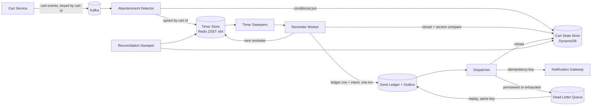

# Abandoned Cart Recovery Implementation Plan

> **For agentic workers:** REQUIRED SUB-SKILL: Use superpowers:subagent-driven-development (recommended) or superpowers:executing-plans to implement this plan task-by-task. Steps use checkbox (`- [ ]`) syntax for tracking.

**Goal:** Build a single-process, framework-free Java 21 detection-and-scheduling pipeline for abandoned-cart reminders with a fake-clock verifier, plus the design document the case study reviewers score.

**Architecture:** Cart events flow into an `AbandonmentDetector` that keeps one record per cart and one version-tagged timer per cart. A `ReminderScheduler` handles timer fires with a compare-on-fire check, writes a send-ledger row and an outbox intent keyed by cart id, version, and offset index, and chains the next reminder timer. A `Dispatcher` drains the outbox with re-validation, retry with backoff, and dead-lettering. A `Pipeline` wires in-memory adapters behind ports and drives everything from a `FakeClock`.

**Tech Stack:** Java 21 (records, sealed interfaces, switch pattern matching), Gradle 8.10 with checked-in wrapper, JUnit 5. No other dependencies.

**Spec:** `docs/superpowers/specs/2026-09-23-abandoned-cart-recovery-design.md`

## Global Constraints

- Java 21, Gradle wrapper checked in, JUnit 5. No third-party runtime dependencies.
- Package root is `com.quince.cartrecovery`. Sub-packages: `model`, `ports`, `core`, `inmemory`. `Pipeline` and `Main` sit in the root package.
- Single-threaded by design. No threads, executors, or locks in the pipeline.
- No real sends. `NotificationSink` implementations only record.
- Default config: window 30 minutes, offsets 30 minutes / 1 hour / 24 hours, lateness bounds 5 minutes / 5 minutes / 30 minutes, frequency cap 3 sequences per cart per 7 days, holdout 10 percent, max send attempts 5, retry base 1 minute.
- Offsets are measured from last activity. Config validation rejects a first offset smaller than the window.
- The design drops when in doubt: stale, mismatched, or too-late timers are dropped or skipped and counted, never sent.
- Every commit uses the `Co-Authored-By: Claude Fable 5.1 <noreply@anthropic.com>` trailer.

## Review Focus

Input classes the spec implies but the scenario list does not name. Each has a pinned test in the owning task.

1. An event for a cart id the pipeline has never seen that is a purchase or clear. Expected: a CLOSED record is created so a later replayed lower-version edit is ignored, no timer is created. Pinned in Task 4.
2. An edit arriving with the same version as the stored record (exact redelivery) after the cart is already ABANDONED. Expected: ignored, the abandoned state and pending reminder timer are untouched. Pinned in Task 4.
3. A reminder timer whose cart record is ABANDONED but the version matches an older cycle because the cart was reopened and abandoned again. Expected: dropped by the version compare, the new cycle's reminders are unaffected. Pinned in Task 5.
4. An outbox entry whose cart was purchased during the retry backoff. Expected: cancelled on the next drain without a send, counted as `dispatch.cancelled`. Pinned in Task 6.
5. `advanceTo` called with a target earlier than the current clock. Expected: no clock rewind, nothing fires, no exception. Pinned in Task 7.

## File Structure

```
build.gradle.kts, settings.gradle.kts, gradlew, gradlew.bat, gradle/wrapper/*
README.md                      how to run tests and the demo
DESIGN.md                      the scored design document
src/main/java/com/quince/cartrecovery/
  model/CartEvent.java         sealed interface + CartEdited, CartResumed, CartCleared, CartPurchased records
  model/CartItem.java
  model/CartStatus.java
  model/Arm.java
  model/CartRecord.java        immutable record with with-ers
  model/TimerKind.java
  model/Timer.java
  model/NotificationIntent.java
  model/OutboxEntry.java
  model/DeadLetter.java
  model/SendResult.java
  model/RecoveryConfig.java    defaults + validation
  ports/Clock.java
  ports/CartStateStore.java
  ports/TimerStore.java
  ports/SendLedger.java
  ports/Outbox.java
  ports/NotificationSink.java
  ports/DeadLetterQueue.java
  ports/ArmAssigner.java
  core/Metrics.java            named counters
  core/ReminderPolicy.java     holdout + frequency cap eligibility (shared by scheduler and reconciler)
  core/AbandonmentDetector.java
  core/ReminderScheduler.java
  core/Dispatcher.java
  core/Reconciler.java
  inmemory/FakeClock.java
  inmemory/InMemoryCartStateStore.java
  inmemory/PriorityQueueTimerStore.java
  inmemory/InMemorySendLedger.java
  inmemory/InMemoryOutbox.java
  inmemory/RecordingNotificationSink.java
  inmemory/InMemoryDeadLetterQueue.java
  inmemory/HashArmAssigner.java
  Pipeline.java                wiring, ingest, advanceTo, outage, restart, redeliver, replayDeadLetters
  Main.java                    scripted demo printing a virtual timeline
src/test/java/com/quince/cartrecovery/
  model/RecoveryConfigTest.java
  inmemory/PriorityQueueTimerStoreTest.java
  inmemory/InMemoryCartStateStoreTest.java
  core/AbandonmentDetectorTest.java
  core/ReminderSchedulerTest.java
  core/DispatcherTest.java
  PipelineTest.java            advanceTo and restart mechanics
  FakeClockVerifierTest.java   the 15 end-to-end scenarios
  TestSupport.java             shared builders and constants
```

---

### Task 1: Project scaffold

**Files:**
- Create: `build.gradle.kts`, `settings.gradle.kts`, `gradle/wrapper/*`, `gradlew`, `gradlew.bat`
- Create: `src/main/java/com/quince/cartrecovery/Main.java` (placeholder that prints one line, replaced in Task 7)
- Test: `src/test/java/com/quince/cartrecovery/SmokeTest.java`

**Interfaces:**
- Produces: a working `./gradlew test` and `./gradlew run`. `JAVA_HOME` convention for this machine.

- [ ] **Step 1: Install JDK 21 and Gradle**

Run:
```bash
brew install openjdk@21 gradle
export JAVA_HOME=/opt/homebrew/opt/openjdk@21/libexec/openjdk.jdk/Contents/Home
"$JAVA_HOME/bin/java" -version
```
Expected: `openjdk version "21...`. Every later Gradle command in this plan assumes `JAVA_HOME` is exported like this in the same shell.

- [ ] **Step 2: Write the build files**

`settings.gradle.kts`:
```kotlin
rootProject.name = "abandoned-cart-recovery"
```

`build.gradle.kts`:
```kotlin
plugins {
    java
    application
}

group = "com.quince"
version = "0.1.0"

java {
    sourceCompatibility = JavaVersion.VERSION_21
    targetCompatibility = JavaVersion.VERSION_21
}

repositories {
    mavenCentral()
}

dependencies {
    testImplementation(platform("org.junit:junit-bom:5.10.2"))
    testImplementation("org.junit.jupiter:junit-jupiter")
    testRuntimeOnly("org.junit.platform:junit-platform-launcher")
}

application {
    mainClass.set("com.quince.cartrecovery.Main")
}

tasks.test {
    useJUnitPlatform()
    testLogging {
        events("passed", "failed", "skipped")
        showStandardStreams = false
    }
}
```

- [ ] **Step 3: Generate the wrapper**

Run:
```bash
cd /Users/vikas/Work/Interviews/quince && gradle wrapper --gradle-version 8.10.2 && ./gradlew --version
```
Expected: `Gradle 8.10.2` and a JVM line showing 21.

- [ ] **Step 4: Write the failing smoke test and placeholder main**

`src/test/java/com/quince/cartrecovery/SmokeTest.java`:
```java
package com.quince.cartrecovery;

import static org.junit.jupiter.api.Assertions.assertEquals;

import org.junit.jupiter.api.Test;

class SmokeTest {
    @Test
    void junitRunsOnJava21() {
        assertEquals(21, Runtime.version().feature());
    }
}
```

`src/main/java/com/quince/cartrecovery/Main.java`:
```java
package com.quince.cartrecovery;

public final class Main {
    public static void main(String[] args) {
        System.out.println("abandoned-cart-recovery scaffold");
    }
}
```

- [ ] **Step 5: Run the test and the app**

Run: `./gradlew test run --console=plain`
Expected: `SmokeTest > junitRunsOnJava21() PASSED` and the scaffold line printed, `BUILD SUCCESSFUL`.

- [ ] **Step 6: Commit**

```bash
git add build.gradle.kts settings.gradle.kts gradlew gradlew.bat gradle src
git commit -m "Scaffold Gradle project with JUnit 5 on Java 21

Co-Authored-By: Claude Fable 5.1 <noreply@anthropic.com>"
```

---

### Task 2: Domain model and config

**Files:**
- Create: all files under `src/main/java/com/quince/cartrecovery/model/`
- Test: `src/test/java/com/quince/cartrecovery/model/RecoveryConfigTest.java`

**Interfaces:**
- Produces the types every later task uses. Signatures are exact; later tasks call them by these names.

- [ ] **Step 1: Write the failing config tests**

`src/test/java/com/quince/cartrecovery/model/RecoveryConfigTest.java`:
```java
package com.quince.cartrecovery.model;

import static org.junit.jupiter.api.Assertions.assertEquals;
import static org.junit.jupiter.api.Assertions.assertThrows;

import java.time.Duration;
import java.util.List;
import org.junit.jupiter.api.Test;

class RecoveryConfigTest {

    @Test
    void defaultsMatchTheBrief() {
        RecoveryConfig c = RecoveryConfig.defaults();
        assertEquals(Duration.ofMinutes(30), c.window());
        assertEquals(List.of(Duration.ofMinutes(30), Duration.ofHours(1), Duration.ofHours(24)), c.offsets());
        assertEquals(List.of(Duration.ofMinutes(5), Duration.ofMinutes(5), Duration.ofMinutes(30)), c.latenessBounds());
        assertEquals(3, c.frequencyCap());
        assertEquals(Duration.ofDays(7), c.frequencyWindow());
        assertEquals(10, c.holdoutPercent());
        assertEquals(5, c.maxSendAttempts());
        assertEquals(Duration.ofMinutes(1), c.retryBase());
    }

    @Test
    void rejectsFirstOffsetSmallerThanWindow() {
        assertThrows(IllegalArgumentException.class, () ->
            RecoveryConfig.defaults().withWindow(Duration.ofMinutes(45)));
    }

    @Test
    void rejectsOffsetsThatAreNotIncreasing() {
        assertThrows(IllegalArgumentException.class, () ->
            RecoveryConfig.defaults().withOffsets(List.of(Duration.ofHours(1), Duration.ofMinutes(30))));
    }

    @Test
    void rejectsLatenessBoundsOfDifferentLength() {
        assertThrows(IllegalArgumentException.class, () ->
            RecoveryConfig.defaults().withLatenessBounds(List.of(Duration.ofMinutes(5))));
    }

    @Test
    void withOffsetsResizesLatenessBoundsToMatch() {
        RecoveryConfig c = RecoveryConfig.defaults()
            .withOffsets(List.of(Duration.ofMinutes(30), Duration.ofHours(2)));
        assertEquals(2, c.latenessBounds().size());
    }
}
```

- [ ] **Step 2: Run to verify it fails**

Run: `./gradlew test --tests 'com.quince.cartrecovery.model.RecoveryConfigTest' --console=plain`
Expected: compilation failure, `RecoveryConfig` does not exist.

- [ ] **Step 3: Write the model types**

`model/CartItem.java`:
```java
package com.quince.cartrecovery.model;

public record CartItem(String sku, String name, int quantity, long priceCents) {}
```

`model/CartEvent.java`:
```java
package com.quince.cartrecovery.model;

import java.time.Instant;
import java.util.List;

/** Events published by the Cart Service. Version is per cart and strictly increasing. */
public sealed interface CartEvent permits CartEvent.CartEdited, CartEvent.CartResumed,
        CartEvent.CartCleared, CartEvent.CartPurchased {

    String cartId();
    String shopperKey();
    long version();
    Instant occurredAt();

    record CartEdited(String cartId, String shopperKey, long version, Instant occurredAt,
                      List<CartItem> items) implements CartEvent {}

    record CartResumed(String cartId, String shopperKey, long version, Instant occurredAt)
            implements CartEvent {}

    record CartCleared(String cartId, String shopperKey, long version, Instant occurredAt)
            implements CartEvent {}

    record CartPurchased(String cartId, String shopperKey, long version, Instant occurredAt)
            implements CartEvent {}
}
```

`model/CartStatus.java`:
```java
package com.quince.cartrecovery.model;

public enum CartStatus { ACTIVE, ABANDONED, CLOSED }
```

`model/Arm.java`:
```java
package com.quince.cartrecovery.model;

public enum Arm { TREATMENT, HOLDOUT }
```

`model/CartRecord.java`:
```java
package com.quince.cartrecovery.model;

import java.time.Instant;
import java.util.ArrayList;
import java.util.List;

/** One record per cart. sequenceStarts holds the last-activity time of each reminder sequence started. */
public record CartRecord(String cartId, String shopperKey, CartStatus status, long version,
                         Instant lastActivityAt, List<CartItem> items, Arm arm,
                         List<Instant> sequenceStarts) {

    public CartRecord {
        items = List.copyOf(items);
        sequenceStarts = List.copyOf(sequenceStarts);
    }

    public static CartRecord fresh(String cartId, String shopperKey, Arm arm) {
        return new CartRecord(cartId, shopperKey, CartStatus.ACTIVE, 0L, Instant.EPOCH, List.of(), arm, List.of());
    }

    public CartRecord activity(long newVersion, Instant at, List<CartItem> newItems) {
        return new CartRecord(cartId, shopperKey, CartStatus.ACTIVE, newVersion, at, newItems, arm, sequenceStarts);
    }

    public CartRecord closed(long newVersion, Instant at) {
        return new CartRecord(cartId, shopperKey, CartStatus.CLOSED, newVersion, at, items, arm, sequenceStarts);
    }

    public CartRecord abandoned() {
        List<Instant> starts = new ArrayList<>(sequenceStarts);
        starts.add(lastActivityAt);
        return new CartRecord(cartId, shopperKey, CartStatus.ABANDONED, version, lastActivityAt, items, arm, starts);
    }
}
```

`model/TimerKind.java`:
```java
package com.quince.cartrecovery.model;

public enum TimerKind { CHECK_ABANDON, REMINDER }
```

`model/Timer.java`:
```java
package com.quince.cartrecovery.model;

import java.time.Instant;

/** One pending timer per cart. offsetIndex is -1 for CHECK_ABANDON. */
public record Timer(String cartId, TimerKind kind, long version, int offsetIndex, Instant dueAt) {

    public static Timer checkAbandon(String cartId, long version, Instant dueAt) {
        return new Timer(cartId, TimerKind.CHECK_ABANDON, version, -1, dueAt);
    }

    public static Timer reminder(String cartId, long version, int offsetIndex, Instant dueAt) {
        return new Timer(cartId, TimerKind.REMINDER, version, offsetIndex, dueAt);
    }
}
```

`model/NotificationIntent.java`:
```java
package com.quince.cartrecovery.model;

import java.time.Instant;
import java.util.List;

public record NotificationIntent(String idempotencyKey, String cartId, String shopperKey, long version,
                                 int offsetIndex, Instant scheduledFor, List<CartItem> items) {

    public static String key(String cartId, long version, int offsetIndex) {
        return cartId + ":" + version + ":" + offsetIndex;
    }
}
```

`model/OutboxEntry.java`:
```java
package com.quince.cartrecovery.model;

import java.time.Instant;

public record OutboxEntry(NotificationIntent intent, int attempts, Instant nextAttemptAt) {

    public String key() { return intent.idempotencyKey(); }

    public OutboxEntry retryAt(Instant at) {
        return new OutboxEntry(intent, attempts + 1, at);
    }
}
```

`model/DeadLetter.java`:
```java
package com.quince.cartrecovery.model;

import java.time.Instant;

public record DeadLetter(NotificationIntent intent, String reason, Instant at) {}
```

`model/SendResult.java`:
```java
package com.quince.cartrecovery.model;

public enum SendResult { SENT, TRANSIENT_FAILURE, PERMANENT_FAILURE }
```

`model/RecoveryConfig.java`:
```java
package com.quince.cartrecovery.model;

import java.time.Duration;
import java.util.List;

public record RecoveryConfig(Duration window, List<Duration> offsets, List<Duration> latenessBounds,
                             int frequencyCap, Duration frequencyWindow, int holdoutPercent,
                             int maxSendAttempts, Duration retryBase) {

    public RecoveryConfig {
        offsets = List.copyOf(offsets);
        latenessBounds = List.copyOf(latenessBounds);
        if (offsets.isEmpty()) throw new IllegalArgumentException("at least one offset required");
        if (offsets.get(0).compareTo(window) < 0)
            throw new IllegalArgumentException("first offset " + offsets.get(0) + " must be >= window " + window);
        for (int i = 1; i < offsets.size(); i++) {
            if (offsets.get(i).compareTo(offsets.get(i - 1)) <= 0)
                throw new IllegalArgumentException("offsets must be strictly increasing");
        }
        if (latenessBounds.size() != offsets.size())
            throw new IllegalArgumentException("one lateness bound per offset required");
        if (frequencyCap < 0 || holdoutPercent < 0 || holdoutPercent > 100 || maxSendAttempts < 1)
            throw new IllegalArgumentException("invalid numeric config");
    }

    public static RecoveryConfig defaults() {
        return new RecoveryConfig(
            Duration.ofMinutes(30),
            List.of(Duration.ofMinutes(30), Duration.ofHours(1), Duration.ofHours(24)),
            List.of(Duration.ofMinutes(5), Duration.ofMinutes(5), Duration.ofMinutes(30)),
            3, Duration.ofDays(7), 10, 5, Duration.ofMinutes(1));
    }

    public RecoveryConfig withWindow(Duration w) {
        return new RecoveryConfig(w, offsets, latenessBounds, frequencyCap, frequencyWindow, holdoutPercent, maxSendAttempts, retryBase);
    }

    /** Replaces offsets and resets lateness bounds to 5 minutes each so the sizes stay in step. */
    public RecoveryConfig withOffsets(List<Duration> o) {
        List<Duration> bounds = o.stream().map(x -> Duration.ofMinutes(5)).toList();
        return new RecoveryConfig(window, o, bounds, frequencyCap, frequencyWindow, holdoutPercent, maxSendAttempts, retryBase);
    }

    public RecoveryConfig withLatenessBounds(List<Duration> b) {
        return new RecoveryConfig(window, offsets, b, frequencyCap, frequencyWindow, holdoutPercent, maxSendAttempts, retryBase);
    }

    public RecoveryConfig withFrequencyCap(int cap) {
        return new RecoveryConfig(window, offsets, latenessBounds, cap, frequencyWindow, holdoutPercent, maxSendAttempts, retryBase);
    }

    public RecoveryConfig withMaxSendAttempts(int n) {
        return new RecoveryConfig(window, offsets, latenessBounds, frequencyCap, frequencyWindow, holdoutPercent, n, retryBase);
    }
}
```

- [ ] **Step 4: Run to verify it passes**

Run: `./gradlew test --tests 'com.quince.cartrecovery.model.RecoveryConfigTest' --console=plain`
Expected: 5 tests PASSED.

- [ ] **Step 5: Commit**

```bash
git add src/main/java/com/quince/cartrecovery/model src/test/java/com/quince/cartrecovery/model
git commit -m "Add domain model and validated recovery config

Co-Authored-By: Claude Fable 5.1 <noreply@anthropic.com>"
```

---

### Task 3: Ports, in-memory adapters, metrics

**Files:**
- Create: all files under `src/main/java/com/quince/cartrecovery/ports/` and `inmemory/`, plus `core/Metrics.java`
- Test: `src/test/java/com/quince/cartrecovery/inmemory/PriorityQueueTimerStoreTest.java`, `InMemoryCartStateStoreTest.java`

**Interfaces:**
- Consumes: model types from Task 2.
- Produces: the port interfaces below, used verbatim by Tasks 4 to 7.

- [ ] **Step 1: Write the failing adapter tests**

`src/test/java/com/quince/cartrecovery/inmemory/PriorityQueueTimerStoreTest.java`:
```java
package com.quince.cartrecovery.inmemory;

import static org.junit.jupiter.api.Assertions.assertEquals;
import static org.junit.jupiter.api.Assertions.assertTrue;

import com.quince.cartrecovery.model.Timer;
import java.time.Instant;
import java.util.List;
import java.util.Optional;
import org.junit.jupiter.api.Test;

class PriorityQueueTimerStoreTest {
    private static final Instant T0 = Instant.parse("2026-01-01T00:00:00Z");

    @Test
    void popsDueTimersInDueOrder() {
        PriorityQueueTimerStore store = new PriorityQueueTimerStore();
        store.upsert(Timer.checkAbandon("b", 1, T0.plusSeconds(20)));
        store.upsert(Timer.checkAbandon("a", 1, T0.plusSeconds(10)));
        store.upsert(Timer.checkAbandon("c", 1, T0.plusSeconds(30)));

        List<Timer> due = store.popDue(T0.plusSeconds(20));

        assertEquals(List.of("a", "b"), due.stream().map(Timer::cartId).toList());
        assertEquals(Optional.of(T0.plusSeconds(30)), store.nextDueAt());
    }

    @Test
    void upsertReplacesTheTimerForTheSameCart() {
        PriorityQueueTimerStore store = new PriorityQueueTimerStore();
        store.upsert(Timer.checkAbandon("a", 1, T0.plusSeconds(10)));
        store.upsert(Timer.checkAbandon("a", 2, T0.plusSeconds(50)));

        assertTrue(store.popDue(T0.plusSeconds(10)).isEmpty());
        List<Timer> due = store.popDue(T0.plusSeconds(50));
        assertEquals(1, due.size());
        assertEquals(2, due.get(0).version());
    }

    @Test
    void removeAndClearDropTimers() {
        PriorityQueueTimerStore store = new PriorityQueueTimerStore();
        store.upsert(Timer.checkAbandon("a", 1, T0));
        store.upsert(Timer.checkAbandon("b", 1, T0));
        store.remove("a");
        assertEquals(1, store.size());
        store.clear();
        assertEquals(0, store.size());
        assertEquals(Optional.empty(), store.nextDueAt());
    }
}
```

`src/test/java/com/quince/cartrecovery/inmemory/InMemoryCartStateStoreTest.java`:
```java
package com.quince.cartrecovery.inmemory;

import static org.junit.jupiter.api.Assertions.assertEquals;
import static org.junit.jupiter.api.Assertions.assertFalse;
import static org.junit.jupiter.api.Assertions.assertTrue;

import com.quince.cartrecovery.model.Arm;
import com.quince.cartrecovery.model.CartRecord;
import com.quince.cartrecovery.model.CartStatus;
import com.quince.cartrecovery.ports.CartStateStore;
import java.time.Instant;
import java.util.List;
import org.junit.jupiter.api.Test;

class InMemoryCartStateStoreTest {
    private static final Instant T0 = Instant.parse("2026-01-01T00:00:00Z");

    @Test
    void conditionalPutRejectsStaleExpectedVersion() {
        InMemoryCartStateStore store = new InMemoryCartStateStore();
        CartRecord v1 = CartRecord.fresh("a", "u1", Arm.TREATMENT).activity(1, T0, List.of());
        assertTrue(store.put(v1, CartStateStore.ABSENT));
        assertFalse(store.put(v1, CartStateStore.ABSENT));

        CartRecord v2 = v1.activity(2, T0.plusSeconds(1), List.of());
        assertFalse(store.put(v2, 5));
        assertTrue(store.put(v2, 1));
        assertEquals(2, store.get("a").orElseThrow().version());
    }

    @Test
    void scanOpenExcludesClosedRecords() {
        InMemoryCartStateStore store = new InMemoryCartStateStore();
        CartRecord open = CartRecord.fresh("a", "u1", Arm.TREATMENT).activity(1, T0, List.of());
        CartRecord closed = CartRecord.fresh("b", "u2", Arm.TREATMENT).activity(1, T0, List.of()).closed(2, T0);
        store.put(open, CartStateStore.ABSENT);
        store.put(closed, CartStateStore.ABSENT);

        List<CartRecord> scanned = store.scanOpen();
        assertEquals(1, scanned.size());
        assertEquals(CartStatus.ACTIVE, scanned.get(0).status());
    }
}
```

- [ ] **Step 2: Run to verify it fails**

Run: `./gradlew test --tests 'com.quince.cartrecovery.inmemory.*' --console=plain`
Expected: compilation failure, the classes do not exist.

- [ ] **Step 3: Write the ports**

`ports/Clock.java`:
```java
package com.quince.cartrecovery.ports;

import java.time.Instant;

public interface Clock {
    Instant now();
}
```

`ports/CartStateStore.java`:
```java
package com.quince.cartrecovery.ports;

import com.quince.cartrecovery.model.CartRecord;
import java.util.List;
import java.util.Optional;

/** Durable per-cart state. Production: DynamoDB with a conditional write on version. */
public interface CartStateStore {
    long ABSENT = -1L;

    Optional<CartRecord> get(String cartId);

    /**
     * Writes the record only if the stored version equals expectedVersion,
     * or if expectedVersion is ABSENT and no record exists. Returns whether it wrote.
     */
    boolean put(CartRecord record, long expectedVersion);

    /** All ACTIVE and ABANDONED records, for reconciliation. */
    List<CartRecord> scanOpen();
}
```

`ports/TimerStore.java`:
```java
package com.quince.cartrecovery.ports;

import com.quince.cartrecovery.model.Timer;
import java.time.Instant;
import java.util.List;
import java.util.Optional;

/** Derived due-time index, one timer per cart. Production: Redis sorted set sharded by cart hash. */
public interface TimerStore {
    void upsert(Timer timer);
    void remove(String cartId);
    List<Timer> popDue(Instant upTo);
    Optional<Instant> nextDueAt();
    int size();
    void clear();
}
```

`ports/SendLedger.java`:
```java
package com.quince.cartrecovery.ports;

/** Dedupe ledger keyed by cart id, version, offset index. Production: DynamoDB conditional put. */
public interface SendLedger {
    /** Returns true if the row was newly recorded, false if it already existed. */
    boolean recordIfAbsent(String cartId, long version, int offsetIndex);

    /** Highest offset index recorded for this cart and version, or -1 if none. */
    int highestOffsetIndex(String cartId, long version);

    int size();
}
```

`ports/Outbox.java`:
```java
package com.quince.cartrecovery.ports;

import com.quince.cartrecovery.model.OutboxEntry;
import java.time.Instant;
import java.util.List;
import java.util.Optional;

public interface Outbox {
    void add(OutboxEntry entry);
    List<OutboxEntry> due(Instant now);
    void replace(OutboxEntry entry);
    void remove(String key);
    Optional<Instant> nextDueAt();
    int size();
}
```

`ports/NotificationSink.java`:
```java
package com.quince.cartrecovery.ports;

import com.quince.cartrecovery.model.NotificationIntent;
import com.quince.cartrecovery.model.SendResult;

/** The notification gateway boundary. No implementation in this repo performs a real send. */
public interface NotificationSink {
    SendResult send(NotificationIntent intent);
}
```

`ports/DeadLetterQueue.java`:
```java
package com.quince.cartrecovery.ports;

import com.quince.cartrecovery.model.DeadLetter;
import java.util.List;

public interface DeadLetterQueue {
    void add(DeadLetter letter);
    /** Removes and returns everything, for replay. */
    List<DeadLetter> drain();
    int size();
}
```

`ports/ArmAssigner.java`:
```java
package com.quince.cartrecovery.ports;

import com.quince.cartrecovery.model.Arm;

@FunctionalInterface
public interface ArmAssigner {
    Arm assign(String shopperKey);
}
```

- [ ] **Step 4: Write metrics and the in-memory adapters**

`core/Metrics.java`:
```java
package com.quince.cartrecovery.core;

import java.util.Map;
import java.util.TreeMap;

/** Named counters. Production: emitted to the metrics backend from every stage. */
public final class Metrics {
    private final Map<String, Long> counters = new TreeMap<>();

    public void increment(String name) {
        counters.merge(name, 1L, Long::sum);
    }

    public long get(String name) {
        return counters.getOrDefault(name, 0L);
    }

    public Map<String, Long> snapshot() {
        return Map.copyOf(counters);
    }
}
```

`inmemory/FakeClock.java`:
```java
package com.quince.cartrecovery.inmemory;

import com.quince.cartrecovery.ports.Clock;
import java.time.Duration;
import java.time.Instant;

public final class FakeClock implements Clock {
    private Instant now;

    public FakeClock(Instant start) { this.now = start; }

    @Override public Instant now() { return now; }

    /** Moves forward only. A target in the past is ignored. */
    public void set(Instant target) {
        if (target.isAfter(now)) now = target;
    }

    public void advance(Duration d) { now = now.plus(d); }
}
```

`inmemory/InMemoryCartStateStore.java`:
```java
package com.quince.cartrecovery.inmemory;

import com.quince.cartrecovery.model.CartRecord;
import com.quince.cartrecovery.model.CartStatus;
import com.quince.cartrecovery.ports.CartStateStore;
import java.util.HashMap;
import java.util.List;
import java.util.Map;
import java.util.Optional;

public final class InMemoryCartStateStore implements CartStateStore {
    private final Map<String, CartRecord> records = new HashMap<>();

    @Override public Optional<CartRecord> get(String cartId) {
        return Optional.ofNullable(records.get(cartId));
    }

    @Override public boolean put(CartRecord record, long expectedVersion) {
        CartRecord current = records.get(record.cartId());
        long currentVersion = current == null ? ABSENT : current.version();
        if (currentVersion != expectedVersion) return false;
        records.put(record.cartId(), record);
        return true;
    }

    @Override public List<CartRecord> scanOpen() {
        return records.values().stream()
            .filter(r -> r.status() != CartStatus.CLOSED)
            .sorted((a, b) -> a.cartId().compareTo(b.cartId()))
            .toList();
    }
}
```

`inmemory/PriorityQueueTimerStore.java`:
```java
package com.quince.cartrecovery.inmemory;

import com.quince.cartrecovery.model.Timer;
import com.quince.cartrecovery.ports.TimerStore;
import java.time.Instant;
import java.util.ArrayList;
import java.util.Comparator;
import java.util.HashMap;
import java.util.List;
import java.util.Map;
import java.util.Optional;
import java.util.PriorityQueue;

/** Map by cart id for upsert semantics, priority queue for due ordering. Stale queue entries are skipped on pop. */
public final class PriorityQueueTimerStore implements TimerStore {
    private static final Comparator<Timer> BY_DUE = Comparator.comparing(Timer::dueAt).thenComparing(Timer::cartId);

    private final Map<String, Timer> byCart = new HashMap<>();
    private final PriorityQueue<Timer> queue = new PriorityQueue<>(BY_DUE);

    @Override public void upsert(Timer timer) {
        byCart.put(timer.cartId(), timer);
        queue.add(timer);
    }

    @Override public void remove(String cartId) {
        byCart.remove(cartId);
        compact();
    }

    @Override public List<Timer> popDue(Instant upTo) {
        List<Timer> due = new ArrayList<>();
        compact();
        while (!queue.isEmpty() && !queue.peek().dueAt().isAfter(upTo)) {
            Timer t = queue.poll();
            byCart.remove(t.cartId());
            due.add(t);
            compact();
        }
        return due;
    }

    @Override public Optional<Instant> nextDueAt() {
        compact();
        return Optional.ofNullable(queue.peek()).map(Timer::dueAt);
    }

    @Override public int size() { return byCart.size(); }

    @Override public void clear() {
        byCart.clear();
        queue.clear();
    }

    /** Drops queue heads that no longer match the live timer for their cart. */
    private void compact() {
        while (!queue.isEmpty() && !queue.peek().equals(byCart.get(queue.peek().cartId()))) {
            queue.poll();
        }
    }
}
```

`inmemory/InMemorySendLedger.java`:
```java
package com.quince.cartrecovery.inmemory;

import com.quince.cartrecovery.model.NotificationIntent;
import com.quince.cartrecovery.ports.SendLedger;
import java.util.HashMap;
import java.util.Map;

public final class InMemorySendLedger implements SendLedger {
    private final Map<String, Integer> highestByCartVersion = new HashMap<>();
    private final Map<String, Boolean> keys = new HashMap<>();

    @Override public boolean recordIfAbsent(String cartId, long version, int offsetIndex) {
        String key = NotificationIntent.key(cartId, version, offsetIndex);
        if (keys.putIfAbsent(key, Boolean.TRUE) != null) return false;
        highestByCartVersion.merge(cartId + ":" + version, offsetIndex, Math::max);
        return true;
    }

    @Override public int highestOffsetIndex(String cartId, long version) {
        return highestByCartVersion.getOrDefault(cartId + ":" + version, -1);
    }

    @Override public int size() { return keys.size(); }
}
```

`inmemory/InMemoryOutbox.java`:
```java
package com.quince.cartrecovery.inmemory;

import com.quince.cartrecovery.model.OutboxEntry;
import com.quince.cartrecovery.ports.Outbox;
import java.time.Instant;
import java.util.LinkedHashMap;
import java.util.List;
import java.util.Map;
import java.util.Optional;

public final class InMemoryOutbox implements Outbox {
    private final Map<String, OutboxEntry> entries = new LinkedHashMap<>();

    @Override public void add(OutboxEntry entry) { entries.put(entry.key(), entry); }

    @Override public List<OutboxEntry> due(Instant now) {
        return entries.values().stream().filter(e -> !e.nextAttemptAt().isAfter(now)).toList();
    }

    @Override public void replace(OutboxEntry entry) { entries.put(entry.key(), entry); }

    @Override public void remove(String key) { entries.remove(key); }

    @Override public Optional<Instant> nextDueAt() {
        return entries.values().stream().map(OutboxEntry::nextAttemptAt).min(Instant::compareTo);
    }

    @Override public int size() { return entries.size(); }
}
```

`inmemory/RecordingNotificationSink.java`:
```java
package com.quince.cartrecovery.inmemory;

import com.quince.cartrecovery.model.NotificationIntent;
import com.quince.cartrecovery.model.SendResult;
import com.quince.cartrecovery.ports.Clock;
import com.quince.cartrecovery.ports.NotificationSink;
import java.time.Instant;
import java.util.ArrayDeque;
import java.util.ArrayList;
import java.util.Deque;
import java.util.List;

/** Records what would have been sent. Never sends. Outcomes can be scripted for failure scenarios. */
public final class RecordingNotificationSink implements NotificationSink {
    public record Sent(NotificationIntent intent, Instant sentAt) {}

    private final Clock clock;
    private final List<Sent> sent = new ArrayList<>();
    private final Deque<SendResult> scripted = new ArrayDeque<>();
    private int attempts = 0;

    public RecordingNotificationSink(Clock clock) { this.clock = clock; }

    /** The next calls to send return these results in order, then SENT. */
    public void scriptOutcomes(SendResult... results) {
        scripted.addAll(List.of(results));
    }

    @Override public SendResult send(NotificationIntent intent) {
        attempts++;
        SendResult result = scripted.isEmpty() ? SendResult.SENT : scripted.poll();
        if (result == SendResult.SENT) sent.add(new Sent(intent, clock.now()));
        return result;
    }

    public List<Sent> sent() { return List.copyOf(sent); }
    public int attempts() { return attempts; }
}
```

`inmemory/InMemoryDeadLetterQueue.java`:
```java
package com.quince.cartrecovery.inmemory;

import com.quince.cartrecovery.model.DeadLetter;
import com.quince.cartrecovery.ports.DeadLetterQueue;
import java.util.ArrayList;
import java.util.List;

public final class InMemoryDeadLetterQueue implements DeadLetterQueue {
    private final List<DeadLetter> letters = new ArrayList<>();

    @Override public void add(DeadLetter letter) { letters.add(letter); }

    @Override public List<DeadLetter> drain() {
        List<DeadLetter> out = List.copyOf(letters);
        letters.clear();
        return out;
    }

    @Override public int size() { return letters.size(); }
}
```

`inmemory/HashArmAssigner.java`:
```java
package com.quince.cartrecovery.inmemory;

import com.quince.cartrecovery.model.Arm;
import com.quince.cartrecovery.ports.ArmAssigner;

/** Deterministic bucketing by shopper key and experiment salt. */
public final class HashArmAssigner implements ArmAssigner {
    private final String salt;
    private final int holdoutPercent;

    public HashArmAssigner(String salt, int holdoutPercent) {
        this.salt = salt;
        this.holdoutPercent = holdoutPercent;
    }

    @Override public Arm assign(String shopperKey) {
        int bucket = Math.floorMod((shopperKey + ":" + salt).hashCode(), 100);
        return bucket < holdoutPercent ? Arm.HOLDOUT : Arm.TREATMENT;
    }
}
```

- [ ] **Step 5: Run to verify it passes**

Run: `./gradlew test --tests 'com.quince.cartrecovery.inmemory.*' --console=plain`
Expected: 5 tests PASSED.

- [ ] **Step 6: Commit**

```bash
git add src/main/java/com/quince/cartrecovery/ports src/main/java/com/quince/cartrecovery/inmemory src/main/java/com/quince/cartrecovery/core/Metrics.java src/test/java/com/quince/cartrecovery/inmemory
git commit -m "Add ports, in-memory adapters, fake clock, and metrics

Co-Authored-By: Claude Fable 5.1 <noreply@anthropic.com>"
```

---

### Task 4: Reminder policy and abandonment detector

**Files:**
- Create: `src/main/java/com/quince/cartrecovery/core/ReminderPolicy.java`, `core/AbandonmentDetector.java`
- Create: `src/test/java/com/quince/cartrecovery/TestSupport.java`
- Test: `src/test/java/com/quince/cartrecovery/core/AbandonmentDetectorTest.java`

**Interfaces:**
- Consumes: model types, `CartStateStore`, `TimerStore`, `ArmAssigner`, `Metrics`, `RecoveryConfig`.
- Produces: `AbandonmentDetector(RecoveryConfig, CartStateStore, TimerStore, ArmAssigner, Metrics)` with `void handle(CartEvent)`. `ReminderPolicy(RecoveryConfig)` with `boolean eligible(CartRecord, Instant now)`. Metric names: `events.ignored`, `events.handled`.

- [ ] **Step 1: Write the shared test support**

`src/test/java/com/quince/cartrecovery/TestSupport.java`:
```java
package com.quince.cartrecovery;

import com.quince.cartrecovery.model.CartEvent;
import com.quince.cartrecovery.model.CartItem;
import java.time.Duration;
import java.time.Instant;
import java.util.List;

public final class TestSupport {
    private TestSupport() {}

    public static final Instant T0 = Instant.parse("2026-01-01T09:00:00Z");
    public static final String CART = "cart-1";
    public static final String SHOPPER = "user-42";
    public static final List<CartItem> ITEMS = List.of(new CartItem("SKU-1", "Linen Shirt", 1, 4990));

    public static Instant at(Duration afterT0) { return T0.plus(afterT0); }
    public static Duration min(long m) { return Duration.ofMinutes(m); }
    public static Duration hrs(long h) { return Duration.ofHours(h); }

    public static CartEvent.CartEdited edited(long version, Duration afterT0) {
        return new CartEvent.CartEdited(CART, SHOPPER, version, at(afterT0), ITEMS);
    }
    public static CartEvent.CartResumed resumed(long version, Duration afterT0) {
        return new CartEvent.CartResumed(CART, SHOPPER, version, at(afterT0));
    }
    public static CartEvent.CartCleared cleared(long version, Duration afterT0) {
        return new CartEvent.CartCleared(CART, SHOPPER, version, at(afterT0));
    }
    public static CartEvent.CartPurchased purchased(long version, Duration afterT0) {
        return new CartEvent.CartPurchased(CART, SHOPPER, version, at(afterT0));
    }
}
```

- [ ] **Step 2: Write the failing detector tests**

`src/test/java/com/quince/cartrecovery/core/AbandonmentDetectorTest.java`:
```java
package com.quince.cartrecovery.core;

import static com.quince.cartrecovery.TestSupport.*;
import static org.junit.jupiter.api.Assertions.assertEquals;
import static org.junit.jupiter.api.Assertions.assertTrue;

import com.quince.cartrecovery.inmemory.InMemoryCartStateStore;
import com.quince.cartrecovery.inmemory.PriorityQueueTimerStore;
import com.quince.cartrecovery.model.Arm;
import com.quince.cartrecovery.model.CartRecord;
import com.quince.cartrecovery.model.CartStatus;
import com.quince.cartrecovery.model.RecoveryConfig;
import com.quince.cartrecovery.model.Timer;
import com.quince.cartrecovery.model.TimerKind;
import java.util.List;
import org.junit.jupiter.api.BeforeEach;
import org.junit.jupiter.api.Test;

class AbandonmentDetectorTest {
    private InMemoryCartStateStore store;
    private PriorityQueueTimerStore timers;
    private Metrics metrics;
    private AbandonmentDetector detector;

    @BeforeEach
    void setUp() {
        store = new InMemoryCartStateStore();
        timers = new PriorityQueueTimerStore();
        metrics = new Metrics();
        detector = new AbandonmentDetector(RecoveryConfig.defaults(), store, timers, key -> Arm.TREATMENT, metrics);
    }

    @Test
    void editCreatesActiveRecordAndCheckTimerAtLastActivityPlusWindow() {
        detector.handle(edited(1, min(0)));

        CartRecord r = store.get(CART).orElseThrow();
        assertEquals(CartStatus.ACTIVE, r.status());
        assertEquals(1, r.version());
        assertEquals(T0, r.lastActivityAt());
        assertEquals(ITEMS, r.items());
        List<Timer> due = timers.popDue(at(min(30)));
        assertEquals(List.of(Timer.checkAbandon(CART, 1, at(min(30)))), due);
    }

    @Test
    void laterEditResetsTheClockAndReplacesTheTimer() {
        detector.handle(edited(1, min(0)));
        detector.handle(edited(2, min(20)));

        assertTrue(timers.popDue(at(min(30))).isEmpty());
        List<Timer> due = timers.popDue(at(min(50)));
        assertEquals(1, due.size());
        assertEquals(2, due.get(0).version());
        assertEquals(TimerKind.CHECK_ABANDON, due.get(0).kind());
    }

    @Test
    void duplicateAndOutOfOrderEventsAreIgnored() {
        detector.handle(edited(2, min(20)));
        detector.handle(edited(2, min(20)));
        detector.handle(edited(1, min(0)));

        assertEquals(2, store.get(CART).orElseThrow().version());
        assertEquals(at(min(20)), store.get(CART).orElseThrow().lastActivityAt());
        assertEquals(2, metrics.get("events.ignored"));
        assertEquals(1, timers.size());
    }

    @Test
    void purchaseClosesTheRecordAndRemovesTheTimer() {
        detector.handle(edited(1, min(0)));
        detector.handle(purchased(2, min(10)));

        assertEquals(CartStatus.CLOSED, store.get(CART).orElseThrow().status());
        assertEquals(0, timers.size());
    }

    @Test
    void clearClosesTheRecordAndRemovesTheTimer() {
        detector.handle(edited(1, min(0)));
        detector.handle(cleared(2, min(10)));

        assertEquals(CartStatus.CLOSED, store.get(CART).orElseThrow().status());
        assertEquals(0, timers.size());
    }

    @Test
    void resumeCountsAsActivityAndKeepsItems() {
        detector.handle(edited(1, min(0)));
        detector.handle(resumed(2, min(15)));

        CartRecord r = store.get(CART).orElseThrow();
        assertEquals(CartStatus.ACTIVE, r.status());
        assertEquals(ITEMS, r.items());
        assertEquals(at(min(15)), r.lastActivityAt());
        assertEquals(List.of(Timer.checkAbandon(CART, 2, at(min(45)))), timers.popDue(at(min(45))));
    }

    @Test
    void purchaseForUnknownCartCreatesClosedRecordSoOlderEditsAreIgnored() {
        detector.handle(purchased(5, min(0)));
        detector.handle(edited(3, min(1)));

        CartRecord r = store.get(CART).orElseThrow();
        assertEquals(CartStatus.CLOSED, r.status());
        assertEquals(5, r.version());
        assertEquals(0, timers.size());
        assertEquals(1, metrics.get("events.ignored"));
    }

    @Test
    void redeliveredEditAfterAbandonmentLeavesAbandonedStateAlone() {
        detector.handle(edited(1, min(0)));
        CartRecord abandoned = store.get(CART).orElseThrow().abandoned();
        store.put(abandoned, 1);
        timers.upsert(Timer.reminder(CART, 1, 0, at(min(30))));

        detector.handle(edited(1, min(0)));

        assertEquals(CartStatus.ABANDONED, store.get(CART).orElseThrow().status());
        assertEquals(TimerKind.REMINDER, timers.popDue(at(min(30))).get(0).kind());
    }

    @Test
    void assignsArmOnFirstSightAndKeepsIt() {
        AbandonmentDetector holdoutDetector = new AbandonmentDetector(
            RecoveryConfig.defaults(), store, timers, key -> Arm.HOLDOUT, metrics);
        holdoutDetector.handle(edited(1, min(0)));
        detector.handle(edited(2, min(1)));

        assertEquals(Arm.HOLDOUT, store.get(CART).orElseThrow().arm());
    }
}
```

- [ ] **Step 3: Run to verify it fails**

Run: `./gradlew test --tests 'com.quince.cartrecovery.core.AbandonmentDetectorTest' --console=plain`
Expected: compilation failure, `AbandonmentDetector` does not exist.

- [ ] **Step 4: Write the policy and detector**

`core/ReminderPolicy.java`:
```java
package com.quince.cartrecovery.core;

import com.quince.cartrecovery.model.Arm;
import com.quince.cartrecovery.model.CartRecord;
import com.quince.cartrecovery.model.RecoveryConfig;
import java.time.Instant;

/** Decides whether an abandoned cart may receive a reminder sequence. Shared by scheduler and reconciler. */
public final class ReminderPolicy {
    private final RecoveryConfig config;

    public ReminderPolicy(RecoveryConfig config) { this.config = config; }

    /** Holdout carts never get reminders. Others are capped on sequences started within the frequency window. */
    public boolean eligible(CartRecord record, Instant now) {
        if (record.arm() == Arm.HOLDOUT) return false;
        Instant windowStart = now.minus(config.frequencyWindow());
        long recent = record.sequenceStarts().stream().filter(s -> !s.isBefore(windowStart)).count();
        return recent <= config.frequencyCap();
    }
}
```

`core/AbandonmentDetector.java`:
```java
package com.quince.cartrecovery.core;

import com.quince.cartrecovery.model.CartEvent;
import com.quince.cartrecovery.model.CartRecord;
import com.quince.cartrecovery.model.RecoveryConfig;
import com.quince.cartrecovery.model.Timer;
import com.quince.cartrecovery.ports.ArmAssigner;
import com.quince.cartrecovery.ports.CartStateStore;
import com.quince.cartrecovery.ports.TimerStore;
import java.util.Optional;

/**
 * Consumes cart events. Keeps one record per cart and one version-tagged timer per cart.
 * Events whose version is at or below the stored version are ignored, which dedupes
 * at-least-once redelivery and drops out-of-order arrivals.
 */
public final class AbandonmentDetector {
    private final RecoveryConfig config;
    private final CartStateStore store;
    private final TimerStore timers;
    private final ArmAssigner arms;
    private final Metrics metrics;

    public AbandonmentDetector(RecoveryConfig config, CartStateStore store, TimerStore timers,
                               ArmAssigner arms, Metrics metrics) {
        this.config = config;
        this.store = store;
        this.timers = timers;
        this.arms = arms;
        this.metrics = metrics;
    }

    public void handle(CartEvent event) {
        Optional<CartRecord> existing = store.get(event.cartId());
        long storedVersion = existing.map(CartRecord::version).orElse(CartStateStore.ABSENT);
        if (existing.isPresent() && event.version() <= storedVersion) {
            metrics.increment("events.ignored");
            return;
        }
        CartRecord base = existing.orElseGet(() ->
            CartRecord.fresh(event.cartId(), event.shopperKey(), arms.assign(event.shopperKey())));

        CartRecord updated = switch (event) {
            case CartEvent.CartEdited e -> base.activity(e.version(), e.occurredAt(), e.items());
            case CartEvent.CartResumed e -> base.activity(e.version(), e.occurredAt(), base.items());
            case CartEvent.CartCleared e -> base.closed(e.version(), e.occurredAt());
            case CartEvent.CartPurchased e -> base.closed(e.version(), e.occurredAt());
        };

        if (!store.put(updated, storedVersion)) {
            metrics.increment("events.conflict");
            return;
        }
        switch (updated.status()) {
            case ACTIVE -> timers.upsert(Timer.checkAbandon(
                updated.cartId(), updated.version(), updated.lastActivityAt().plus(config.window())));
            case CLOSED -> timers.remove(updated.cartId());
            case ABANDONED -> throw new IllegalStateException("events never produce ABANDONED");
        }
        metrics.increment("events.handled");
    }
}
```

- [ ] **Step 5: Run to verify it passes**

Run: `./gradlew test --tests 'com.quince.cartrecovery.core.AbandonmentDetectorTest' --console=plain`
Expected: 9 tests PASSED.

- [ ] **Step 6: Commit**

```bash
git add src/main/java/com/quince/cartrecovery/core src/test/java/com/quince/cartrecovery
git commit -m "Add abandonment detector with version-based event dedupe

Co-Authored-By: Claude Fable 5.1 <noreply@anthropic.com>"
```

---

### Task 5: Reminder scheduler

**Files:**
- Create: `src/main/java/com/quince/cartrecovery/core/ReminderScheduler.java`
- Test: `src/test/java/com/quince/cartrecovery/core/ReminderSchedulerTest.java`

**Interfaces:**
- Consumes: `ReminderPolicy`, `CartStateStore`, `TimerStore`, `SendLedger`, `Outbox`, `Clock`, `Metrics`.
- Produces: `ReminderScheduler(RecoveryConfig, CartStateStore, TimerStore, SendLedger, Outbox, Clock, Metrics)` with `void onTimer(Timer)`. Metric names: `timers.stale`, `timers.wrong_status`, `carts.abandoned`, `carts.holdout`, `carts.cap_reached`, `reminders.scheduled`, `reminders.skipped_late`, `reminders.duplicate_timer`.

- [ ] **Step 1: Write the failing scheduler tests**

`src/test/java/com/quince/cartrecovery/core/ReminderSchedulerTest.java`:
```java
package com.quince.cartrecovery.core;

import static com.quince.cartrecovery.TestSupport.*;
import static org.junit.jupiter.api.Assertions.assertEquals;
import static org.junit.jupiter.api.Assertions.assertTrue;

import com.quince.cartrecovery.inmemory.FakeClock;
import com.quince.cartrecovery.inmemory.InMemoryCartStateStore;
import com.quince.cartrecovery.inmemory.InMemoryOutbox;
import com.quince.cartrecovery.inmemory.InMemorySendLedger;
import com.quince.cartrecovery.inmemory.PriorityQueueTimerStore;
import com.quince.cartrecovery.model.Arm;
import com.quince.cartrecovery.model.CartRecord;
import com.quince.cartrecovery.model.CartStatus;
import com.quince.cartrecovery.model.RecoveryConfig;
import com.quince.cartrecovery.model.Timer;
import com.quince.cartrecovery.ports.CartStateStore;
import java.time.Duration;
import java.util.List;
import org.junit.jupiter.api.BeforeEach;
import org.junit.jupiter.api.Test;

class ReminderSchedulerTest {
    private FakeClock clock;
    private InMemoryCartStateStore store;
    private PriorityQueueTimerStore timers;
    private InMemorySendLedger ledger;
    private InMemoryOutbox outbox;
    private Metrics metrics;
    private ReminderScheduler scheduler;

    @BeforeEach
    void setUp() {
        clock = new FakeClock(T0);
        store = new InMemoryCartStateStore();
        timers = new PriorityQueueTimerStore();
        ledger = new InMemorySendLedger();
        outbox = new InMemoryOutbox();
        metrics = new Metrics();
        scheduler = new ReminderScheduler(RecoveryConfig.defaults(), store, timers, ledger, outbox, clock, metrics);
    }

    private CartRecord activeRecord(long version, Arm arm) {
        CartRecord r = CartRecord.fresh(CART, SHOPPER, arm).activity(version, T0, ITEMS);
        store.put(r, CartStateStore.ABSENT);
        return r;
    }

    @Test
    void checkAbandonMarksAbandonedAndSchedulesFirstReminder() {
        activeRecord(1, Arm.TREATMENT);
        clock.set(at(min(30)));

        scheduler.onTimer(Timer.checkAbandon(CART, 1, at(min(30))));

        assertEquals(CartStatus.ABANDONED, store.get(CART).orElseThrow().status());
        assertEquals(List.of(Timer.reminder(CART, 1, 0, at(min(30)))), timers.popDue(at(min(30))));
        assertEquals(1, metrics.get("carts.abandoned"));
    }

    @Test
    void staleVersionTimerIsDropped() {
        activeRecord(2, Arm.TREATMENT);
        scheduler.onTimer(Timer.checkAbandon(CART, 1, at(min(30))));

        assertEquals(CartStatus.ACTIVE, store.get(CART).orElseThrow().status());
        assertEquals(0, timers.size());
        assertEquals(1, metrics.get("timers.stale"));
    }

    @Test
    void checkAbandonOnClosedCartIsDropped() {
        CartRecord r = activeRecord(1, Arm.TREATMENT);
        store.put(r.closed(2, at(min(10))), 1);
        scheduler.onTimer(Timer.checkAbandon(CART, 2, at(min(30))));

        assertEquals(0, timers.size());
        assertEquals(1, metrics.get("timers.wrong_status"));
    }

    @Test
    void holdoutCartIsAbandonedButGetsNoReminderTimer() {
        activeRecord(1, Arm.HOLDOUT);
        scheduler.onTimer(Timer.checkAbandon(CART, 1, at(min(30))));

        assertEquals(CartStatus.ABANDONED, store.get(CART).orElseThrow().status());
        assertEquals(0, timers.size());
        assertEquals(1, metrics.get("carts.holdout"));
    }

    @Test
    void frequencyCapStopsFurtherSequences() {
        scheduler = new ReminderScheduler(RecoveryConfig.defaults().withFrequencyCap(1),
            store, timers, ledger, outbox, clock, metrics);
        CartRecord r = activeRecord(1, Arm.TREATMENT);
        store.put(r.abandoned().activity(2, at(min(40)), ITEMS), 1);

        scheduler.onTimer(Timer.checkAbandon(CART, 2, at(min(70))));

        assertEquals(CartStatus.ABANDONED, store.get(CART).orElseThrow().status());
        assertEquals(0, timers.size());
        assertEquals(1, metrics.get("carts.cap_reached"));
    }

    @Test
    void reminderWritesLedgerAndOutboxAndChainsNextOffset() {
        CartRecord r = activeRecord(1, Arm.TREATMENT);
        store.put(r.abandoned(), 1);
        clock.set(at(min(30)));

        scheduler.onTimer(Timer.reminder(CART, 1, 0, at(min(30))));

        assertEquals(1, ledger.size());
        assertEquals(1, outbox.size());
        assertEquals("cart-1:1:0", outbox.due(clock.now()).get(0).key());
        assertEquals(List.of(Timer.reminder(CART, 1, 1, at(hrs(1)))), timers.popDue(at(hrs(1))));
        assertEquals(1, metrics.get("reminders.scheduled"));
    }

    @Test
    void lastReminderDoesNotChainAnotherTimer() {
        CartRecord r = activeRecord(1, Arm.TREATMENT);
        store.put(r.abandoned(), 1);
        clock.set(at(hrs(24)));

        scheduler.onTimer(Timer.reminder(CART, 1, 2, at(hrs(24))));

        assertEquals(1, outbox.size());
        assertEquals(0, timers.size());
    }

    @Test
    void duplicateReminderTimerWritesNothingTwice() {
        CartRecord r = activeRecord(1, Arm.TREATMENT);
        store.put(r.abandoned(), 1);
        clock.set(at(min(30)));

        scheduler.onTimer(Timer.reminder(CART, 1, 0, at(min(30))));
        scheduler.onTimer(Timer.reminder(CART, 1, 0, at(min(30))));

        assertEquals(1, ledger.size());
        assertEquals(1, outbox.size());
        assertEquals(1, metrics.get("reminders.duplicate_timer"));
    }

    @Test
    void reminderPastLatenessBoundIsSkippedButNextIsStillChained() {
        CartRecord r = activeRecord(1, Arm.TREATMENT);
        store.put(r.abandoned(), 1);
        clock.set(at(min(36)));

        scheduler.onTimer(Timer.reminder(CART, 1, 0, at(min(30))));

        assertEquals(0, outbox.size());
        assertEquals(0, ledger.size());
        assertEquals(1, metrics.get("reminders.skipped_late"));
        assertEquals(List.of(Timer.reminder(CART, 1, 1, at(hrs(1)))), timers.popDue(at(hrs(1))));
    }

    @Test
    void reminderForOlderCycleIsDroppedAfterReopenAndReabandon() {
        CartRecord r = activeRecord(1, Arm.TREATMENT);
        CartRecord secondCycle = r.abandoned().closed(2, at(min(40))).activity(3, at(min(50)), ITEMS).abandoned();
        store.put(secondCycle, 1);
        clock.set(at(min(80)));

        scheduler.onTimer(Timer.reminder(CART, 1, 1, at(hrs(1))));

        assertEquals(0, outbox.size());
        assertEquals(1, metrics.get("timers.stale"));
        assertTrue(timers.popDue(at(hrs(2))).isEmpty());
    }

    @Test
    void reminderOnActiveCartIsDropped() {
        activeRecord(1, Arm.TREATMENT);
        scheduler.onTimer(Timer.reminder(CART, 1, 0, at(min(30))));

        assertEquals(0, outbox.size());
        assertEquals(1, metrics.get("timers.wrong_status"));
    }
}
```

- [ ] **Step 2: Run to verify it fails**

Run: `./gradlew test --tests 'com.quince.cartrecovery.core.ReminderSchedulerTest' --console=plain`
Expected: compilation failure, `ReminderScheduler` does not exist.

- [ ] **Step 3: Write the scheduler**

`core/ReminderScheduler.java`:
```java
package com.quince.cartrecovery.core;

import com.quince.cartrecovery.model.Arm;
import com.quince.cartrecovery.model.CartRecord;
import com.quince.cartrecovery.model.CartStatus;
import com.quince.cartrecovery.model.NotificationIntent;
import com.quince.cartrecovery.model.OutboxEntry;
import com.quince.cartrecovery.model.RecoveryConfig;
import com.quince.cartrecovery.model.Timer;
import com.quince.cartrecovery.ports.CartStateStore;
import com.quince.cartrecovery.ports.Clock;
import com.quince.cartrecovery.ports.Outbox;
import com.quince.cartrecovery.ports.SendLedger;
import com.quince.cartrecovery.ports.TimerStore;
import java.time.Duration;
import java.time.Instant;
import java.util.Optional;

/**
 * Handles timer fires. Every fire reloads the record and compares the version tag,
 * so a cancelled or superseded timer is dropped rather than deleted. Reminder timers
 * chain: handling offset i schedules offset i + 1.
 */
public final class ReminderScheduler {
    private final RecoveryConfig config;
    private final ReminderPolicy policy;
    private final CartStateStore store;
    private final TimerStore timers;
    private final SendLedger ledger;
    private final Outbox outbox;
    private final Clock clock;
    private final Metrics metrics;

    public ReminderScheduler(RecoveryConfig config, CartStateStore store, TimerStore timers,
                             SendLedger ledger, Outbox outbox, Clock clock, Metrics metrics) {
        this.config = config;
        this.policy = new ReminderPolicy(config);
        this.store = store;
        this.timers = timers;
        this.ledger = ledger;
        this.outbox = outbox;
        this.clock = clock;
        this.metrics = metrics;
    }

    public void onTimer(Timer timer) {
        Optional<CartRecord> loaded = store.get(timer.cartId());
        if (loaded.isEmpty() || loaded.get().version() != timer.version()) {
            metrics.increment("timers.stale");
            return;
        }
        CartRecord record = loaded.get();
        switch (timer.kind()) {
            case CHECK_ABANDON -> checkAbandon(record);
            case REMINDER -> reminder(record, timer);
        }
    }

    private void checkAbandon(CartRecord record) {
        if (record.status() != CartStatus.ACTIVE) {
            metrics.increment("timers.wrong_status");
            return;
        }
        CartRecord abandoned = record.abandoned();
        if (!store.put(abandoned, record.version())) {
            metrics.increment("timers.conflict");
            return;
        }
        metrics.increment("carts.abandoned");
        if (!policy.eligible(abandoned, clock.now())) {
            metrics.increment(abandoned.arm() == Arm.HOLDOUT ? "carts.holdout" : "carts.cap_reached");
            return;
        }
        scheduleReminder(abandoned, 0);
    }

    private void reminder(CartRecord record, Timer timer) {
        if (record.status() != CartStatus.ABANDONED) {
            metrics.increment("timers.wrong_status");
            return;
        }
        int i = timer.offsetIndex();
        Instant now = clock.now();
        Duration bound = config.latenessBounds().get(i);
        if (now.isAfter(timer.dueAt().plus(bound))) {
            metrics.increment("reminders.skipped_late");
        } else if (!ledger.recordIfAbsent(record.cartId(), record.version(), i)) {
            metrics.increment("reminders.duplicate_timer");
        } else {
            NotificationIntent intent = new NotificationIntent(
                NotificationIntent.key(record.cartId(), record.version(), i),
                record.cartId(), record.shopperKey(), record.version(), i, timer.dueAt(), record.items());
            outbox.add(new OutboxEntry(intent, 0, now));
            metrics.increment("reminders.scheduled");
        }
        if (i + 1 < config.offsets().size()) {
            scheduleReminder(record, i + 1);
        }
    }

    private void scheduleReminder(CartRecord record, int offsetIndex) {
        Instant due = record.lastActivityAt().plus(config.offsets().get(offsetIndex));
        timers.upsert(Timer.reminder(record.cartId(), record.version(), offsetIndex, due));
    }
}
```

- [ ] **Step 4: Run to verify it passes**

Run: `./gradlew test --tests 'com.quince.cartrecovery.core.ReminderSchedulerTest' --console=plain`
Expected: 11 tests PASSED.

- [ ] **Step 5: Commit**

```bash
git add src/main/java/com/quince/cartrecovery/core/ReminderScheduler.java src/test/java/com/quince/cartrecovery/core/ReminderSchedulerTest.java
git commit -m "Add reminder scheduler with compare-on-fire and chained offsets

Co-Authored-By: Claude Fable 5.1 <noreply@anthropic.com>"
```

---

### Task 6: Dispatcher with retry, dead-letter, and replay

**Files:**
- Create: `src/main/java/com/quince/cartrecovery/core/Dispatcher.java`
- Test: `src/test/java/com/quince/cartrecovery/core/DispatcherTest.java`

**Interfaces:**
- Consumes: `Outbox`, `CartStateStore`, `NotificationSink`, `DeadLetterQueue`, `Clock`, `Metrics`, `RecoveryConfig`.
- Produces: `Dispatcher(RecoveryConfig, CartStateStore, Outbox, NotificationSink, DeadLetterQueue, Clock, Metrics)` with `void drain()` and `void replayDeadLetters()`. Metric names: `dispatch.sent`, `dispatch.cancelled`, `dispatch.retry`, `dispatch.dead_lettered`, `dispatch.replayed`. Backoff for attempt n (1-based) is `retryBase * 2^(n-1)`, no jitter in the in-memory build so tests are deterministic.

- [ ] **Step 1: Write the failing dispatcher tests**

`src/test/java/com/quince/cartrecovery/core/DispatcherTest.java`:
```java
package com.quince.cartrecovery.core;

import static com.quince.cartrecovery.TestSupport.*;
import static org.junit.jupiter.api.Assertions.assertEquals;

import com.quince.cartrecovery.inmemory.FakeClock;
import com.quince.cartrecovery.inmemory.InMemoryCartStateStore;
import com.quince.cartrecovery.inmemory.InMemoryDeadLetterQueue;
import com.quince.cartrecovery.inmemory.InMemoryOutbox;
import com.quince.cartrecovery.inmemory.RecordingNotificationSink;
import com.quince.cartrecovery.model.Arm;
import com.quince.cartrecovery.model.CartRecord;
import com.quince.cartrecovery.model.NotificationIntent;
import com.quince.cartrecovery.model.OutboxEntry;
import com.quince.cartrecovery.model.RecoveryConfig;
import com.quince.cartrecovery.model.SendResult;
import com.quince.cartrecovery.ports.CartStateStore;
import java.util.Optional;
import org.junit.jupiter.api.BeforeEach;
import org.junit.jupiter.api.Test;

class DispatcherTest {
    private FakeClock clock;
    private InMemoryCartStateStore store;
    private InMemoryOutbox outbox;
    private RecordingNotificationSink sink;
    private InMemoryDeadLetterQueue dlq;
    private Metrics metrics;
    private Dispatcher dispatcher;
    private CartRecord abandoned;

    @BeforeEach
    void setUp() {
        clock = new FakeClock(at(min(30)));
        store = new InMemoryCartStateStore();
        outbox = new InMemoryOutbox();
        sink = new RecordingNotificationSink(clock);
        dlq = new InMemoryDeadLetterQueue();
        metrics = new Metrics();
        dispatcher = new Dispatcher(RecoveryConfig.defaults().withMaxSendAttempts(3),
            store, outbox, sink, dlq, clock, metrics);
        abandoned = CartRecord.fresh(CART, SHOPPER, Arm.TREATMENT).activity(1, T0, ITEMS).abandoned();
        store.put(abandoned, CartStateStore.ABSENT);
    }

    private NotificationIntent intent(int offsetIndex) {
        return new NotificationIntent(NotificationIntent.key(CART, 1, offsetIndex), CART, SHOPPER, 1,
            offsetIndex, at(min(30)), ITEMS);
    }

    @Test
    void sendsDueEntryOnceAndRemovesIt() {
        outbox.add(new OutboxEntry(intent(0), 0, clock.now()));

        dispatcher.drain();
        dispatcher.drain();

        assertEquals(1, sink.sent().size());
        assertEquals(at(min(30)), sink.sent().get(0).sentAt());
        assertEquals(0, outbox.size());
        assertEquals(1, metrics.get("dispatch.sent"));
    }

    @Test
    void doesNotSendEntriesThatAreNotYetDue() {
        outbox.add(new OutboxEntry(intent(0), 0, at(min(31))));
        dispatcher.drain();
        assertEquals(0, sink.sent().size());
        assertEquals(1, outbox.size());
    }

    @Test
    void cancelsEntryWhenCartWasPurchasedBeforeTheSend() {
        outbox.add(new OutboxEntry(intent(0), 0, clock.now()));
        store.put(abandoned.closed(2, clock.now()), 1);

        dispatcher.drain();

        assertEquals(0, sink.sent().size());
        assertEquals(0, outbox.size());
        assertEquals(1, metrics.get("dispatch.cancelled"));
    }

    @Test
    void transientFailureRetriesWithExponentialBackoffThenSucceedsOnce() {
        sink.scriptOutcomes(SendResult.TRANSIENT_FAILURE, SendResult.TRANSIENT_FAILURE);
        outbox.add(new OutboxEntry(intent(0), 0, clock.now()));

        dispatcher.drain();
        assertEquals(Optional.of(at(min(31))), outbox.nextDueAt());
        clock.set(at(min(31)));
        dispatcher.drain();
        assertEquals(Optional.of(at(min(33))), outbox.nextDueAt());
        clock.set(at(min(33)));
        dispatcher.drain();

        assertEquals(1, sink.sent().size());
        assertEquals(3, sink.attempts());
        assertEquals(0, outbox.size());
        assertEquals(2, metrics.get("dispatch.retry"));
    }

    @Test
    void purchaseDuringBackoffCancelsTheRetry() {
        sink.scriptOutcomes(SendResult.TRANSIENT_FAILURE);
        outbox.add(new OutboxEntry(intent(0), 0, clock.now()));
        dispatcher.drain();
        store.put(abandoned.closed(2, clock.now()), 1);
        clock.set(at(min(31)));

        dispatcher.drain();

        assertEquals(0, sink.sent().size());
        assertEquals(0, outbox.size());
        assertEquals(1, metrics.get("dispatch.cancelled"));
    }

    @Test
    void exhaustedRetriesGoToDeadLetter() {
        sink.scriptOutcomes(SendResult.TRANSIENT_FAILURE, SendResult.TRANSIENT_FAILURE, SendResult.TRANSIENT_FAILURE);
        outbox.add(new OutboxEntry(intent(0), 0, clock.now()));

        dispatcher.drain();
        clock.set(at(min(31)));
        dispatcher.drain();
        clock.set(at(min(33)));
        dispatcher.drain();

        assertEquals(0, sink.sent().size());
        assertEquals(0, outbox.size());
        assertEquals(1, dlq.size());
        assertEquals("retries_exhausted", dlq.drain().get(0).reason());
    }

    @Test
    void permanentFailureGoesStraightToDeadLetterAndReplaySendsOnce() {
        sink.scriptOutcomes(SendResult.PERMANENT_FAILURE);
        outbox.add(new OutboxEntry(intent(0), 0, clock.now()));

        dispatcher.drain();
        assertEquals(1, dlq.size());
        assertEquals(1, metrics.get("dispatch.dead_lettered"));

        dispatcher.replayDeadLetters();
        dispatcher.drain();

        assertEquals(1, sink.sent().size());
        assertEquals(0, dlq.size());
        assertEquals(1, metrics.get("dispatch.replayed"));
    }
}
```

- [ ] **Step 2: Run to verify it fails**

Run: `./gradlew test --tests 'com.quince.cartrecovery.core.DispatcherTest' --console=plain`
Expected: compilation failure, `Dispatcher` does not exist.

- [ ] **Step 3: Write the dispatcher**

`core/Dispatcher.java`:
```java
package com.quince.cartrecovery.core;

import com.quince.cartrecovery.model.CartRecord;
import com.quince.cartrecovery.model.CartStatus;
import com.quince.cartrecovery.model.DeadLetter;
import com.quince.cartrecovery.model.OutboxEntry;
import com.quince.cartrecovery.model.RecoveryConfig;
import com.quince.cartrecovery.model.SendResult;
import com.quince.cartrecovery.ports.CartStateStore;
import com.quince.cartrecovery.ports.Clock;
import com.quince.cartrecovery.ports.DeadLetterQueue;
import com.quince.cartrecovery.ports.NotificationSink;
import com.quince.cartrecovery.ports.Outbox;
import java.time.Duration;
import java.time.Instant;
import java.util.Optional;

/**
 * Drains the outbox. Re-validates the cart immediately before each send attempt,
 * retries transient failures with exponential backoff, dead-letters permanent failures
 * and exhausted retries, and replays dead letters under their original idempotency key.
 */
public final class Dispatcher {
    private final RecoveryConfig config;
    private final CartStateStore store;
    private final Outbox outbox;
    private final NotificationSink sink;
    private final DeadLetterQueue dlq;
    private final Clock clock;
    private final Metrics metrics;

    public Dispatcher(RecoveryConfig config, CartStateStore store, Outbox outbox, NotificationSink sink,
                      DeadLetterQueue dlq, Clock clock, Metrics metrics) {
        this.config = config;
        this.store = store;
        this.outbox = outbox;
        this.sink = sink;
        this.dlq = dlq;
        this.clock = clock;
        this.metrics = metrics;
    }

    public void drain() {
        Instant now = clock.now();
        for (OutboxEntry entry : outbox.due(now)) {
            if (!stillWanted(entry)) {
                outbox.remove(entry.key());
                metrics.increment("dispatch.cancelled");
                continue;
            }
            SendResult result = sink.send(entry.intent());
            switch (result) {
                case SENT -> {
                    outbox.remove(entry.key());
                    metrics.increment("dispatch.sent");
                }
                case PERMANENT_FAILURE -> deadLetter(entry, "permanent_failure");
                case TRANSIENT_FAILURE -> {
                    int attemptsSoFar = entry.attempts() + 1;
                    if (attemptsSoFar >= config.maxSendAttempts()) {
                        deadLetter(entry, "retries_exhausted");
                    } else {
                        outbox.replace(entry.retryAt(now.plus(backoff(attemptsSoFar))));
                        metrics.increment("dispatch.retry");
                    }
                }
            }
        }
    }

    public void replayDeadLetters() {
        for (DeadLetter letter : dlq.drain()) {
            outbox.add(new OutboxEntry(letter.intent(), 0, clock.now()));
            metrics.increment("dispatch.replayed");
        }
    }

    /** Last checkpoint before the gateway call: the cart must still be abandoned at the same version. */
    private boolean stillWanted(OutboxEntry entry) {
        Optional<CartRecord> record = store.get(entry.intent().cartId());
        return record.isPresent()
            && record.get().version() == entry.intent().version()
            && record.get().status() == CartStatus.ABANDONED;
    }

    private void deadLetter(OutboxEntry entry, String reason) {
        outbox.remove(entry.key());
        dlq.add(new DeadLetter(entry.intent(), reason, clock.now()));
        metrics.increment("dispatch.dead_lettered");
    }

    private Duration backoff(int attempt) {
        return config.retryBase().multipliedBy(1L << (attempt - 1));
    }
}
```

- [ ] **Step 4: Run to verify it passes**

Run: `./gradlew test --tests 'com.quince.cartrecovery.core.DispatcherTest' --console=plain`
Expected: 7 tests PASSED.

- [ ] **Step 5: Commit**

```bash
git add src/main/java/com/quince/cartrecovery/core/Dispatcher.java src/test/java/com/quince/cartrecovery/core/DispatcherTest.java
git commit -m "Add dispatcher with re-validation, backoff retry, dead-letter, and replay

Co-Authored-By: Claude Fable 5.1 <noreply@anthropic.com>"
```

---

### Task 7: Reconciler, pipeline wiring, and demo main

**Files:**
- Create: `src/main/java/com/quince/cartrecovery/core/Reconciler.java`, `src/main/java/com/quince/cartrecovery/Pipeline.java`
- Modify: `src/main/java/com/quince/cartrecovery/Main.java` (replace the placeholder)
- Test: `src/test/java/com/quince/cartrecovery/PipelineTest.java`

**Interfaces:**
- Consumes: everything from Tasks 2 to 6.
- Produces: `Reconciler(RecoveryConfig, CartStateStore, TimerStore, SendLedger, Clock, Metrics)` with `void rebuildTimers()`. `Pipeline(RecoveryConfig, Instant start, ArmAssigner)` and `Pipeline.withDefaults(Instant start)`, with `ingest(CartEvent)`, `advanceTo(Instant)`, `outage(Duration)`, `restart()`, `redeliver(Timer)`, `replayDeadLetters()`, and accessors `clock()`, `store()`, `timers()`, `ledger()`, `outbox()`, `sink()`, `dlq()`, `metrics()`. Metric name: `reconcile.timers_rebuilt`.

- [ ] **Step 1: Write the failing pipeline tests**

`src/test/java/com/quince/cartrecovery/PipelineTest.java`:
```java
package com.quince.cartrecovery;

import static com.quince.cartrecovery.TestSupport.*;
import static org.junit.jupiter.api.Assertions.assertEquals;

import com.quince.cartrecovery.model.Arm;
import com.quince.cartrecovery.model.CartStatus;
import com.quince.cartrecovery.model.RecoveryConfig;
import java.time.Instant;
import java.util.List;
import org.junit.jupiter.api.Test;

class PipelineTest {

    private Pipeline treatmentPipeline() {
        return new Pipeline(RecoveryConfig.defaults(), T0, key -> Arm.TREATMENT);
    }

    private List<Instant> sentTimes(Pipeline p) {
        return p.sink().sent().stream().map(s -> s.sentAt()).toList();
    }

    @Test
    void advanceToFiresTimersScheduledDuringAFireAtTheirOwnDueTime() {
        Pipeline p = treatmentPipeline();
        p.ingest(edited(1, min(0)));

        p.advanceTo(at(hrs(1)));

        assertEquals(List.of(at(min(30)), at(hrs(1))), sentTimes(p));
        assertEquals(at(hrs(1)), p.clock().now());
    }

    @Test
    void advanceToEarlierThanNowDoesNothing() {
        Pipeline p = treatmentPipeline();
        p.ingest(edited(1, min(0)));
        p.advanceTo(at(min(10)));

        p.advanceTo(at(min(5)));

        assertEquals(at(min(10)), p.clock().now());
        assertEquals(0, p.sink().sent().size());
        assertEquals(1, p.timers().size());
    }

    @Test
    void restartWhileActiveRebuildsTheCheckTimer() {
        Pipeline p = treatmentPipeline();
        p.ingest(edited(1, min(0)));
        p.advanceTo(at(min(10)));

        p.restart();
        assertEquals(1, p.timers().size());
        p.advanceTo(at(hrs(24)));

        assertEquals(List.of(at(min(30)), at(hrs(1)), at(hrs(24))), sentTimes(p));
    }

    @Test
    void restartWhileAbandonedResumesFromTheLedger() {
        Pipeline p = treatmentPipeline();
        p.ingest(edited(1, min(0)));
        p.advanceTo(at(min(40)));
        assertEquals(CartStatus.ABANDONED, p.store().get(CART).orElseThrow().status());

        p.restart();
        assertEquals(1, p.metrics().get("reconcile.timers_rebuilt"));
        p.advanceTo(at(hrs(24)));

        assertEquals(List.of(at(min(30)), at(hrs(1)), at(hrs(24))), sentTimes(p));
        assertEquals(3, p.ledger().size());
    }

    @Test
    void restartAfterAllRemindersSchedulesNothing() {
        Pipeline p = treatmentPipeline();
        p.ingest(edited(1, min(0)));
        p.advanceTo(at(hrs(25)));

        p.restart();

        assertEquals(0, p.timers().size());
    }
}
```

- [ ] **Step 2: Run to verify it fails**

Run: `./gradlew test --tests 'com.quince.cartrecovery.PipelineTest' --console=plain`
Expected: compilation failure, `Pipeline` does not exist.

- [ ] **Step 3: Write the reconciler and pipeline**

`core/Reconciler.java`:
```java
package com.quince.cartrecovery.core;

import com.quince.cartrecovery.model.CartRecord;
import com.quince.cartrecovery.model.RecoveryConfig;
import com.quince.cartrecovery.model.Timer;
import com.quince.cartrecovery.ports.CartStateStore;
import com.quince.cartrecovery.ports.Clock;
import com.quince.cartrecovery.ports.SendLedger;
import com.quince.cartrecovery.ports.TimerStore;

/**
 * Rebuilds the timer index from durable state. The timer store is derived data:
 * an ACTIVE cart needs its abandonment check, an ABANDONED cart needs the reminder
 * after the highest offset already in the ledger.
 */
public final class Reconciler {
    private final RecoveryConfig config;
    private final ReminderPolicy policy;
    private final CartStateStore store;
    private final TimerStore timers;
    private final SendLedger ledger;
    private final Clock clock;
    private final Metrics metrics;

    public Reconciler(RecoveryConfig config, CartStateStore store, TimerStore timers,
                      SendLedger ledger, Clock clock, Metrics metrics) {
        this.config = config;
        this.policy = new ReminderPolicy(config);
        this.store = store;
        this.timers = timers;
        this.ledger = ledger;
        this.clock = clock;
        this.metrics = metrics;
    }

    public void rebuildTimers() {
        for (CartRecord r : store.scanOpen()) {
            switch (r.status()) {
                case ACTIVE -> rebuilt(Timer.checkAbandon(
                    r.cartId(), r.version(), r.lastActivityAt().plus(config.window())));
                case ABANDONED -> {
                    if (!policy.eligible(r, clock.now())) continue;
                    int next = ledger.highestOffsetIndex(r.cartId(), r.version()) + 1;
                    if (next < config.offsets().size()) {
                        rebuilt(Timer.reminder(r.cartId(), r.version(), next,
                            r.lastActivityAt().plus(config.offsets().get(next))));
                    }
                }
                case CLOSED -> { }
            }
        }
    }

    private void rebuilt(Timer timer) {
        timers.upsert(timer);
        metrics.increment("reconcile.timers_rebuilt");
    }
}
```

`Pipeline.java`:
```java
package com.quince.cartrecovery;

import com.quince.cartrecovery.core.AbandonmentDetector;
import com.quince.cartrecovery.core.Dispatcher;
import com.quince.cartrecovery.core.Metrics;
import com.quince.cartrecovery.core.Reconciler;
import com.quince.cartrecovery.core.ReminderScheduler;
import com.quince.cartrecovery.inmemory.FakeClock;
import com.quince.cartrecovery.inmemory.HashArmAssigner;
import com.quince.cartrecovery.inmemory.InMemoryCartStateStore;
import com.quince.cartrecovery.inmemory.InMemoryDeadLetterQueue;
import com.quince.cartrecovery.inmemory.InMemoryOutbox;
import com.quince.cartrecovery.inmemory.InMemorySendLedger;
import com.quince.cartrecovery.inmemory.PriorityQueueTimerStore;
import com.quince.cartrecovery.inmemory.RecordingNotificationSink;
import com.quince.cartrecovery.model.CartEvent;
import com.quince.cartrecovery.model.RecoveryConfig;
import com.quince.cartrecovery.model.Timer;
import com.quince.cartrecovery.ports.ArmAssigner;
import java.time.Duration;
import java.time.Instant;
import java.util.Optional;

/**
 * Wires the in-memory adapters to the core stages and drives them from a fake clock.
 * Single-threaded: production ordering per cart comes from stream partitioning, here it
 * comes from processing one input at a time.
 */
public final class Pipeline {
    private final FakeClock clock;
    private final InMemoryCartStateStore store = new InMemoryCartStateStore();
    private final PriorityQueueTimerStore timers = new PriorityQueueTimerStore();
    private final InMemorySendLedger ledger = new InMemorySendLedger();
    private final InMemoryOutbox outbox = new InMemoryOutbox();
    private final RecordingNotificationSink sink;
    private final InMemoryDeadLetterQueue dlq = new InMemoryDeadLetterQueue();
    private final Metrics metrics = new Metrics();
    private final AbandonmentDetector detector;
    private final ReminderScheduler scheduler;
    private final Dispatcher dispatcher;
    private final Reconciler reconciler;

    public Pipeline(RecoveryConfig config, Instant start, ArmAssigner arms) {
        this.clock = new FakeClock(start);
        this.sink = new RecordingNotificationSink(clock);
        this.detector = new AbandonmentDetector(config, store, timers, arms, metrics);
        this.scheduler = new ReminderScheduler(config, store, timers, ledger, outbox, clock, metrics);
        this.dispatcher = new Dispatcher(config, store, outbox, sink, dlq, clock, metrics);
        this.reconciler = new Reconciler(config, store, timers, ledger, clock, metrics);
    }

    public static Pipeline withDefaults(Instant start) {
        RecoveryConfig config = RecoveryConfig.defaults();
        return new Pipeline(config, start, new HashArmAssigner("cart-recovery-v1", config.holdoutPercent()));
    }

    /** Feeds one event through the detector at the current virtual time. */
    public void ingest(CartEvent event) {
        clock.set(event.occurredAt());
        detector.handle(event);
        dispatcher.drain();
    }

    /**
     * Advances the fake clock to target, stopping at every timer due time and outbox retry time
     * in order so each fire runs at its own virtual time. Timers scheduled during a fire are
     * picked up in the same pass. Never moves the clock backwards.
     */
    public void advanceTo(Instant target) {
        while (true) {
            Optional<Instant> next = earliest(timers.nextDueAt(), outbox.nextDueAt());
            if (next.isEmpty() || next.get().isAfter(target)) break;
            clock.set(next.get());
            for (Timer t : timers.popDue(clock.now())) {
                scheduler.onTimer(t);
            }
            dispatcher.drain();
        }
        clock.set(target);
        dispatcher.drain();
    }

    /** Time passes with nothing running, as during an outage. Timers due meanwhile fire late on the next advanceTo. */
    public void outage(Duration downFor) {
        clock.advance(downFor);
    }

    /** Simulates losing the timer index and rebuilding it from durable state. */
    public void restart() {
        timers.clear();
        reconciler.rebuildTimers();
    }

    /** Simulates at-least-once timer delivery by handing a timer to the scheduler again. */
    public void redeliver(Timer timer) {
        scheduler.onTimer(timer);
        dispatcher.drain();
    }

    public void replayDeadLetters() {
        dispatcher.replayDeadLetters();
        dispatcher.drain();
    }

    private static Optional<Instant> earliest(Optional<Instant> a, Optional<Instant> b) {
        if (a.isEmpty()) return b;
        if (b.isEmpty()) return a;
        return a.get().isBefore(b.get()) ? a : b;
    }

    public FakeClock clock() { return clock; }
    public InMemoryCartStateStore store() { return store; }
    public PriorityQueueTimerStore timers() { return timers; }
    public InMemorySendLedger ledger() { return ledger; }
    public InMemoryOutbox outbox() { return outbox; }
    public RecordingNotificationSink sink() { return sink; }
    public InMemoryDeadLetterQueue dlq() { return dlq; }
    public Metrics metrics() { return metrics; }
}
```

- [ ] **Step 4: Run to verify it passes**

Run: `./gradlew test --tests 'com.quince.cartrecovery.PipelineTest' --console=plain`
Expected: 5 tests PASSED.

- [ ] **Step 5: Replace the placeholder main with the scripted demo**

`Main.java`:
```java
package com.quince.cartrecovery;

import com.quince.cartrecovery.inmemory.RecordingNotificationSink;
import com.quince.cartrecovery.model.Arm;
import com.quince.cartrecovery.model.CartEvent;
import com.quince.cartrecovery.model.CartItem;
import com.quince.cartrecovery.model.RecoveryConfig;
import java.time.Duration;
import java.time.Instant;
import java.util.List;
import java.util.Map;

/** Plays a scripted scenario through the pipeline on a fake clock and prints which triggers fired. */
public final class Main {
    private static final Instant T0 = Instant.parse("2026-01-01T09:00:00Z");
    private static final List<CartItem> ITEMS = List.of(
        new CartItem("SKU-1", "Linen Shirt", 1, 4990),
        new CartItem("SKU-2", "Cashmere Sweater", 1, 9900));

    public static void main(String[] args) {
        Pipeline p = new Pipeline(RecoveryConfig.defaults(), T0, key -> Arm.TREATMENT);
        int[] seen = {0};

        System.out.println("virtual start " + T0);
        System.out.println();

        step(p, seen, "cart A edited at +0m, cart B edited at +0m, cart C edited at +0m", () -> {
            p.ingest(new CartEvent.CartEdited("A", "user-a", 1, T0, ITEMS));
            p.ingest(new CartEvent.CartEdited("B", "user-b", 1, T0, ITEMS));
            p.ingest(new CartEvent.CartEdited("C", "user-c", 1, T0, ITEMS));
        });
        step(p, seen, "cart B edited again at +20m (clock reset)", () ->
            p.ingest(new CartEvent.CartEdited("B", "user-b", 2, T0.plus(Duration.ofMinutes(20)), ITEMS)));
        step(p, seen, "cart C purchased at +25m (cancels)", () ->
            p.ingest(new CartEvent.CartPurchased("C", "user-c", 2, T0.plus(Duration.ofMinutes(25)))));
        step(p, seen, "advance to +30m", () -> p.advanceTo(T0.plus(Duration.ofMinutes(30))));
        step(p, seen, "duplicate delivery of cart A's first edit (ignored)", () ->
            p.ingest(new CartEvent.CartEdited("A", "user-a", 1, T0, ITEMS)));
        step(p, seen, "advance to +1h", () -> p.advanceTo(T0.plus(Duration.ofHours(1))));
        step(p, seen, "restart: timer index lost and rebuilt from cart records", p::restart);
        step(p, seen, "cart A purchased at +1h10m (stops the 24h reminder)", () ->
            p.ingest(new CartEvent.CartPurchased("A", "user-a", 2, T0.plus(Duration.ofMinutes(70)))));
        step(p, seen, "advance to +25h", () -> p.advanceTo(T0.plus(Duration.ofHours(25))));

        System.out.println("metrics");
        for (Map.Entry<String, Long> e : p.metrics().snapshot().entrySet()) {
            System.out.printf("  %-28s %d%n", e.getKey(), e.getValue());
        }
    }

    private static void step(Pipeline p, int[] seen, String label, Runnable action) {
        System.out.println("== " + label);
        action.run();
        List<RecordingNotificationSink.Sent> sent = p.sink().sent();
        for (int i = seen[0]; i < sent.size(); i++) {
            RecordingNotificationSink.Sent s = sent.get(i);
            System.out.printf("   FIRED  %s  cart=%s offset=%d key=%s%n",
                s.sentAt(), s.intent().cartId(), s.intent().offsetIndex(), s.intent().idempotencyKey());
        }
        if (seen[0] == sent.size()) System.out.println("   (no sends)");
        seen[0] = sent.size();
        System.out.println("   clock now " + p.clock().now() + ", pending timers " + p.timers().size());
        System.out.println();
    }
}
```

- [ ] **Step 6: Run the demo and check the timeline**

Run: `./gradlew run --console=plain -q`
Expected output includes, in order: at `+30m` cart A fires offset 0 and cart C does not; at `+50m` (inside the advance to +1h) cart B fires offset 0; at `+1h` cart A fires offset 1; the restart rebuilds 2 timers; after the purchase and the advance to +25h, cart B fires offset 1 at `+1h20m` and offset 2 at `+24h20m`, and cart A's 24h reminder does not fire because its version tag is stale. Metrics show `events.ignored 1`, `carts.abandoned 2`, `dispatch.sent 5`, `reconcile.timers_rebuilt 2`, `timers.stale 1`.

- [ ] **Step 7: Commit**

```bash
git add src/main/java/com/quince/cartrecovery/core/Reconciler.java src/main/java/com/quince/cartrecovery/Pipeline.java src/main/java/com/quince/cartrecovery/Main.java src/test/java/com/quince/cartrecovery/PipelineTest.java
git commit -m "Add reconciler, pipeline wiring on a fake clock, and scripted demo

Co-Authored-By: Claude Fable 5.1 <noreply@anthropic.com>"
```

---

### Task 8: Fake-clock verifier

**Files:**
- Test: `src/test/java/com/quince/cartrecovery/FakeClockVerifierTest.java`
- Delete: `src/test/java/com/quince/cartrecovery/SmokeTest.java`

**Interfaces:**
- Consumes: `Pipeline` and `TestSupport`. No production code changes expected. If a scenario fails, the bug is in a core class from Tasks 4 to 7 and is fixed there with its own unit test.

- [ ] **Step 1: Write the verifier**

`src/test/java/com/quince/cartrecovery/FakeClockVerifierTest.java`:
```java
package com.quince.cartrecovery;

import static com.quince.cartrecovery.TestSupport.*;
import static org.junit.jupiter.api.Assertions.assertEquals;
import static org.junit.jupiter.api.Assertions.assertThrows;
import static org.junit.jupiter.api.Assertions.assertTrue;

import com.quince.cartrecovery.model.Arm;
import com.quince.cartrecovery.model.CartStatus;
import com.quince.cartrecovery.model.RecoveryConfig;
import com.quince.cartrecovery.model.SendResult;
import com.quince.cartrecovery.model.Timer;
import java.time.Duration;
import java.time.Instant;
import java.util.List;
import org.junit.jupiter.api.DisplayName;
import org.junit.jupiter.api.Test;

/**
 * End-to-end scenarios from the spec, section 14. Each drives the pipeline on a fake clock
 * and asserts exactly which reminders would have fired, and when.
 */
class FakeClockVerifierTest {

    private static Pipeline pipeline() {
        return new Pipeline(RecoveryConfig.defaults(), T0, key -> Arm.TREATMENT);
    }

    private static Pipeline pipeline(RecoveryConfig config) {
        return new Pipeline(config, T0, key -> Arm.TREATMENT);
    }

    private static List<Instant> sentTimes(Pipeline p) {
        return p.sink().sent().stream().map(s -> s.sentAt()).toList();
    }

    private static List<String> sentKeys(Pipeline p) {
        return p.sink().sent().stream().map(s -> s.intent().idempotencyKey()).toList();
    }

    @Test @DisplayName("1. single edit fires at 30m, 1h, 24h, one send each")
    void singleEdit() {
        Pipeline p = pipeline();
        p.ingest(edited(1, min(0)));
        p.advanceTo(at(hrs(48)));

        assertEquals(List.of(at(min(30)), at(hrs(1)), at(hrs(24))), sentTimes(p));
        assertEquals(List.of("cart-1:1:0", "cart-1:1:1", "cart-1:1:2"), sentKeys(p));
        assertEquals(0, p.timers().size());
    }

    @Test @DisplayName("2. edit at 20m resets the clock")
    void editResetsClock() {
        Pipeline p = pipeline();
        p.ingest(edited(1, min(0)));
        p.ingest(edited(2, min(20)));
        p.advanceTo(at(hrs(48)));

        assertEquals(List.of(at(min(50)), at(min(80)), at(hrs(24).plusMinutes(20))), sentTimes(p));
        assertEquals(List.of("cart-1:2:0", "cart-1:2:1", "cart-1:2:2"), sentKeys(p));
    }

    @Test @DisplayName("3a. purchase at 10m: no sends")
    void purchaseBeforeAbandonment() {
        Pipeline p = pipeline();
        p.ingest(edited(1, min(0)));
        p.ingest(purchased(2, min(10)));
        p.advanceTo(at(hrs(48)));

        assertEquals(List.of(), sentTimes(p));
        assertEquals(CartStatus.CLOSED, p.store().get(CART).orElseThrow().status());
    }

    @Test @DisplayName("3b. purchase at 45m: first send only")
    void purchaseBetweenReminders() {
        Pipeline p = pipeline();
        p.ingest(edited(1, min(0)));
        p.advanceTo(at(min(45)));
        p.ingest(purchased(2, min(45)));
        p.advanceTo(at(hrs(48)));

        assertEquals(List.of(at(min(30))), sentTimes(p));
    }

    @Test @DisplayName("4a. clear cancels pending reminders")
    void clearCancels() {
        Pipeline p = pipeline();
        p.ingest(edited(1, min(0)));
        p.advanceTo(at(min(35)));
        p.ingest(cleared(2, min(35)));
        p.advanceTo(at(hrs(48)));

        assertEquals(List.of(at(min(30))), sentTimes(p));
    }

    @Test @DisplayName("4b. resume cancels pending reminders and restarts the clock")
    void resumeCancelsAndRestarts() {
        Pipeline p = pipeline();
        p.ingest(edited(1, min(0)));
        p.advanceTo(at(min(35)));
        p.ingest(resumed(2, min(35)));
        p.advanceTo(at(hrs(48)));

        assertEquals(List.of(at(min(30)), at(min(65)), at(min(95)), at(hrs(24).plusMinutes(35))), sentTimes(p));
        assertEquals("cart-1:2:0", sentKeys(p).get(1));
    }

    @Test @DisplayName("5. duplicate delivery of the same edit: same schedule, one send each")
    void duplicateEvent() {
        Pipeline p = pipeline();
        p.ingest(edited(1, min(0)));
        p.ingest(edited(1, min(0)));
        p.advanceTo(at(min(10)));
        p.ingest(edited(1, min(0)));
        p.advanceTo(at(hrs(48)));

        assertEquals(List.of(at(min(30)), at(hrs(1)), at(hrs(24))), sentTimes(p));
        assertEquals(2, p.metrics().get("events.ignored"));
    }

    @Test @DisplayName("6. duplicate delivery of the same timer: one send")
    void duplicateTimer() {
        Pipeline p = pipeline();
        p.ingest(edited(1, min(0)));
        p.advanceTo(at(min(30)));
        assertEquals(1, p.sink().sent().size());

        p.redeliver(Timer.reminder(CART, 1, 0, at(min(30))));
        p.redeliver(Timer.checkAbandon(CART, 1, at(min(30))));
        p.advanceTo(at(hrs(48)));

        assertEquals(List.of(at(min(30)), at(hrs(1)), at(hrs(24))), sentTimes(p));
        assertEquals(1, p.metrics().get("reminders.duplicate_timer"));
        assertEquals(1, p.metrics().get("timers.wrong_status"));
    }

    @Test @DisplayName("7. out-of-order events: the older version is ignored")
    void outOfOrder() {
        Pipeline p = pipeline();
        p.ingest(edited(2, min(20)));
        p.ingest(edited(1, min(0)));
        p.advanceTo(at(hrs(48)));

        assertEquals(List.of(at(min(50)), at(min(80)), at(hrs(24).plusMinutes(20))), sentTimes(p));
        assertEquals(1, p.metrics().get("events.ignored"));
    }

    @Test @DisplayName("8. transient failure twice then success: one send, one ledger row")
    void transientFailureRetries() {
        Pipeline p = pipeline();
        p.sink().scriptOutcomes(SendResult.TRANSIENT_FAILURE, SendResult.TRANSIENT_FAILURE);
        p.ingest(edited(1, min(0)));
        p.advanceTo(at(min(40)));

        assertEquals(List.of(at(min(33))), sentTimes(p));
        assertEquals(3, p.sink().attempts());
        assertEquals(1, p.ledger().size());
        assertEquals(0, p.dlq().size());
    }

    @Test @DisplayName("9. permanent failure dead-letters, replay sends once")
    void permanentFailureAndReplay() {
        Pipeline p = pipeline();
        p.sink().scriptOutcomes(SendResult.PERMANENT_FAILURE);
        p.ingest(edited(1, min(0)));
        p.advanceTo(at(min(40)));
        assertEquals(0, p.sink().sent().size());
        assertEquals(1, p.dlq().size());

        p.replayDeadLetters();
        p.replayDeadLetters();

        assertEquals(List.of("cart-1:1:0"), sentKeys(p));
        assertEquals(0, p.dlq().size());
    }

    @Test @DisplayName("10. restart between abandonment and next reminder: reminders still fire on time")
    void restartRebuildsTimers() {
        Pipeline p = pipeline();
        p.ingest(edited(1, min(0)));
        p.advanceTo(at(min(40)));
        p.restart();
        p.advanceTo(at(hrs(48)));

        assertEquals(List.of(at(min(30)), at(hrs(1)), at(hrs(24))), sentTimes(p));
        assertEquals(3, p.ledger().size());
    }

    @Test @DisplayName("11. timers delivered past the lateness bound are skipped, later offsets still fire")
    void latenessBound() {
        Pipeline p = pipeline();
        p.ingest(edited(1, min(0)));
        p.outage(Duration.ofHours(3));
        p.advanceTo(at(hrs(48)));

        assertEquals(List.of(at(hrs(24))), sentTimes(p));
        assertEquals(2, p.metrics().get("reminders.skipped_late"));
        assertEquals(1, p.ledger().size());
    }

    @Test @DisplayName("12. holdout arm: abandoned, no sends")
    void holdout() {
        Pipeline p = new Pipeline(RecoveryConfig.defaults(), T0, key -> Arm.HOLDOUT);
        p.ingest(edited(1, min(0)));
        p.advanceTo(at(hrs(48)));

        assertEquals(CartStatus.ABANDONED, p.store().get(CART).orElseThrow().status());
        assertEquals(List.of(), sentTimes(p));
        assertEquals(1, p.metrics().get("carts.holdout"));
    }

    @Test @DisplayName("13. reopen after purchase: a fresh cycle with its own keys")
    void reopenAfterPurchase() {
        Pipeline p = pipeline();
        p.ingest(edited(1, min(0)));
        p.advanceTo(at(min(45)));
        p.ingest(purchased(2, min(45)));
        p.ingest(edited(3, min(60)));
        p.advanceTo(at(hrs(48)));

        assertEquals(List.of(at(min(30)), at(min(90)), at(min(120)), at(hrs(25))), sentTimes(p));
        assertEquals(List.of("cart-1:1:0", "cart-1:3:0", "cart-1:3:1", "cart-1:3:2"), sentKeys(p));
    }

    @Test @DisplayName("14. frequency cap reached: further sequences schedule nothing")
    void frequencyCap() {
        Pipeline p = pipeline(RecoveryConfig.defaults().withFrequencyCap(1));
        p.ingest(edited(1, min(0)));
        p.advanceTo(at(min(35)));
        p.ingest(resumed(2, min(35)));
        p.advanceTo(at(hrs(48)));

        assertEquals(List.of(at(min(30))), sentTimes(p));
        assertEquals(2, p.metrics().get("carts.abandoned"));
        assertEquals(1, p.metrics().get("carts.cap_reached"));
    }

    @Test @DisplayName("15. config rejects a first offset smaller than the window")
    void configValidation() {
        assertThrows(IllegalArgumentException.class, () ->
            RecoveryConfig.defaults().withWindow(Duration.ofMinutes(31)));
    }

    @Test @DisplayName("many carts interleaved keep independent schedules")
    void manyCartsInterleaved() {
        Pipeline p = pipeline();
        for (int i = 0; i < 100; i++) {
            p.ingest(new com.quince.cartrecovery.model.CartEvent.CartEdited(
                "cart-" + i, "shopper-" + i, 1, T0.plusSeconds(i), ITEMS));
        }
        p.ingest(new com.quince.cartrecovery.model.CartEvent.CartPurchased("cart-7", "shopper-7", 2, at(min(5))));
        p.advanceTo(at(hrs(48)));

        assertEquals(99 * 3, p.sink().sent().size());
        assertTrue(sentKeys(p).stream().noneMatch(k -> k.startsWith("cart-7:")));
        assertEquals(at(min(30)).plusSeconds(1), p.sink().sent().get(1).sentAt());
    }
}
```

- [ ] **Step 2: Delete the smoke test and run everything**

Run:
```bash
rm src/test/java/com/quince/cartrecovery/SmokeTest.java
./gradlew test --console=plain
```
Expected: all tests PASSED, `BUILD SUCCESSFUL`. The verifier has 18 tests. If any scenario fails, fix the core class it exposes and add a unit test for the bug in that class's test file before re-running.

- [ ] **Step 3: Commit**

```bash
git add -A src/test
git commit -m "Add fake-clock verifier covering the spec scenarios

Co-Authored-By: Claude Fable 5.1 <noreply@anthropic.com>"
```

---

### Task 9: Design document and README

**Files:**
- Create: `DESIGN.md`, `README.md`

**Interfaces:**
- Consumes: the finished code from Tasks 1 to 8, so the document's component names match the classes. No code changes.

- [ ] **Step 1: Write DESIGN.md**

`DESIGN.md`:
````markdown
# Abandoned Cart Recovery: Design

## 1. Summary

Shoppers who add items and then go quiet get up to three reminders, at 30 minutes, 1 hour, and 24 hours after their last activity, unless they purchase, clear, or come back to the cart first. Detection is event-driven. Each cart has one record and one pending timer tagged with the cart's version. A timer that fires checks the tag against the record and drops itself if anything changed, so cancellation is a compare, not a delete, and works under at-least-once delivery. Every send has a deterministic idempotency key of cart id, version, and offset index, which dedupes at the ledger and at the notification provider. Failures retry with backoff, dead-letter with a reason, and replay safely under the same key.

The runnable pipeline in this repository implements detection, scheduling, cancellation, idempotency, and failure handling behind interfaces with in-memory adapters, driven by a fake clock. Section 12 maps each interface to its production backing.

## 2. Assumptions

- About 10 events per cart session, about 70% of carts abandon, about 1 KB per event. Peak is 5k events per second, spikes are 2.5x for an hour.
- The Cart Service already exists, owns the durable cart, and publishes events carrying a strictly increasing per-cart version.
- Reminders go through an existing notification gateway that accepts an idempotency key. The gateway is out of scope.
- Offsets are measured from last activity, so with defaults the first reminder fires at the moment the cart is declared abandoned. Configuration rejects a first offset smaller than the window.
- A resume, meaning the shopper reopened the cart, counts as activity. It cancels pending reminders and restarts the inactivity clock. A frequency cap of three sequences per cart per 7 days stops a shopper who keeps peeking from receiving endless sequences.
- The company does not run a workflow engine. See section 13 for the Temporal alternative.

## 3. Success and guardrail metrics

**Control group.** A holdout arm of about 10% of eligible carts is assigned by hashing the shopper key with an experiment salt. Holdout carts run through the whole pipeline and are tracked identically but schedule no sends, so the groups differ only in the reminder.

**Success.** Primary: recovery rate, the share of abandoned carts that purchase within 7 days of abandonment, treatment versus holdout, reported with confidence intervals. Secondary: recovered revenue per abandoned cart, time to recovery. Attribution uses the purchase event, not link clicks, so open and click tracking do not bias it.

**Guardrails, the signs of harm.** Unsubscribe and spam-complaint rates per send, bounce rate, sends after purchase, duplicate sends, sends per shopper per day against the frequency cap, and holdout purchase rate not dropping. Any of these breaching its threshold pauses dispatch.

**System health.** Consumer lag, timer backlog past due, fire latency p99, dead letter depth, dedupe hit rate, skipped-for-lateness count.

**Targets.** Wrong sends under 0.01% of sends. Timely delivery, within 5 minutes for the 30 minute and 1 hour offsets and 30 minutes for the 24 hour offset, for 99.5% of scheduled reminders. Missed entirely under 0.1% per month. The design drops when in doubt: a stale or too-late reminder is skipped and counted, never sent.

## 4. Detection: event-driven

Event-driven, with lazily validated timers. A batch scan every minute would be simpler to explain, but its precision is bounded by the scan interval, every scan is a wide query over a large cart table, spikes land on scan boundaries, scaling needs manual partitioning, and the cancellation race between the scan reading a row and the checkout writing it still forces a version check. Event-driven gives minute-level precision at 5k events per second, one cheap upsert per event, and horizontal scaling by stream partition.

### Components

| Component | Job | Talks to |
|---|---|---|
| Cart Service (existing) | Publishes `CartEdited`, `CartResumed`, `CartCleared`, `CartPurchased` with cart id, shopper key, version, time, item snapshot | `cart-events` stream, 64 partitions keyed by cart id |
| Abandonment Detector | Upserts the cart record and one version-tagged timer per cart. Ignores events at or below the stored version. Commits the offset after the state write. | Cart State Store, Timer Store |
| Cart State Store | One record per cart: status, version, last activity, snapshot, arm, sequence starts. Conditional writes on version. | DynamoDB |
| Timer Store | Due-time index, one timer per cart, upsert replaces. Derived and rebuildable. | Redis sorted set, 64 shards by cart hash |
| Timer Sweepers | Pop due timers per shard in bounded batches under a short lease. An expired lease returns the timer, giving at-least-once timer delivery. | Reminder Worker |
| Reminder Worker | Reloads the record, compares the version tag and expected status, then drops, marks abandoned and schedules, or writes ledger row plus outbox intent in one conditional transaction. | Cart State Store, Timer Store, Send Ledger, Outbox |
| Dispatcher | Drains the outbox in two priority lanes, re-validates the cart, calls the gateway with the idempotency key, retries, dead-letters. | Notification Gateway, Dead Letter Queue |
| Reconciliation Sweeper | Every few minutes scans open records and reinserts any missing timer. | Cart State Store, Timer Store |
| Config and Metrics | Window, offsets, lateness bounds, frequency cap, holdout, arms. Counters from every stage. | All |



### State machine

Statuses `ACTIVE`, `ABANDONED`, `CLOSED`.

- Edit or resume: `ACTIVE`, version and last activity updated, timer `CHECK_ABANDON` due at last activity plus window, tagged with the version. A closed cart reopens as a new cycle.
- Purchase or clear: `CLOSED`, version updated, best-effort timer removal.
- `CHECK_ABANDON` fires: drop if the version differs or status is not `ACTIVE`. Otherwise `ABANDONED`, and unless the arm is holdout or the cap is reached, timer `REMINDER 0` due at last activity plus the first offset.
- `REMINDER i` fires: drop if the version differs or status is not `ABANDONED`. Skip and count if past the lateness bound. Otherwise write the ledger row and outbox intent. Either way schedule `REMINDER i+1` if one exists.

One timer per cart at all times keeps the Redis upsert model simple and bounds the timer set to the number of in-flight carts.

## 5. Mid-flight cancellation

Three checkpoints, each a cheap read:

1. The version compare when the timer fires. Any edit, resume, purchase, or clear bumps the version, so a timer created before it is stale.
2. The ledger and outbox write, conditioned on the record version being unchanged.
3. A reload of the record immediately before the gateway call, and before every retry attempt. A purchase seen here cancels the intent.

The residual window is the gateway round trip. Sends after purchase are counted as a guardrail with a target under 0.01%.

## 6. Idempotency under at-least-once delivery

| Layer | Mechanism |
|---|---|
| Events | Per-cart version monotonicity. Redelivered or reordered events are ignored and counted. |
| Timers | Version tag compared on fire. A redelivered timer fails the ledger existence check. |
| Intents | Ledger key of cart id, version, and offset index, written with a conditional put. |
| Gateway | The same key is the provider idempotency key, so a retry after a timeout does not double send. |

A reopened cart has a new version, so its reminders get new keys and are not confused with the earlier cycle's.

## 7. Failure handling

| Failure | Behaviour |
|---|---|
| Transient send failure | Exponential backoff with jitter, bounded attempts. The cart is re-validated before each attempt, so a purchase during backoff stops the retry. |
| Permanent send failure or exhausted retries | Dead letter with reason. Replay re-enqueues under the same key and re-validates, so it is safe to replay any number of times. |
| Detector down | Kafka retains events for seven days. The consumer resumes from its committed offset. Reprocessing is idempotent by version. |
| Timer store loss | The store is derived data. The reconciliation sweeper reinserts missing timers from records and the ledger. Full rebuild scans the state store or replays the stream. Timers that fire past their lateness bound are skipped and counted rather than sent stale. |
| Gateway down | Circuit breaker pauses dispatch, the outbox backs up, drain resumes within lateness bounds. |
| Poison event | Schema validation, event dead letter, alert. |

## 8. Capacity

| Figure | Baseline | Spike (2.5x for 1 hour) |
|---|---|---|
| Cart events per second | 5,000 | 12,500 |
| Events in the spike hour | | 45 million |
| Stream throughput | 5 MB/s | 12.5 MB/s |
| State and timer upserts per second, each | 5,000 | 12,500 |
| Distinct carts per second | 500 | 1,250 |
| Carts becoming abandoned per second | 350 | 875 |
| Reminder sends per second | about 1,000 | about 2,600 |

Sixty-four partitions keep each under 200 events per second at spike. Redis and DynamoDB absorb 12.5k writes per second each, which a single Postgres primary would not. The timer set holds about 2 million in-flight carts at spike, roughly 200 MB, sharded 64 ways so sweepers run in parallel. The 24 hour reminders for a spike hour land as a burst a day later, so the dispatcher has a rate limiter and a backlog.

## 9. Behaviour under load spikes

Delay, never drop events, never reject upstream. The pipeline is off the checkout path, so cart events are always accepted. Kafka absorbs the burst, detectors autoscale on consumer lag, sweepers pull bounded batches, and the dispatcher rate limits to the gateway. Two priority lanes keep 30 minute reminders ahead of 24 hour ones, because a fresh reminder recovers more revenue than a stale one. If the backlog grows past the lateness bounds, reminders are skipped and counted rather than sent late, so an extreme spike degrades into fewer reminders instead of a flood of stale ones.

## 10. Secondary topics

**Guest users.** The shopper key is the user id when known, otherwise the session id. On login the Cart Service merges the guest cart into the user cart, keeping the guest quantities for overlapping items because they reflect the most recent intent, then emits a clear for the guest cart and an edit for the user cart. The pipeline needs no new logic: the clear cancels the guest reminders and the edit starts the user cart's clock. Guests get reminders only when a contact channel exists, such as an email captured before checkout or a web push subscription, and are otherwise tracked but not sent.

**Experimentation.** Arms cover timing, meaning alternate offset sets resolved at scheduling time, and message variants resolved at dispatch time. Assignment unit is the shopper key, fixed on the cart record for the cart's life. Trade-off: user id gives a consistent experience across devices and clean attribution but covers only logged-in shoppers, while session id covers everyone but one person can land in several arms across sessions and attribution to a session is noisier. Recommendation: user id when available, session id otherwise, and report the two populations separately.

**Personalization.** The intent carries first name and item snapshot. The dispatcher refreshes the snapshot from the Cart Service at send time, so prices and stock are current, and falls back to the stored snapshot if that call fails.

## 11. The runnable pipeline

Java 21, Gradle, no runtime dependencies. `./gradlew test` runs the fake-clock verifier, `./gradlew run` prints a scripted timeline.

| Interface | In-memory adapter | Production backing |
|---|---|---|
| `Clock` | `FakeClock`, moves forward only | System clock |
| `CartStateStore` | `InMemoryCartStateStore`, conditional put on version | DynamoDB, conditional write |
| `TimerStore` | `PriorityQueueTimerStore`, upsert by cart id | Redis sorted set per shard, `ZADD` replaces |
| `SendLedger` | `InMemorySendLedger` | DynamoDB conditional put on the key |
| `Outbox` | `InMemoryOutbox` | Same table as the ledger, written in one transaction |
| `NotificationSink` | `RecordingNotificationSink`, never sends, scriptable failures | Notification gateway client |
| `DeadLetterQueue` | `InMemoryDeadLetterQueue` | Kafka topic plus replay tool |

Core classes: `AbandonmentDetector` handles events, `ReminderScheduler` handles timer fires, `Dispatcher` drains the outbox, `Reconciler` rebuilds timers. `Pipeline` wires them and drives the clock. `advanceTo` stops at every timer and retry due time so each fire runs at its own virtual time.

The verifier covers: the default schedule, clock reset on edit, cancellation by purchase, clear, and resume, duplicate events, duplicate timers, out-of-order events, transient retry, permanent failure with replay, restart with timer rebuild, lateness skipping, holdout, reopen after purchase, the frequency cap, config validation, and a hundred interleaved carts.

## 12. Alternatives considered

**Batch scan.** Rejected for the reasons in section 4.

**Temporal or a durable workflow engine.** A workflow per cart, edits as signals, a sleep that resets on each signal, and a purchase signal that ends the workflow is a textbook fit, and it removes most of the timer store, reconciliation, and outbox code. The cost is that every edit becomes a durable history write, roughly a billion workflow actions per day at this volume, which is a material bill on a hosted service or a heavy sharded persistence tier when self-hosted, and carts with hundreds of edits need continue-as-new. If the company already runs Temporal, the recommended shape is a hybrid: keep the lightweight stream consumer for the high-volume edit stream and start a workflow only when a cart is confirmed abandoned, about ten times fewer starts than events. That workflow would own the three timers, cancellation by signal, retries, and dead-lettering.

## 13. Questions for the business

- Which contact channels exist for guests, and is capturing an email before checkout acceptable?
- Is the 24 hour reminder subject to quiet hours or local-time delivery windows?
- Does the frequency cap apply per cart or per shopper across carts?
- Are discounts ever included in reminders, which would add a margin guardrail?
````

- [ ] **Step 2: Write README.md**

`README.md`:
````markdown
# Abandoned Cart Recovery

Case study submission: an event-driven detection-and-scheduling pipeline for abandoned-cart reminders, with a fake-clock verifier. No real sends are performed.

- `DESIGN.md` is the design document.
- `src/main/java` is the pipeline. `src/test/java/com/quince/cartrecovery/FakeClockVerifierTest.java` is the verifier.

## Run

Requires JDK 21 on `JAVA_HOME`. Gradle is bundled through the wrapper.

```bash
./gradlew test    # runs the verifier and unit tests
./gradlew run     # prints a scripted virtual timeline of which reminders fire
```

On macOS with Homebrew:

```bash
brew install openjdk@21
export JAVA_HOME=/opt/homebrew/opt/openjdk@21/libexec/openjdk.jdk/Contents/Home
```

## Layout

```
src/main/java/com/quince/cartrecovery/
  model/      events, cart record, timer, intent, config
  ports/      interfaces: clock, state store, timer store, ledger, outbox, sink, dead letter queue
  core/       AbandonmentDetector, ReminderScheduler, Dispatcher, Reconciler, Metrics
  inmemory/   adapters and FakeClock
  Pipeline    wiring; ingest, advanceTo, outage, restart, redeliver, replayDeadLetters
  Main        scripted demo
```
````

- [ ] **Step 3: Verify the whole build one last time**

Run: `./gradlew clean test run --console=plain`
Expected: `BUILD SUCCESSFUL`, all tests passed, timeline printed.

- [ ] **Step 4: Commit**

```bash
git add DESIGN.md README.md
git commit -m "Add design document and README

Co-Authored-By: Claude Fable 5.1 <noreply@anthropic.com>"
```
